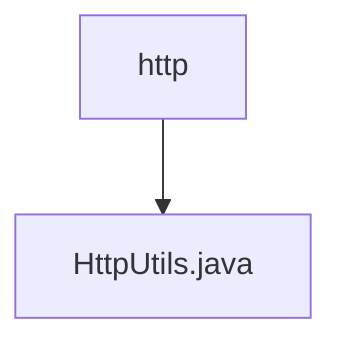

# 基础信息

|      |      |
|------|------|
| 名称 | http |
| 编码语言 | .java |
| 代码路径 | RuoYi-main/ruoyi-common/src/main/java/com/ruoyi/common/utils/http |
| 包名 | RuoYi-main.ruoyi-common.src.main.java.com.ruoyi.common.utils.http |
| 概述说明 | HttpUtils类支持GET、POST、SSL POST请求，含参数、编码、异常处理和日志记录。 |

# 说明

HttpUtils类是一个功能全面的工具类，提供了GET、POST以及SSL POST三种HTTP请求方法。该类支持传入请求参数，并允许指定编码类型以确保数据传输的正确性。此外，HttpUtils类还内置了异常处理机制，能够有效捕获和处理请求过程中可能出现的错误。同时，该类集成了日志记录功能，便于开发者追踪和分析请求的执行情况，确保系统的稳定性和可维护性。

### 包内部结构视图

该流程图展示了路径中的层级关系，`http`文件夹包含一个名为`HttpUtils.java`的文件。这种结构清晰地反映了文件在项目中的位置和依赖关系，帮助开发者快速理解项目的目录组织。

# 文件列表 File List

| 名称   | 类型  | 说明 |
|-------|------|-------------|
| [HttpUtils.java](HttpUtils.md) | file | HttpUtils类支持GET、POST、SSL POST请求，含参数、编码、异常处理和日志记录。 |

