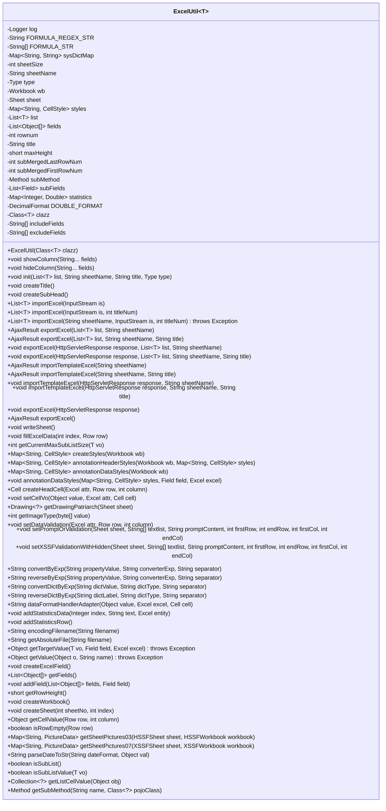

# 基础信息

|      |      |
|------|------|
| 名称 | ExcelUtil |
| 编码语言 | .java |
| 代码路径 | RuoYi-main/ruoyi-common/src/main/java/com/ruoyi/common/utils/poi/ExcelUtil.java |
| 包名 | com.ruoyi.common.utils.poi |
| 依赖项 | ['java.io.File', 'java.io.FileOutputStream', 'java.io.IOException', 'java.io.InputStream', 'java.io.OutputStream', 'java.lang.reflect.Field', 'java.lang.reflect.Method', 'java.lang.reflect.ParameterizedType', 'java.math.BigDecimal', 'java.text.DecimalFormat', 'java.time.LocalDate', 'java.time.LocalDateTime', 'java.util.ArrayList', 'java.util.Arrays', 'java.util.Collection', 'java.util.Comparator', 'java.util.Date', 'java.util.HashMap', 'java.util.List', 'java.util.Map', 'java.util.Set', 'java.util.UUID', 'java.util.stream.Collectors', 'javax.servlet.http.HttpServletResponse', 'org.apache.commons.lang3.ArrayUtils', 'org.apache.commons.lang3.RegExUtils', 'org.apache.commons.lang3.reflect.FieldUtils', 'org.apache.poi.hssf.usermodel.HSSFClientAnchor', 'org.apache.poi.hssf.usermodel.HSSFPicture', 'org.apache.poi.hssf.usermodel.HSSFPictureData', 'org.apache.poi.hssf.usermodel.HSSFShape', 'org.apache.poi.hssf.usermodel.HSSFSheet', 'org.apache.poi.hssf.usermodel.HSSFWorkbook', 'org.apache.poi.ooxml.POIXMLDocumentPart', 'org.apache.poi.ss.usermodel.BorderStyle', 'org.apache.poi.ss.usermodel.Cell', 'org.apache.poi.ss.usermodel.CellStyle', 'org.apache.poi.ss.usermodel.CellType', 'org.apache.poi.ss.usermodel.ClientAnchor', 'org.apache.poi.ss.usermodel.DataFormat', 'org.apache.poi.ss.usermodel.DataValidation', 'org.apache.poi.ss.usermodel.DataValidationConstraint', 'org.apache.poi.ss.usermodel.DataValidationHelper', 'org.apache.poi.ss.usermodel.DateUtil', 'org.apache.poi.ss.usermodel.Drawing', 'org.apache.poi.ss.usermodel.FillPatternType', 'org.apache.poi.ss.usermodel.Font', 'org.apache.poi.ss.usermodel.HorizontalAlignment', 'org.apache.poi.ss.usermodel.IndexedColors', 'org.apache.poi.ss.usermodel.Name', 'org.apache.poi.ss.usermodel.PictureData', 'org.apache.poi.ss.usermodel.Row', 'org.apache.poi.ss.usermodel.Sheet', 'org.apache.poi.ss.usermodel.VerticalAlignment', 'org.apache.poi.ss.usermodel.Workbook', 'org.apache.poi.ss.usermodel.WorkbookFactory', 'org.apache.poi.ss.util.CellRangeAddress', 'org.apache.poi.ss.util.CellRangeAddressList', 'org.apache.poi.util.IOUtils', 'org.apache.poi.xssf.streaming.SXSSFWorkbook', 'org.apache.poi.xssf.usermodel.XSSFClientAnchor', 'org.apache.poi.xssf.usermodel.XSSFDataValidation', 'org.apache.poi.xssf.usermodel.XSSFDrawing', 'org.apache.poi.xssf.usermodel.XSSFPicture', 'org.apache.poi.xssf.usermodel.XSSFShape', 'org.apache.poi.xssf.usermodel.XSSFSheet', 'org.apache.poi.xssf.usermodel.XSSFWorkbook', 'org.openxmlformats.schemas.drawingml.x2006.spreadsheetDrawing.CTMarker', 'org.slf4j.Logger', 'org.slf4j.LoggerFactory', 'com.ruoyi.common.annotation.Excel', 'com.ruoyi.common.annotation.Excel.ColumnType', 'com.ruoyi.common.annotation.Excel.Type', 'com.ruoyi.common.annotation.Excels', 'com.ruoyi.common.config.RuoYiConfig', 'com.ruoyi.common.core.domain.AjaxResult', 'com.ruoyi.common.core.text.Convert', 'com.ruoyi.common.exception.UtilException', 'com.ruoyi.common.utils.DateUtils', 'com.ruoyi.common.utils.DictUtils', 'com.ruoyi.common.utils.StringUtils', 'com.ruoyi.common.utils.file.FileTypeUtils', 'com.ruoyi.common.utils.file.FileUtils', 'com.ruoyi.common.utils.file.ImageUtils', 'com.ruoyi.common.utils.reflect.ReflectUtils'] |
| 概述说明 | ExcelUtil类处理Excel导入导出，支持数据转换、样式设置和子列表处理。 |

# 说明

ExcelUtil类是一个专门用于处理Excel文件导入导出的工具类。它提供了多种功能，包括数据转换、样式设置以及子列表处理。数据转换功能允许用户将Excel中的数据转换为其他格式或从其他格式转换为Excel数据。样式设置功能使用户能够自定义Excel文件的样式，如字体、颜色、边框等。子列表处理功能则支持对Excel中的子列表进行操作，如添加、删除或修改子列表数据。这些功能使得ExcelUtil类在处理复杂Excel文件时非常实用和高效。

# 类列表 Class Summary

| 名称   | 类型  | 说明 |
|-------|------|-------------|
| ExcelUtil | class | ExcelUtil类用于处理Excel导入导出，支持数据转换、样式设置、子列表处理等功能。 |

## 类 ExcelUtil

|      |      |
|------|------|
| 访问范围 | public |
| 类型 | class |
| 名称 | ExcelUtil |
| 说明 | ExcelUtil类用于处理Excel导入导出，支持数据转换、样式设置、子列表处理等功能。 |

### UML类图

### 描述
`ExcelUtil` 是一个泛型类，用于处理Excel文件的导入和导出操作。它支持多种Excel格式（如XLS和XLSX），并提供了丰富的功能，如数据验证、样式设置、合并单元格、统计信息等。该类通过注解和反射机制，能够灵活地处理不同类型的数据，并生成符合业务需求的Excel文件。此外，它还支持处理子列表数据，能够在Excel中展示复杂的数据结构。

### 内部方法调用关系图

**描述：**  
`ExcelUtil<T>` 类是一个用于处理 Excel 导入导出的工具类，支持多种 Excel 操作，包括数据导入、导出、模板生成等。类中包含了多个属性和方法，用于管理 Excel 文件的工作簿、工作表、样式、数据列表等。通过 `init` 方法初始化 Excel 文件，`importExcel` 方法用于导入数据，`exportExcel` 方法用于导出数据。类中还提供了多种样式设置、数据验证、统计功能等，确保 Excel 文件的生成和解析过程高效且灵活。

### 字段列表 Field List

| 名称  | 类型  | 说明 |
|-------|-------|------|
| sheet | Sheet | 私有Sheet类型变量sheet声明。 |
| FORMULA_REGEX_STR = "=|-|\\+|@" | String | 公式正则表达式定义为"=|-|\\+|@"。 |
| sheetName | String | 定义私有字符串变量sheetName。 |
| excludeFields | String[] | 定义字符串数组变量excludeFields。 |
| type | Type | 声明了一个私有类型变量type。 |
| rownum | int | 定义一个私有的整型变量rownum。 |
| subMethod | Method | 私有方法subMethod定义。 |
| title | String | 定义了一个私有的字符串类型变量title。 |
| clazz | Class<T> | 定义了一个泛型类对象clazz。 |
| sheetSize = 65536 | int | 定义一个静态常量sheetSize，值为65536。 |
| subFields | List<Field> | 私有字段subFields，类型为Field的列表。 |
| styles | Map<String, CellStyle> | 私有Map存储字符串键与单元格样式值。 |
| maxHeight | short | 定义私有短整型变量maxHeight。 |
| fields | List<Object[]> | 定义了一个私有字段列表，存储对象数组。 |
| statistics = new HashMap<Integer, Double>() | Map<Integer, Double> | 定义了一个存储整数键和双精度值的哈希映射。 |
| list | List<T> | 声明一个泛型列表变量list。 |
| wb | Workbook | 声明一个私有的Workbook对象变量wb。 |
| subMergedLastRowNum = 0 | int | 私有整型变量subMergedLastRowNum初始值为0。 |
| includeFields | String[] | 包含字段的字符串数组。 |
| sysDictMap = new HashMap<String, String>() | Map<String, String> | 创建一个存储字符串键值对的HashMap实例。 |
| FORMULA_STR = { "=", "-", "+", "@" } | String[] | 定义常量字符串数组FORMULA_STR，包含"= - + @"四个元素。 |
| DOUBLE_FORMAT = new DecimalFormat("######0.00") | DecimalFormat | 定义私有静态常量DOUBLE_FORMAT，用于格式化双精度浮点数为两位小数。 |
| log = LoggerFactory.getLogger(ExcelUtil.class) | Logger | ExcelUtil类中定义了一个私有的静态日志记录器log。 |
| subMergedFirstRowNum = 1 | int | 私有整型变量subMergedFirstRowNum初始值为1。 |

### 方法列表 Method List

| 名称  | 类型  | 说明 |
|-------|-------|------|
| getDrawingPatriarch | Drawing<?> | 获取或创建Sheet的绘图对象并返回。 |
| createTitle | void | 创建标题行，合并单元格，设置样式和高度。 |
| getTargetValue | Object | 通过反射获取目标对象属性值，支持嵌套属性访问。 |
| importTemplateExcel | AjaxResult | 导入模板Excel方法，初始化并导出Excel文件。 |
| getCurrentMaxSubListSize | int | 方法计算集合字段的最大子列表大小，返回最大值。 |
| getListCellValue | Collection<?> | 方法通过反射获取对象属性值，异常时返回空列表。 |
| annotationDataStyles | void | 根据Excel配置创建单元格样式并存储。 |
| isSubList | boolean | 判断子列表是否存在且非空。 |
| exportExcel | void | 导出Excel文件并处理异常，最后关闭资源。 |
| createSubHead | void | 方法创建子表头，处理字段类型合并单元格并设置样式。 |
| setDataValidation | void | 根据Excel属性设置列宽和数据验证，处理下拉列表和提示信息。 |
| exportExcel | void | 导出Excel方法，接受响应、列表和表名参数。 |
| getAbsoluteFile | String | 获取文件绝对路径，若父目录不存在则创建。 |
| getValue | Object | 通过反射获取对象指定字段的值。 |
| convertDictByExp | String | 静态方法convertDictByExp通过DictUtils.getDictLabel转换字典值。 |
| exportExcel | void | 导出Excel文件，设置响应类型和编码，初始化数据并执行导出操作。 |
| fillExcelData | void | 该方法将数据填充到Excel中，处理集合和普通字段，支持合并单元格。 |
| getSheetPictures03 | Map<String, PictureData> | 从Excel表格中提取图片数据并映射到行号列号。 |
| importExcel | List<T> | 方法importExcel接收输入流参数，调用重载方法并返回列表。 |
| exportExcel | AjaxResult | 导出Excel表格，支持指定列表和表名。 |
| convertByExp | String | 静态方法通过分隔符和转换表达式将属性值转换为新字符串。 |
| createHeadCell | Cell | 创建Excel表头单元格，设置样式、数据验证及合并单元格。 |
| getRowHeight | short | 获取行高，计算字段最大高度并乘以20返回。 |
| importTemplateExcel | AjaxResult | AjaxResult方法importTemplateExcel接收sheetName参数，调用同名方法并传递空字符串。 |
| annotationHeaderStyles | Map<String, CellStyle> | 根据字段信息生成Excel表头样式并返回。 |
| hideColumn | void | 该方法用于隐藏指定列，接收可变参数作为列名。 |
| createWorkbook | void | 创建Excel工作簿，初始化工作表并设置样式。 |
| reverseByExp | String | 根据表达式反转属性值，使用分隔符匹配并替换。 |
| writeSheet | void | 方法根据数据量创建多个sheet，生成表头并填充数据。 |
| exportExcel | AjaxResult | 导出Excel文件，处理异常并关闭资源。 |
| setPromptOrValidation | void | 为Excel设置数据验证和提示信息，处理兼容性问题并添加到工作表中。 |
| reverseDictByExp | String | 静态方法reverseDictByExp通过字典标签和类型返回字典值，使用分隔符。 |
| annotationDataStyles | Map<String, CellStyle> | 方法生成带注解字段的单元格样式映射。 |
| addStatisticsRow | void | 方法`addStatisticsRow`在统计表末行添加合计行，清空统计数据。 |
| createSheet | void | 创建工作表并设置名称，条件为sheetNo大于1且index大于0。 |
| getImageType | int | 方法根据文件类型返回JPEG或PNG的图片类型。 |
| getFields | List<Object[]> | 方法获取类及其父类的字段，根据包含或排除条件筛选并返回字段列表。 |
| addStatisticsData | void | 方法addStatisticsData在entity非空且启用统计时，更新指定索引的统计值。 |
| createExcelField | void | 方法创建Excel字段，排序并获取最大行高。 |
| importTemplateExcel | void | 导入模板Excel，设置响应类型和编码，初始化并导出。 |
| getSheetPictures07 | Map<String, PictureData> | 提取XSSFSheet中图片数据并返回索引与图片的映射。 |
| importExcel | List<T> | 导入Excel数据并返回列表，处理异常并关闭输入流。 |
| importExcel | List<T> | 导入Excel数据，处理表头、行数据及图片，返回对象列表。 |
| dataFormatHandlerAdapter | String | 方法处理Excel数据格式化，调用指定handler实例的format方法，捕获异常并记录错误。 |
| isSubListValue | boolean | 检查子列表值是否有效，需子字段和列表值均非空且非零。 |
| isRowEmpty | boolean | 检查行是否为空，若行为空或所有单元格为空则返回真。 |
| encodingFilename | String | 生成唯一编码的Excel文件名，格式为UUID_原文件名.xlsx。 |
| createStyles | Map<String, CellStyle> | 创建Excel样式，包括标题、数据和总计样式，设置对齐、字体和边框。 |
| addCell | Cell | 该方法根据Excel属性创建单元格，处理数据格式并设置样式，支持合并单元格和统计数据处理。 |
| setXSSFValidationWithHidden | void | 在Excel表格中设置隐藏下拉列表数据验证，并支持提示信息和兼容性处理。 |
| parseDateToStr | String | 将日期对象按指定格式转换为字符串，支持多种日期类型。 |
| showColumn | void | 方法`showColumn`用于设置包含的字段数组。 |
| setCellVo | void | 根据单元格类型设置值，防止CSV注入，处理空值，支持字符串、数字和图片类型。 |
| getCellValue | Object | 获取Excel行中指定列的值，支持数字、日期、字符串、布尔和错误类型。 |
| init | void | 初始化方法：设置列表、工作表名、标题和类型，并创建Excel字段、工作簿、标题和子标题。 |
| addField | void | 方法`addField`根据字段注解`Excel`或`Excels`筛选并添加字段到列表，处理单注解和多注解情况。 |
| exportExcel | AjaxResult | 导出Excel文件，初始化数据后执行导出操作。 |
| getSubMethod | Method | 根据名称和类获取子方法，处理异常并返回结果。 |
| importTemplateExcel | void | 方法importTemplateExcel导出Excel模板，接收响应对象和表名参数。 |

