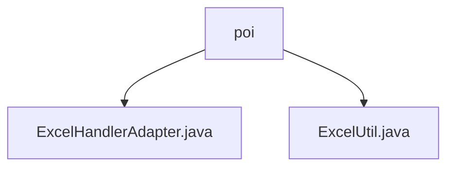

# 基础信息

|      |      |
|------|------|
| 名称 | poi |
| 编码语言 | .java |
| 代码路径 | RuoYi-main/ruoyi-common/src/main/java/com/ruoyi/common/utils/poi |
| 包名 | RuoYi-main.ruoyi-common.src.main.java.com.ruoyi.common.utils.poi |
| 概述说明 | ExcelUtil类提供Excel文件导入导出功能，支持数据转换、样式设置和子列表处理。 |

# 说明

## 概述

该代码模块主要包含两个Java类文件，分别是`ExcelHandlerAdapter.java`和`ExcelUtil.java`，它们位于`RuoYi-main/ruoyi-common`项目的`com.ruoyi.common.utils.poi`包中。这两个类主要用于处理Excel文件的导入和导出操作，提供了丰富的功能来支持复杂Excel文件的处理。

## 主要业务场景

1. **Excel文件导入导出**：
   - `ExcelUtil`类是一个专门用于处理Excel文件导入导出的工具类，支持将Excel中的数据转换为其他格式，或从其他格式转换为Excel数据。

2. **数据转换**：
   - 该模块提供了数据转换功能，允许用户在Excel数据和其他数据格式之间进行转换，方便数据的处理和存储。

3. **样式设置**：
   - 用户可以通过该模块自定义Excel文件的样式，包括字体、颜色、边框等，以满足不同的业务需求。

4. **子列表处理**：
   - 该模块支持对Excel中的子列表进行操作，如添加、删除或修改子列表数据，适用于处理复杂的Excel文件结构。

总的来说，该模块为处理Excel文件提供了强大的工具，能够满足多种业务场景下的需求，特别是在处理复杂Excel文件时表现出高效和实用性。

### 包内部结构视图

该流程图展示了路径中文件夹与文件的层级关系。根节点为`poi`文件夹，其下包含两个文件：`ExcelHandlerAdapter.java`和`ExcelUtil.java`。这种结构清晰地表示了文件在文件夹中的组织方式，便于理解项目中的模块划分和文件依赖关系。

# 文件列表 File List

| 名称   | 类型  | 说明 |
|-------|------|-------------|
| [ExcelHandlerAdapter.java](ExcelHandlerAdapter.md) | file | 内容为空，无法生成概要描述。 |
| [ExcelUtil.java](ExcelUtil.md) | file | ExcelUtil类处理Excel导入导出，支持数据转换、样式设置和子列表处理。 |

