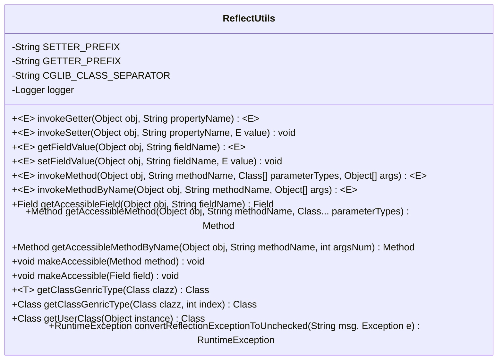

# 基础信息

|      |      |
|------|------|
| 名称 | ReflectUtils |
| 编码语言 | .java |
| 代码路径 | RuoYi-main/ruoyi-common/src/main/java/com/ruoyi/common/utils/reflect/ReflectUtils.java |
| 包名 | com.ruoyi.common.utils.reflect |
| 依赖项 | ['java.lang.reflect.Field', 'java.lang.reflect.InvocationTargetException', 'java.lang.reflect.Method', 'java.lang.reflect.Modifier', 'java.lang.reflect.ParameterizedType', 'java.lang.reflect.Type', 'java.util.Date', 'org.apache.commons.lang3.StringUtils', 'org.apache.commons.lang3.Validate', 'org.apache.poi.ss.usermodel.DateUtil', 'org.slf4j.Logger', 'org.slf4j.LoggerFactory', 'com.ruoyi.common.core.text.Convert', 'com.ruoyi.common.utils.DateUtils'] |
| 概述说明 | ReflectUtils类提供反射工具，支持Getter/Setter、字段操作和方法调用。 |

# 说明

ReflectUtils类是一个用于反射操作的工具类，提供了多种实用方法。它支持调用对象的Getter和Setter方法，能够读取和设置对象的字段值，还可以调用对象的各种方法。通过这些功能，ReflectUtils类能够动态地操作和访问对象的属性和行为，增强了代码的灵活性和可扩展性。

# 类列表 Class Summary

| 名称   | 类型  | 说明 |
|-------|------|-------------|
| ReflectUtils | class | ReflectUtils类提供反射工具方法，支持调用Getter/Setter、读取/设置字段值、调用方法等功能。 |

## 类 ReflectUtils

|      |      |
|------|------|
| 访问范围 | @SuppressWarnings("rawtypes");public |
| 类型 | class |
| 名称 | ReflectUtils |
| 说明 | ReflectUtils类提供反射工具方法，支持调用Getter/Setter、读取/设置字段值、调用方法等功能。 |

### UML类图

**描述：**
`ReflectUtils` 类是一个用于简化反射操作的实用工具类。它提供了多种方法来动态调用对象的Getter和Setter方法、直接读取或设置对象的字段值、以及通过反射调用对象的方法。此外，它还支持处理泛型类型、获取可访问的字段和方法、以及将反射时的检查异常转换为未检查异常。该类通过封装复杂的反射操作，使得开发者能够更便捷地进行动态操作，尤其是在处理多级对象属性时表现出色。

### 内部方法调用关系图

```mermaid
graph TD
    A["类ReflectUtils"]
    B["常量: SETTER_PREFIX = 'set'"]
    C["常量: GETTER_PREFIX = 'get'"]
    D["常量: CGLIB_CLASS_SEPARATOR = '$$'"]
    E["属性: Logger logger"]
    F["方法: <E> E invokeGetter(Object obj, String propertyName)"]
    G["方法: <E> void invokeSetter(Object obj, String propertyName, E value)"]
    H["方法: <E> E getFieldValue(Object obj, String fieldName)"]
    I["方法: <E> void setFieldValue(Object obj, String fieldName, E value)"]
    J["方法: <E> E invokeMethod(Object obj, String methodName, Class<?>[] parameterTypes, Object[] args)"]
    K["方法: <E> E invokeMethodByName(Object obj, String methodName, Object[] args)"]
    L["方法: Field getAccessibleField(Object obj, String fieldName)"]
    M["方法: Method getAccessibleMethod(Object obj, String methodName, Class<?>... parameterTypes)"]
    N["方法: Method getAccessibleMethodByName(Object obj, String methodName, int argsNum)"]
    O["方法: void makeAccessible(Method method)"]
    P["方法: void makeAccessible(Field field)"]
    Q["方法: <T> Class<T> getClassGenricType(Class clazz)"]
    R["方法: Class getClassGenricType(Class clazz, int index)"]
    S["方法: Class<?> getUserClass(Object instance)"]
    T["方法: RuntimeException convertReflectionExceptionToUnchecked(String msg, Exception e)"]

    A --> B
    A --> C
    A --> D
    A --> E
    A --> F
    A --> G
    A --> H
    A --> I
    A --> J
    A --> K
    A --> L
    A --> M
    A --> N
    A --> O
    A --> P
    A --> Q
    A --> R
    A --> S
    A --> T
```

这段代码定义了一个名为 `ReflectUtils` 的工具类，主要用于通过反射机制调用对象的Getter和Setter方法、直接读取和设置对象的属性值、以及调用对象的方法。该类还提供了处理私有和受保护成员的方法，并支持泛型类型的获取。通过反射，`ReflectUtils` 可以绕过访问控制，直接操作对象的内部属性和方法，适用于需要动态调用对象方法的场景。

### 字段列表 Field List

| 名称  | 类型  | 说明 |
|-------|-------|------|
| CGLIB_CLASS_SEPARATOR = "$$" | String | CGLIB类分隔符定义为"$$"。 |
| GETTER_PREFIX = "get" | String | 定义常量字符串GETTER_PREFIX，值为"get"。 |
| SETTER_PREFIX = "set" | String | 定义静态常量SETTER_PREFIX，值为"set"。 |
| logger = LoggerFactory.getLogger(ReflectUtils.class) | Logger | ReflectUtils类中定义了一个私有静态Logger对象。 |

### 方法列表 Method List

| 名称  | 类型  | 说明 |
|-------|-------|------|
| invokeGetter | E | 通过反射调用对象属性的getter方法，支持嵌套属性访问。 |
| getClassGenricType | Class<T> | 获取指定类的泛型类型。 |
| getClassGenricType | Class | 获取类的泛型类型，若不符合条件返回Object.class。 |
| getAccessibleMethodByName | Method | 获取对象中指定名称和参数数量的可访问方法。 |
| invokeSetter | void | 通过反射调用对象的setter方法，支持嵌套属性赋值。 |
| invokeMethod | E | 通过反射调用对象方法，处理异常并返回结果。 |
| makeAccessible | void | 该方法检查并设置非公共方法为可访问状态。 |
| invokeMethodByName | E | 通过方法名调用对象方法，自动转换参数类型并返回结果。 |
| getUserClass | Class<?> | 获取对象实例的类，处理CGLIB代理类时返回其父类。 |
| setFieldValue | void | 静态方法setFieldValue通过反射为对象字段赋值，未找到字段时记录日志。 |
| makeAccessible | void | Java方法makeAccessible用于设置非公共或final字段的可访问性。 |
| getAccessibleField | Field | 获取对象指定字段，若为空或未找到返回null。 |
| convertReflectionExceptionToUnchecked | RuntimeException | 将反射异常转换为未检查异常，处理非法访问、非法参数、无方法异常，返回运行时异常。 |
| getAccessibleMethod | Method | 获取对象可访问方法，参数为对象、方法名和参数类型，若对象为空返回null。 |
| getFieldValue | E | 通过反射获取对象指定字段值，若字段不存在或访问异常则返回null。 |

