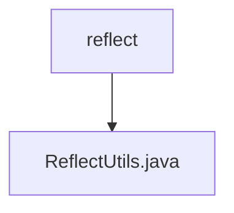

# 基础信息

|      |      |
|------|------|
| 名称 | reflect |
| 编码语言 | .java |
| 代码路径 | RuoYi-main/ruoyi-common/src/main/java/com/ruoyi/common/utils/reflect |
| 包名 | RuoYi-main.ruoyi-common.src.main.java.com.ruoyi.common.utils.reflect |
| 概述说明 | ReflectUtils类提供反射工具，支持Getter/Setter、字段操作和方法调用。 |

# 说明

ReflectUtils类是一个用于反射操作的工具类，提供了多种实用方法。它支持调用对象的Getter和Setter方法，能够读取和设置对象的字段值，还可以调用对象的各种方法。通过这些功能，ReflectUtils类能够动态地操作和访问对象的属性和行为，增强了代码的灵活性和可扩展性。

### 包内部结构视图

该流程图展示了`reflect`文件夹与`ReflectUtils.java`文件之间的层级关系。`reflect`是父节点，`ReflectUtils.java`是其子节点，表示`ReflectUtils.java`文件位于`reflect`文件夹内。这种层级关系清晰地反映了文件在项目中的组织结构。

# 文件列表 File List

| 名称   | 类型  | 说明 |
|-------|------|-------------|
| [ReflectUtils.java](ReflectUtils.md) | file | ReflectUtils类提供反射工具，支持Getter/Setter、字段操作和方法调用。 |

