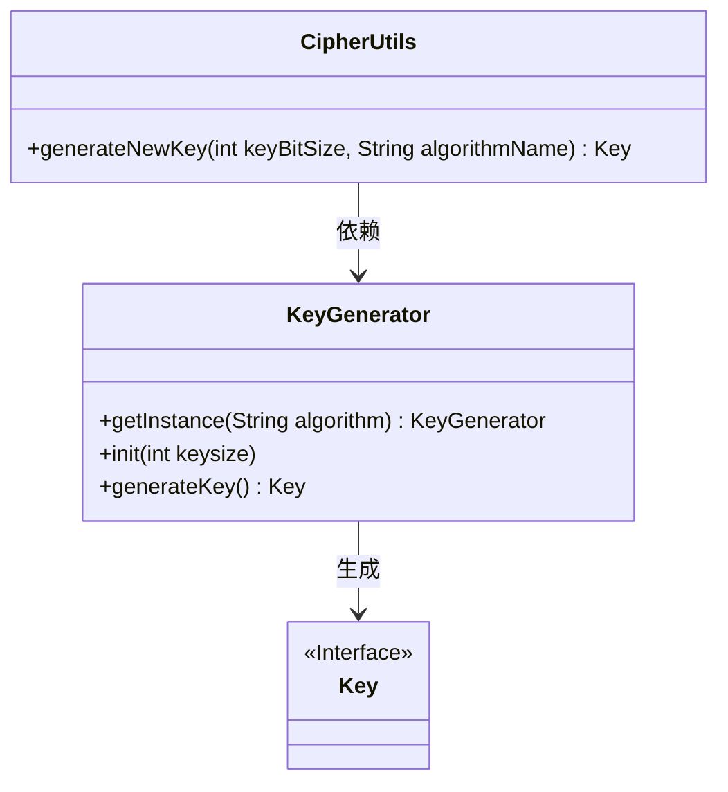
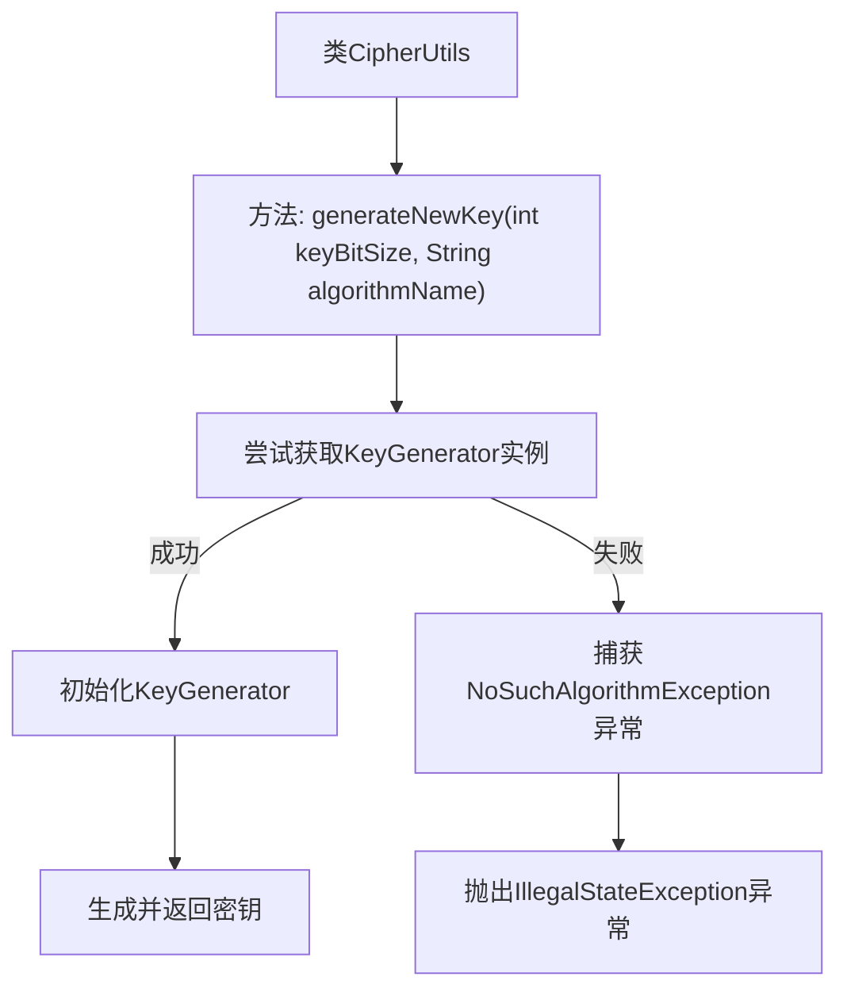

# 基础信息

|      |      |
|------|------|
| 名称 | CipherUtils |
| 编码语言 | .java |
| 代码路径 | RuoYi-main/ruoyi-common/src/main/java/com/ruoyi/common/utils/security/CipherUtils.java |
| 包名 | com.ruoyi.common.utils.security |
| 依赖项 | ['java.security.Key', 'java.security.NoSuchAlgorithmException', 'javax.crypto.KeyGenerator'] |
| 概述说明 | CipherUtils类提供指定字节大小和算法名称的随机秘钥生成方法。 |

# 说明

CipherUtils类包含一个用于生成随机秘钥的方法。该方法需要用户指定两个关键参数：秘钥的字节大小和所使用的算法名称。通过这两个参数，该方法能够生成符合指定算法和长度要求的随机秘钥，确保秘钥的安全性和适用性。

# 类列表 Class Summary

| 名称   | 类型  | 说明 |
|-------|------|-------------|
| CipherUtils | class | CipherUtils类提供生成随机秘钥的方法，需指定字节大小和算法名称。 |

## 类 CipherUtils

|      |      |
|------|------|
| 访问范围 | public |
| 类型 | class |
| 名称 | CipherUtils |
| 说明 | CipherUtils类提供生成随机秘钥的方法，需指定字节大小和算法名称。 |

### UML类图

这段代码定义了一个 `CipherUtils` 类，其中包含一个静态方法 `generateNewKey`，用于生成指定算法和密钥大小的密钥。该方法依赖于 `KeyGenerator` 类来获取密钥生成器实例，并最终生成 `Key` 接口的实现对象。`KeyGenerator` 类负责密钥的初始化和生成，而 `Key` 接口表示生成的密钥。

### 内部方法调用关系图

这段代码展示了`CipherUtils`类中的`generateNewKey`方法，用于生成指定算法和密钥大小的密钥。方法首先尝试获取指定算法的`KeyGenerator`实例，如果成功则初始化并生成密钥；如果失败则捕获`NoSuchAlgorithmException`异常并抛出`IllegalStateException`异常。流程图清晰地展示了方法的执行流程和异常处理路径。

### 字段列表 Field List

| 名称  | 类型  | 说明 |
|-------|-------|------|

### 方法列表 Method List

| 名称  | 类型  | 说明 |
|-------|-------|------|
| generateNewKey | Key | 生成指定算法和长度的密钥，若算法不支持则抛出异常。 |

