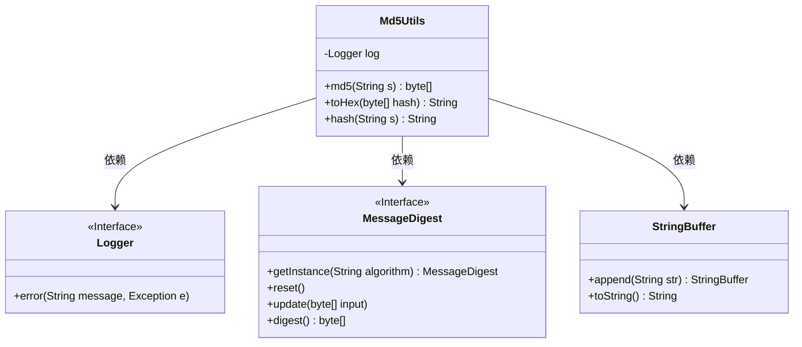
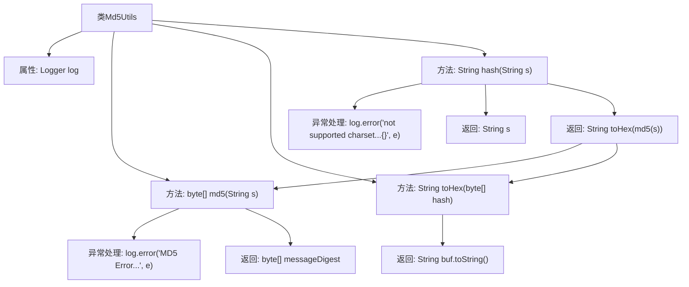

# 基础信息

|      |      |
|------|------|
| 名称 | Md5Utils |
| 编码语言 | .java |
| 代码路径 | RuoYi-main/ruoyi-common/src/main/java/com/ruoyi/common/utils/security/Md5Utils.java |
| 包名 | com.ruoyi.common.utils.security |
| 依赖项 | ['java.nio.charset.StandardCharsets', 'java.security.MessageDigest', 'org.slf4j.Logger', 'org.slf4j.LoggerFactory'] |
| 概述说明 | Md5Utils类提供MD5加密及十六进制字符串转换功能。 |

# 说明

Md5Utils类是一个用于实现MD5加密的工具类，提供了生成MD5摘要的功能，并支持将生成的摘要转换为十六进制字符串。该类主要用于数据的加密处理，确保数据的安全性和完整性。通过使用该类，用户可以方便地对任意数据进行MD5加密，并获取加密后的十六进制字符串表示。

# 类列表 Class Summary

| 名称   | 类型  | 说明 |
|-------|------|-------------|
| Md5Utils | class | Md5Utils类提供MD5加密功能，包括生成MD5摘要和转换为十六进制字符串。 |

## 类 Md5Utils

|      |      |
|------|------|
| 访问范围 | public |
| 类型 | class |
| 名称 | Md5Utils |
| 说明 | Md5Utils类提供MD5加密功能，包括生成MD5摘要和转换为十六进制字符串。 |

### UML类图

**描述：**
`Md5Utils` 类提供了 MD5 哈希功能的实现，包括生成 MD5 哈希值、将字节数组转换为十六进制字符串以及最终的哈希字符串生成。该类依赖于 `Logger` 接口记录错误日志，使用 `MessageDigest` 接口进行 MD5 计算，并利用 `StringBuffer` 类构建十六进制字符串。整个类设计用于处理字符串的 MD5 哈希，并在出现异常时记录错误信息。

### 内部方法调用关系图

这段代码定义了一个`Md5Utils`类，用于计算字符串的MD5哈希值并将其转换为十六进制字符串。`md5`方法负责计算MD5哈希值，`toHex`方法将字节数组转换为十六进制字符串，`hash`方法则是外部调用的入口，结合了前两个方法的功能，并处理可能的异常。流程图展示了类的方法调用关系和异常处理流程。

### 字段列表 Field List

| 名称  | 类型  | 说明 |
|-------|-------|------|
| log = LoggerFactory.getLogger(Md5Utils.class) | Logger | Md5Utils类中定义了一个私有的静态日志记录器。 |

### 方法列表 Method List

| 名称  | 类型  | 说明 |
|-------|-------|------|
| toHex | String | 将字节数组转换为十六进制字符串，处理空值并补零。 |
| md5 | byte[] | 该方法使用MD5算法对字符串进行加密，返回字节数组，异常时记录错误日志。 |
| hash | String | 静态方法hash使用MD5算法对字符串进行哈希处理，返回UTF-8编码的十六进制结果，异常时返回原字符串。 |

