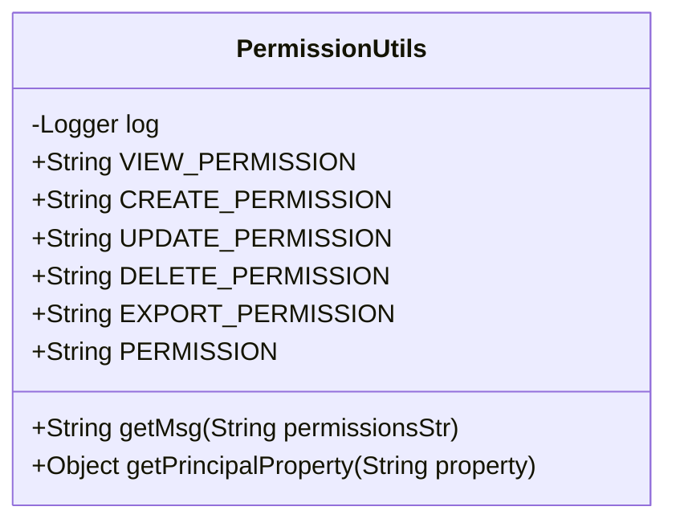
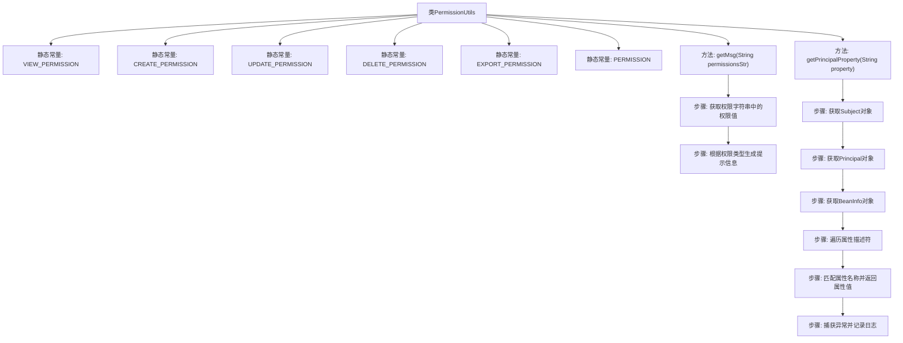

# 基础信息

|      |      |
|------|------|
| 名称 | PermissionUtils |
| 编码语言 | .java |
| 代码路径 | RuoYi-main/ruoyi-common/src/main/java/com/ruoyi/common/utils/security/PermissionUtils.java |
| 包名 | com.ruoyi.common.utils.security |
| 依赖项 | ['java.beans.BeanInfo', 'java.beans.Introspector', 'java.beans.PropertyDescriptor', 'org.apache.commons.lang3.StringUtils', 'org.apache.shiro.SecurityUtils', 'org.apache.shiro.subject.Subject', 'org.slf4j.Logger', 'org.slf4j.LoggerFactory', 'com.ruoyi.common.constant.PermissionConstants', 'com.ruoyi.common.utils.MessageUtils'] |
| 概述说明 | PermissionUtils类定义权限常量，提供错误消息和用户属性获取功能。 |

# 说明

PermissionUtils类是一个用于定义权限常量的工具类，它不仅提供了与权限相关的常量，还包含了处理权限错误消息的功能。此外，该类还具备获取用户属性的能力，以便在权限管理中更灵活地处理用户权限问题。通过集成这些功能，PermissionUtils类为开发者提供了一个统一的权限管理解决方案，简化了权限相关的操作和错误处理流程。

# 类列表 Class Summary

| 名称   | 类型  | 说明 |
|-------|------|-------------|
| PermissionUtils | class | PermissionUtils类定义权限常量并提供权限错误消息和用户属性获取功能。 |

## 类 PermissionUtils

|      |      |
|------|------|
| 访问范围 | public |
| 类型 | class |
| 名称 | PermissionUtils |
| 说明 | PermissionUtils类定义权限常量并提供权限错误消息和用户属性获取功能。 |

### UML类图

**描述：**  
`PermissionUtils` 类是一个工具类，主要用于处理权限相关的操作。它包含多个静态常量，用于表示不同的权限类型（如查看、创建、修改、删除、导出等）。类中提供了两个主要方法：`getMsg` 用于根据权限字符串生成相应的错误提示信息，`getPrincipalProperty` 用于从当前用户的主体对象中获取指定属性的值。该类依赖于 `Logger`、`StringUtils`、`MessageUtils`、`SecurityUtils` 等工具类来完成其功能。

### 内部方法调用关系图

这段代码定义了一个名为 `PermissionUtils` 的工具类，主要用于处理权限相关的操作。类中包含多个静态常量，用于表示不同的权限类型。`getMsg` 方法根据传入的权限字符串生成相应的提示信息，`getPrincipalProperty` 方法则用于获取用户对象的属性值。代码通过日志记录异常情况，确保在出现错误时能够及时捕获并处理。

### 字段列表 Field List

| 名称  | 类型  | 说明 |
|-------|-------|------|
| log = LoggerFactory.getLogger(PermissionUtils.class) | Logger | PermissionUtils类中定义了静态日志记录器log。 |
| EXPORT_PERMISSION = "no.export.permission" | String | 定义了一个不可更改的字符串常量，表示无导出权限。 |
| VIEW_PERMISSION = "no.view.permission" | String | 定义常量VIEW_PERMISSION为"no.view.permission"。 |
| CREATE_PERMISSION = "no.create.permission" | String | 常量CREATE_PERMISSION表示无创建权限。 |
| UPDATE_PERMISSION = "no.update.permission" | String | 常量UPDATE_PERMISSION定义为"no.update.permission"。 |
| DELETE_PERMISSION = "no.delete.permission" | String | 定义常量DELETE_PERMISSION，值为"no.delete.permission"。 |
| PERMISSION = "no.permission" | String | 常量PERMISSION定义为"no.permission"。 |

### 方法列表 Method List

| 名称  | 类型  | 说明 |
|-------|-------|------|
| getPrincipalProperty | Object | 获取主体对象的指定属性值，若属性存在则返回，否则返回空。 |
| getMsg | String | 根据权限字符串生成相应消息，支持增删改查等操作。 |

