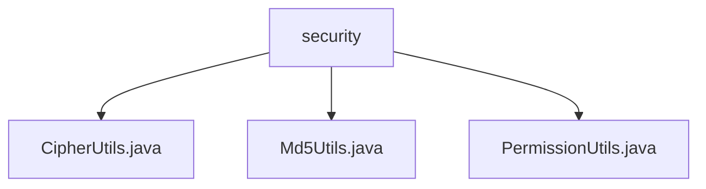

# 基础信息

|      |      |
|------|------|
| 名称 | security |
| 编码语言 | .java |
| 代码路径 | RuoYi-main/ruoyi-common/src/main/java/com/ruoyi/common/utils/security |
| 包名 | RuoYi-main.ruoyi-common.src.main.java.com.ruoyi.common.utils.security |
| 概述说明 | CipherUtils生成随机秘钥，Md5Utils实现MD5加密，PermissionUtils管理权限常量。 |

# 说明

## 概述

该代码模块主要包含与安全相关的工具类，涵盖了秘钥生成、数据加密、权限管理等功能。这些工具类旨在为开发者提供便捷、安全的方式来处理加密、权限校验等常见的安全需求。模块中的类包括`CipherUtils`、`Md5Utils`和`PermissionUtils`，分别负责生成随机秘钥、实现MD5加密以及管理权限相关的操作和错误处理。

## 主要业务场景

1. **秘钥生成**：通过`CipherUtils`类，开发者可以根据指定的算法名称和秘钥字节大小生成符合要求的随机秘钥。该功能适用于需要动态生成秘钥的场景，如加密通信、数据存储等，确保秘钥的安全性和适用性。

2. **数据加密**：`Md5Utils`类提供了MD5加密功能，支持将任意数据生成MD5摘要，并将其转换为十六进制字符串。该功能常用于数据完整性校验、密码存储等场景，确保数据的安全性和不可篡改性。

3. **权限管理**：`PermissionUtils`类集成了权限常量定义、权限错误消息处理以及用户属性获取等功能。该工具类适用于权限管理系统，帮助开发者简化权限校验、错误处理等操作，提升权限管理的灵活性和效率。

### 包内部结构视图

该流程图展示了`security`文件夹下的三个文件：`CipherUtils.java`、`Md5Utils.java`和`PermissionUtils.java`。这些文件都属于`security`目录，没有进一步的子目录层级，所有文件直接位于`security`文件夹下。

# 文件列表 File List

| 名称   | 类型  | 说明 |
|-------|------|-------------|
| [PermissionUtils.java](PermissionUtils.md) | file | PermissionUtils类定义权限常量，提供错误消息和用户属性获取功能。 |
| [Md5Utils.java](Md5Utils.md) | file | Md5Utils类提供MD5加密及十六进制字符串转换功能。 |
| [CipherUtils.java](CipherUtils.md) | file | CipherUtils类提供指定字节大小和算法名称的随机秘钥生成方法。 |

