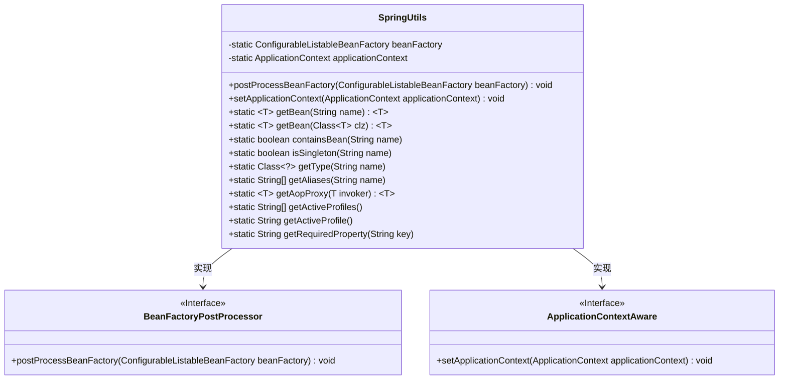

# 基础信息

|      |      |
|------|------|
| 名称 | SpringUtils |
| 编码语言 | .java |
| 代码路径 | RuoYi-main/ruoyi-common/src/main/java/com/ruoyi/common/utils/spring/SpringUtils.java |
| 包名 | com.ruoyi.common.utils.spring |
| 依赖项 | ['org.springframework.aop.framework.AopContext', 'org.springframework.beans.BeansException', 'org.springframework.beans.factory.NoSuchBeanDefinitionException', 'org.springframework.beans.factory.config.BeanFactoryPostProcessor', 'org.springframework.beans.factory.config.ConfigurableListableBeanFactory', 'org.springframework.context.ApplicationContext', 'org.springframework.context.ApplicationContextAware', 'org.springframework.stereotype.Component', 'com.ruoyi.common.utils.StringUtils'] |
| 概述说明 | SpringUtils类实现接口，提供获取Bean、检查类型及环境配置功能。 |

# 说明

SpringUtils类实现了BeanFactoryPostProcessor和ApplicationContextAware接口，具备在Spring容器启动时处理Bean工厂和获取应用上下文的能力。该类提供了多种实用功能，包括从容器中获取Bean实例、检查Bean的类型是否符合预期、以及获取环境配置信息等。这些功能使得开发者能够更方便地管理和操作Spring容器中的Bean，提升代码的灵活性和可维护性。

# 类列表 Class Summary

| 名称   | 类型  | 说明 |
|-------|------|-------------|
| SpringUtils | class | SpringUtils类实现BeanFactoryPostProcessor和ApplicationContextAware接口，提供获取Bean、检查Bean类型、获取环境配置等功能。 |

## 类 SpringUtils

|      |      |
|------|------|
| 访问范围 | @Component;public final |
| 类型 | class |
| 名称 | SpringUtils |
| 说明 | SpringUtils类实现BeanFactoryPostProcessor和ApplicationContextAware接口，提供获取Bean、检查Bean类型、获取环境配置等功能。 |

### UML类图

### 描述
`SpringUtils` 类是一个工具类，实现了 `BeanFactoryPostProcessor` 和 `ApplicationContextAware` 接口，用于管理和访问 Spring 应用上下文中的 Bean。它提供了多种静态方法，如获取 Bean、检查 Bean 是否存在、获取 Bean 的类型和别名等。通过这些方法，开发者可以方便地与 Spring 容器进行交互，简化了 Spring 应用中的 Bean 管理操作。

### 内部方法调用关系图

```mermaid
graph TD
    A["类SpringUtils"]
    B["属性: ConfigurableListableBeanFactory beanFactory"]
    C["属性: ApplicationContext applicationContext"]
    D["方法: postProcessBeanFactory(ConfigurableListableBeanFactory beanFactory)"]
    E["方法: setApplicationContext(ApplicationContext applicationContext)"]
    F["方法: <T> T getBean(String name)"]
    G["方法: <T> T getBean(Class<T> clz)"]
    H["方法: boolean containsBean(String name)"]
    I["方法: boolean isSingleton(String name)"]
    J["方法: Class<?> getType(String name)"]
    K["方法: String[] getAliases(String name)"]
    L["方法: <T> T getAopProxy(T invoker)"]
    M["方法: String[] getActiveProfiles()"]
    N["方法: String getActiveProfile()"]
    O["方法: String getRequiredProperty(String key)"]

    A --> B
    A --> C
    A --> D
    A --> E
    A --> F
    A --> G
    A --> H
    A --> I
    A --> J
    A --> K
    A --> L
    A --> M
    M --> N
    A --> O
```

这段代码定义了一个名为 `SpringUtils` 的工具类，用于与 Spring 框架的 `BeanFactory` 和 `ApplicationContext` 进行交互。类中包含多个静态方法，用于获取 Bean、检查 Bean 的存在性、获取 Bean 的类型和别名、获取 AOP 代理对象、以及获取当前的环境配置和配置文件中的值。这些方法通过 `beanFactory` 和 `applicationContext` 属性来访问 Spring 容器的功能。

### 字段列表 Field List

| 名称  | 类型  | 说明 |
|-------|-------|------|
| beanFactory | ConfigurableListableBeanFactory | 私有静态可配置列表式Bean工厂变量。 |
| applicationContext | ApplicationContext | 定义静态ApplicationContext变量applicationContext。 |

### 方法列表 Method List

| 名称  | 类型  | 说明 |
|-------|-------|------|
| getBean | T | 通过beanFactory获取指定名称的Bean实例。 |
| setApplicationContext | void | 重写方法，设置Spring应用上下文。 |
| getActiveProfiles | String[] | 获取当前应用激活的配置文件列表。 |
| getAopProxy | T | 方法getAopProxy返回当前AOP代理对象。 |
| isSingleton | boolean | 该方法检查指定名称的Bean是否为单例。 |
| getRequiredProperty | String | 获取指定键的必需属性值。 |
| getActiveProfile | String | 获取当前激活的配置文件中第一个非空项。 |
| getBean | T | 静态方法getBean通过beanFactory获取指定类的实例并返回。 |
| containsBean | boolean | 检查指定名称的Bean是否存在于beanFactory中。 |
| getType | Class<?> | 静态方法getType通过beanFactory获取指定名称的Bean类型，可能抛出NoSuchBeanDefinitionException异常。 |
| postProcessBeanFactory | void | 重写方法，将Spring的beanFactory赋值给SpringUtils。 |
| getAliases | String[] | 静态方法getAliases通过beanFactory获取指定名称的别名数组。 |

