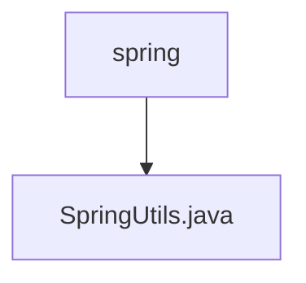

# 基础信息

|      |      |
|------|------|
| 名称 | spring |
| 编码语言 | .java |
| 代码路径 | RuoYi-main/ruoyi-common/src/main/java/com/ruoyi/common/utils/spring |
| 包名 | RuoYi-main.ruoyi-common.src.main.java.com.ruoyi.common.utils.spring |
| 概述说明 | SpringUtils类实现接口，提供获取Bean、检查类型及环境配置功能。 |

# 说明

SpringUtils类实现了BeanFactoryPostProcessor和ApplicationContextAware接口，具备在Spring容器启动时处理Bean工厂和获取应用上下文的能力。该类提供了多种实用功能，包括从容器中获取Bean实例、检查Bean的类型是否符合预期、以及获取环境配置信息等。这些功能使得开发者能够更方便地管理和操作Spring容器中的Bean，提升代码的灵活性和可维护性。

### 包内部结构视图

该流程图展示了路径的层级关系，`spring` 文件夹包含 `SpringUtils.java` 文件。路径结构简单明了，体现了文件与文件夹之间的从属关系。

# 文件列表 File List

| 名称   | 类型  | 说明 |
|-------|------|-------------|
| [SpringUtils.java](SpringUtils.md) | file | SpringUtils类实现接口，提供获取Bean、检查类型及环境配置功能。 |

