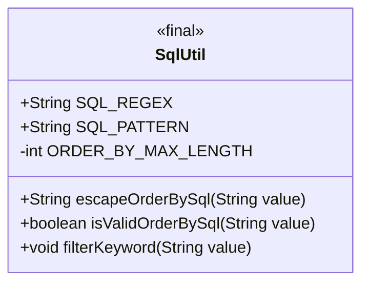
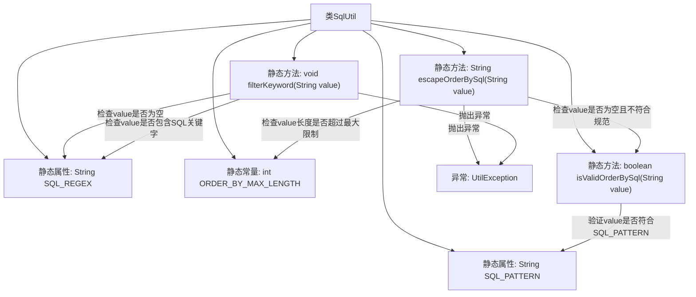

# 基础信息

|      |      |
|------|------|
| 名称 | SqlUtil |
| 编码语言 | .java |
| 代码路径 | RuoYi-main/ruoyi-common/src/main/java/com/ruoyi/common/utils/sql/SqlUtil.java |
| 包名 | com.ruoyi.common.utils.sql |
| 依赖项 | ['com.ruoyi.common.exception.UtilException', 'com.ruoyi.common.utils.StringUtils'] |
| 概述说明 | SqlUtil类提供SQL关键字过滤、orderBy验证及长度限制，防范SQL注入。 |

# 说明

SqlUtil类是一个用于增强SQL语句安全性的工具类，主要包含三个核心功能。首先，它提供了SQL关键字过滤功能，能够有效防止SQL注入攻击。其次，该类具备orderBy语法验证功能，确保orderBy子句的语法正确性。最后，SqlUtil类还实现了长度限制功能，防止SQL语句过长导致性能问题或潜在的安全风险。通过这些功能，SqlUtil类显著提升了SQL操作的安全性和可靠性。

# 类列表 Class Summary

| 名称   | 类型  | 说明 |
|-------|------|-------------|
| SqlUtil | class | SqlUtil类包含SQL关键字过滤、orderBy语法验证及长度限制功能，防止SQL注入。 |

## 类 SqlUtil

|      |      |
|------|------|
| 访问范围 | public |
| 类型 | class |
| 名称 | SqlUtil |
| 说明 | SqlUtil类包含SQL关键字过滤、orderBy语法验证及长度限制功能，防止SQL注入。 |

### UML类图

**描述：**  
`SqlUtil` 类是一个工具类，用于处理与SQL相关的安全检查和字符串处理。它包含三个主要方法：`escapeOrderBySql` 用于检查并转义`ORDER BY`子句中的字符串，确保其符合规范且不超过最大长度限制；`isValidOrderBySql` 用于验证`ORDER BY`子句的语法是否符合预定义的正则表达式；`filterKeyword` 用于检查字符串中是否包含SQL关键字，以防止SQL注入攻击。该类还定义了两个公共的静态字符串常量 `SQL_REGEX` 和 `SQL_PATTERN`，分别用于存储SQL关键字和合法的字符模式。

### 内部方法调用关系图

这段代码定义了一个`SqlUtil`类，用于处理SQL相关的安全检查和验证。代码中包含了三个主要方法：`escapeOrderBySql`用于检查`order by`语句的合法性和长度限制，`isValidOrderBySql`用于验证`order by`语句是否符合规范，`filterKeyword`用于检查输入是否包含SQL注入风险的关键字。这些方法通过正则表达式和关键字列表来确保SQL语句的安全性，防止SQL注入攻击。

### 字段列表 Field List

| 名称  | 类型  | 说明 |
|-------|-------|------|
| ORDER_BY_MAX_LENGTH = 500 | int | 定义常量ORDER_BY_MAX_LENGTH，值为500。 |
| SQL_PATTERN = "[a-zA-Z0-9_\\ \\,\\.]+" | String | 定义SQL模式字符串，匹配字母、数字、下划线、空格、逗号和句号。 |
| SQL_REGEX = "\u000B|and |extractvalue|updatexml|sleep|exec |insert |select |delete |update |drop |count |chr |mid |master |truncate |char |declare |or |union |like |+|/*|user()" | String | SQL注入防护正则表达式，包含常见攻击关键词。 |

### 方法列表 Method List

| 名称  | 类型  | 说明 |
|-------|-------|------|
| escapeOrderBySql | String | 检查SQL排序参数规范及长度，异常时抛出错误。 |
| isValidOrderBySql | boolean | 静态方法验证SQL排序字段格式。 |
| filterKeyword | void | 过滤输入参数，检测SQL注入风险，存在风险则抛出异常。 |

