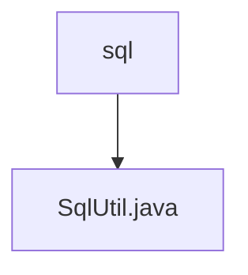

# 基础信息

|      |      |
|------|------|
| 名称 | sql |
| 编码语言 | .java |
| 代码路径 | RuoYi-main/ruoyi-common/src/main/java/com/ruoyi/common/utils/sql |
| 包名 | RuoYi-main.ruoyi-common.src.main.java.com.ruoyi.common.utils.sql |
| 概述说明 | SqlUtil类提供SQL关键字过滤、orderBy验证及长度限制，防范SQL注入。 |

# 说明

SqlUtil类是一个用于增强SQL语句安全性的工具类，主要包含三个核心功能。首先，它提供了SQL关键字过滤功能，能够有效防止SQL注入攻击。其次，该类具备orderBy语法验证功能，确保orderBy子句的语法正确性。最后，SqlUtil类还实现了长度限制功能，防止SQL语句过长导致性能问题或潜在的安全风险。通过这些功能，SqlUtil类显著提升了SQL操作的安全性和可靠性。

### 包内部结构视图

流程图描述：该流程图展示了`sql`文件夹与其包含的`SqlUtil.java`文件之间的层级关系。`sql`作为父节点，直接包含`SqlUtil.java`文件，表示该文件位于`sql`文件夹下，用于处理SQL相关的工具类功能。

# 文件列表 File List

| 名称   | 类型  | 说明 |
|-------|------|-------------|
| [SqlUtil.java](SqlUtil.md) | file | SqlUtil类提供SQL关键字过滤、orderBy验证及长度限制，防范SQL注入。 |

