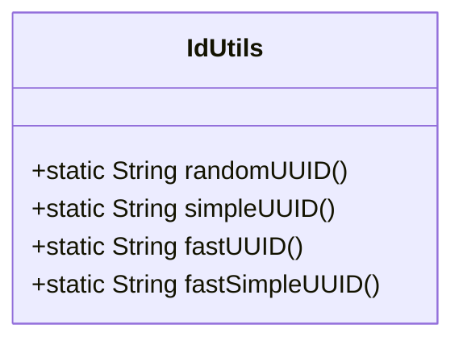
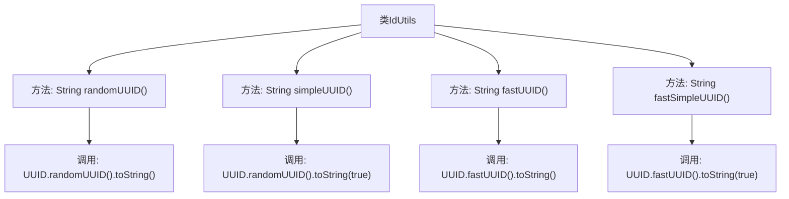

# 基础信息

|      |      |
|------|------|
| 名称 | IdUtils |
| 编码语言 | .java |
| 代码路径 | RuoYi-main/ruoyi-common/src/main/java/com/ruoyi/common/utils/uuid/IdUtils.java |
| 包名 | com.ruoyi.common.utils.uuid |
| 依赖项 | [] |
| 概述说明 | IdUtils类提供生成随机UUID的简化版和性能优化版方法。 |

# 说明

IdUtils类是一个用于生成随机UUID的工具类，提供了两种生成方法。第一种是简化版，适用于一般场景，操作简单且易于使用。第二种是性能优化版，针对高并发或高性能需求进行了优化，确保在大量生成UUID时仍能保持较高的效率。这两种方法满足了不同场景下的需求，用户可以根据具体应用场景选择合适的方法来生成随机UUID。

# 类列表 Class Summary

| 名称   | 类型  | 说明 |
|-------|------|-------------|
| IdUtils | class | IdUtils类提供生成随机UUID的方法，包括简化版和性能优化版。 |

## 类 IdUtils

|      |      |
|------|------|
| 访问范围 | public |
| 类型 | class |
| 名称 | IdUtils |
| 说明 | IdUtils类提供生成随机UUID的方法，包括简化版和性能优化版。 |

### UML类图

这段代码定义了一个名为 `IdUtils` 的工具类，提供了四种生成UUID的方法。`randomUUID` 方法生成标准的随机UUID，`simpleUUID` 方法生成去掉横线的简化UUID，`fastUUID` 方法使用性能更好的 `ThreadLocalRandom` 生成UUID，`fastSimpleUUID` 方法则是 `fastUUID` 的简化版本，同样去掉横线。这些方法均为静态方法，可以直接通过类名调用，无需实例化 `IdUtils` 类。

### 内部方法调用关系图

该流程图展示了`IdUtils`类中的四个静态方法及其内部调用关系。每个方法都通过调用`UUID`类的不同方法来生成不同类型的UUID。`randomUUID`和`simpleUUID`分别生成带有横线和不带横线的UUID，而`fastUUID`和`fastSimpleUUID`则使用性能更好的`ThreadLocalRandom`生成相应的UUID。流程图清晰地展示了每个方法的调用路径，帮助理解代码的执行流程。

### 字段列表 Field List

| 名称  | 类型  | 说明 |
|-------|-------|------|

### 方法列表 Method List

| 名称  | 类型  | 说明 |
|-------|-------|------|
| fastUUID | String | 生成快速UUID的静态方法。 |
| fastSimpleUUID | String | 快速生成简化UUID字符串的静态方法。 |
| simpleUUID | String | 生成不带连字符的简化UUID字符串。 |
| randomUUID | String | 生成随机UUID并返回字符串形式。 |

