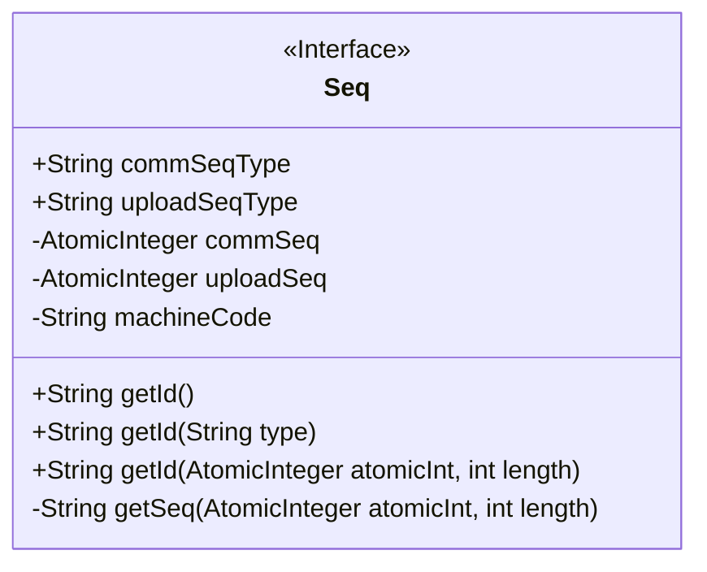
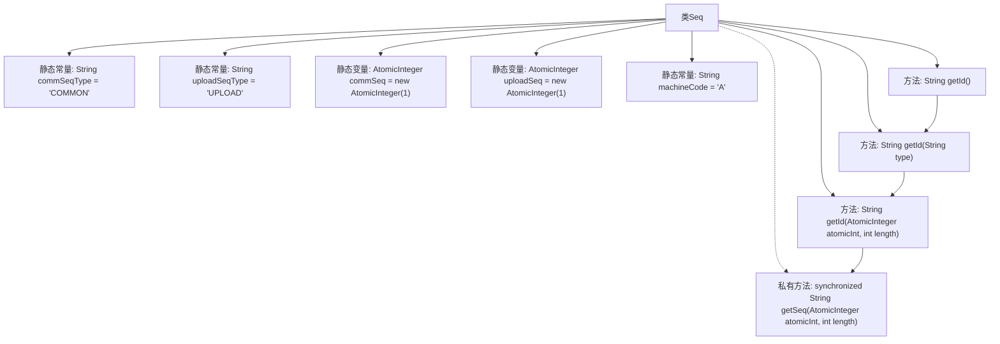

# 基础信息

|      |      |
|------|------|
| 名称 | Seq |
| 编码语言 | .java |
| 代码路径 | RuoYi-main/ruoyi-common/src/main/java/com/ruoyi/common/utils/uuid/Seq.java |
| 包名 | com.ruoyi.common.utils.uuid |
| 依赖项 | ['java.util.concurrent.atomic.AtomicInteger', 'com.ruoyi.common.utils.DateUtils', 'com.ruoyi.common.utils.StringUtils'] |
| 概述说明 | Seq类生成序列号，包含日期、机器标识和递增数值。 |

# 说明

Seq类用于生成通用和上传序列号，序列号包含日期、机器标识和递增数值三个部分。日期部分记录生成序列号的具体时间，机器标识部分用于区分不同设备或系统，递增数值部分确保每个序列号的唯一性和顺序性。通过这种组合方式，Seq类能够高效地生成具有唯一标识的序列号，适用于需要唯一标识的场景。

# 类列表 Class Summary

| 名称   | 类型  | 说明 |
|-------|------|-------------|
| Seq | class | Seq类生成通用和上传序列号，包含日期、机器标识和递增数值。 |

## 类 Seq

|      |      |
|------|------|
| 访问范围 | public |
| 类型 | class |
| 名称 | Seq |
| 说明 | Seq类生成通用和上传序列号，包含日期、机器标识和递增数值。 |

### UML类图

这段代码定义了一个名为 `Seq` 的类，用于生成不同类型的序列号。类中包含两个静态常量 `commSeqType` 和 `uploadSeqType` 来标识序列类型，以及两个静态的 `AtomicInteger` 变量 `commSeq` 和 `uploadSeq` 来维护序列号的自增。`machineCode` 是一个机器标识符。类提供了三个公有方法 `getId()` 来生成不同格式的序列号，其中 `getSeq()` 是一个私有方法，用于生成指定长度的循环递增序列字符串。整个类的设计旨在生成具有时间戳、机器标识和自增序列号的唯一标识符。

### 内部方法调用关系图

该流程图描述了类`Seq`的结构和方法调用关系。类`Seq`包含两个静态常量和两个静态变量，分别用于标识序列类型和存储序列号。`getId()`方法通过调用`getId(String type)`来获取通用序列号，而`getId(String type)`则根据传入的类型选择相应的序列号生成器，并调用`getId(AtomicInteger atomicInt, int length)`生成序列号。最后，`getId(AtomicInteger atomicInt, int length)`调用私有方法`getSeq(AtomicInteger atomicInt, int length)`来生成循环递增的序列号字符串。

### 字段列表 Field List

| 名称  | 类型  | 说明 |
|-------|-------|------|
| machineCode = "A" | String | 私有静态常量machineCode值为"A"。 |
| commSeq = new AtomicInteger(1) | AtomicInteger | 定义了一个静态原子整型变量commSeq，初始值为1。 |
| uploadSeq = new AtomicInteger(1) | AtomicInteger | 私有静态原子整型变量uploadSeq初始化为1。 |
| commSeqType = "COMMON" | String | 定义静态常量commSeqType，值为"COMMON"。 |
| uploadSeqType = "UPLOAD" | String | 上传序列类型定义为常量“UPLOAD”。 |

### 方法列表 Method List

| 名称  | 类型  | 说明 |
|-------|-------|------|
| getId | String | 静态方法`getId`返回`commSeqType`的ID。 |
| getId | String | 该方法生成唯一ID，包含当前时间、机器码和序列号。 |
| getSeq | String | 同步方法获取序列号，超过最大值重置为1，左补零返回。 |
| getId | String | 根据类型获取唯一ID，默认使用commSeq，若为uploadSeqType则使用uploadSeq，最终返回3位ID。 |

