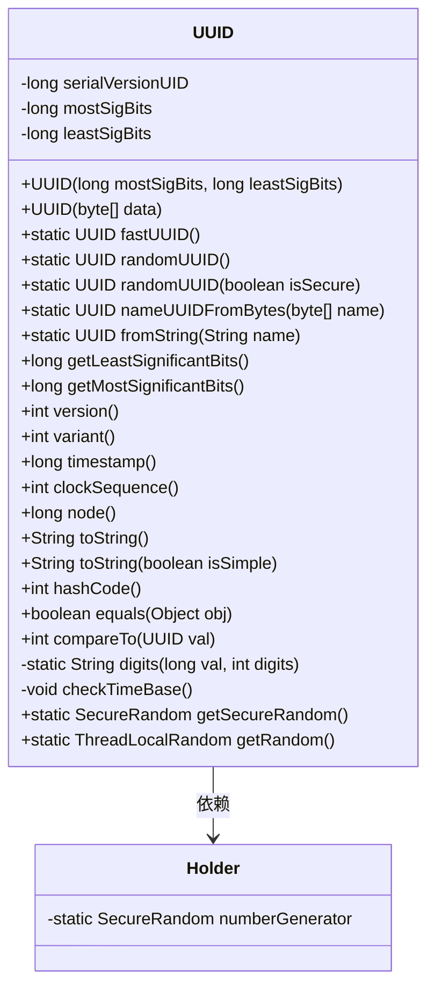

# 基础信息

|      |      |
|------|------|
| 名称 | UUID |
| 编码语言 | .java |
| 代码路径 | RuoYi-main/ruoyi-common/src/main/java/com/ruoyi/common/utils/uuid/UUID.java |
| 包名 | com.ruoyi.common.utils.uuid |
| 依赖项 | ['java.security.MessageDigest', 'java.security.NoSuchAlgorithmException', 'java.security.SecureRandom', 'java.util.Random', 'java.util.concurrent.ThreadLocalRandom', 'com.ruoyi.common.exception.UtilException'] |
| 概述说明 | UUID类实现序列化和比较接口，支持随机生成、名称生成及字符串转换，包含高低64位。 |

# 说明

UUID类实现了序列化和比较接口，包含高64位和低64位两部分。该类支持多种生成方式，包括随机生成和基于名称生成。此外，UUID类还提供了与字符串之间的转换功能，便于在不同场景下使用。

# 类列表 Class Summary

| 名称   | 类型  | 说明 |
|-------|------|-------------|
| UUID | class | UUID类实现序列化和比较接口，包含高低64位，支持随机生成、基于名称生成和字符串转换。 |

## 类 UUID

|      |      |
|------|------|
| 访问范围 | public final |
| 类型 | class |
| 名称 | UUID |
| 说明 | UUID类实现序列化和比较接口，包含高低64位，支持随机生成、基于名称生成和字符串转换。 |

### UML类图

这段代码定义了一个`UUID`类，用于生成和操作通用唯一标识符（UUID）。`UUID`类实现了`Serializable`和`Comparable`接口，支持序列化和比较操作。类中包含多个静态方法用于生成不同类型的UUID，如随机生成的UUID、基于名称的UUID等。`Holder`类是一个内部类，用于持有`SecureRandom`实例，确保随机数的安全性。`UUID`类还提供了多种方法来获取UUID的各个部分，如最高有效位、最低有效位、版本号、变体号等，并支持转换为字符串和哈希码计算。

### 内部方法调用关系图

```mermaid
graph TD
    A["类UUID"]
    B["属性: long serialVersionUID"]
    C["内部类: Holder"]
    D["属性: long mostSigBits"]
    E["属性: long leastSigBits"]
    F["构造方法: UUID(byte[] data)"]
    G["构造方法: UUID(long mostSigBits, long leastSigBits)"]
    H["静态方法: UUID fastUUID()"]
    I["静态方法: UUID randomUUID()"]
    J["静态方法: UUID randomUUID(boolean isSecure)"]
    K["静态方法: UUID nameUUIDFromBytes(byte[] name)"]
    L["静态方法: UUID fromString(String name)"]
    M["方法: long getLeastSignificantBits()"]
    N["方法: long getMostSignificantBits()"]
    O["方法: int version()"]
    P["方法: int variant()"]
    Q["方法: long timestamp()"]
    R["方法: int clockSequence()"]
    S["方法: long node()"]
    T["方法: String toString()"]
    U["方法: String toString(boolean isSimple)"]
    V["方法: int hashCode()"]
    W["方法: boolean equals(Object obj)"]
    X["方法: int compareTo(UUID val)"]
    Y["私有方法: String digits(long val, int digits)"]
    Z["私有方法: void checkTimeBase()"]
    AA["静态方法: SecureRandom getSecureRandom()"]
    AB["静态方法: ThreadLocalRandom getRandom()"]

    A --> B
    A --> C
    A --> D
    A --> E
    A --> F
    A --> G
    A --> H
    A --> I
    A --> J
    A --> K
    A --> L
    A --> M
    A --> N
    A --> O
    A --> P
    A --> Q
    A --> R
    A --> S
    A --> T
    A --> U
    A --> V
    A --> W
    A --> X
    A --> Y
    A --> Z
    A --> AA
    A --> AB
    C --> AA
```

这段代码定义了一个`UUID`类，用于生成和操作通用唯一标识符（UUID）。它包含了多个构造方法和静态工厂方法，用于生成不同类型的UUID，如随机生成的UUID、基于名称的UUID等。类中还定义了多个方法，用于获取UUID的各个部分（如最高有效位、最低有效位）、版本号、变体号、时间戳、时钟序列和节点值等。此外，还提供了`toString`、`hashCode`、`equals`和`compareTo`等方法，用于字符串表示、哈希计算、比较和排序。

### 字段列表 Field List

| 名称  | 类型  | 说明 |
|-------|-------|------|
| leastSigBits | long | 私有长整型变量leastSigBits。 |
| mostSigBits | long | 定义了一个私有的长整型变量mostSigBits。 |
| serialVersionUID = -1185015143654744140L | long | 定义序列化版本UID为-1185015143654744140L。 |

### 方法列表 Method List

| 名称  | 类型  | 说明 |
|-------|-------|------|
| randomUUID | UUID | 生成随机UUID并返回。 |
| fastUUID | UUID | 静态方法fastUUID生成随机UUID。 |
| getMostSignificantBits | long | 获取最高有效位的方法。 |
| nameUUIDFromBytes | UUID | 通过MD5生成UUID，设置版本和变体。 |
| toString | String | 生成UUID字符串，支持简单和复杂格式。 |
| toString | String | 重写toString方法，默认调用带参数的toString方法。 |
| digits | String | 将长整型数值转换为指定位数的十六进制字符串。 |
| compareTo | int | UUID比较方法，按高位和低位数值排序。 |
| getRandom | ThreadLocalRandom | 获取当前线程的随机数生成器实例。 |
| clockSequence | int | `clockSequence`方法检查时间基准并返回时钟序列值。 |
| variant | int | 该方法返回UUID变体类型的整数值，基于最低有效位计算。 |
| equals | boolean | 重写equals方法，比较UUID对象的高位和低位是否相等。 |
| node | long | 该方法检查时间基准并返回最低有效位与掩码的按位与结果。 |
| getLeastSignificantBits | long | 获取UUID的最低有效位。 |
| randomUUID | UUID | 生成UUID方法，支持安全随机数，设置版本和变体。 |
| fromString | UUID | 该方法将字符串转换为UUID，验证格式并生成高低位。 |
| getSecureRandom | SecureRandom | 获取安全随机数实例，使用SHA1PRNG算法，异常时抛出UtilException。 |
| hashCode | int | 重写hashCode方法，通过异或运算生成哈希值。 |
| checkTimeBase | void | 检查UUID版本，若非时间类型则抛出异常。 |
| version | int | 提取版本号，通过右移12位并与0x0F进行按位与操作。 |
| timestamp | long | 该方法返回一个长整型时间戳，基于mostSigBits位运算生成。 |

