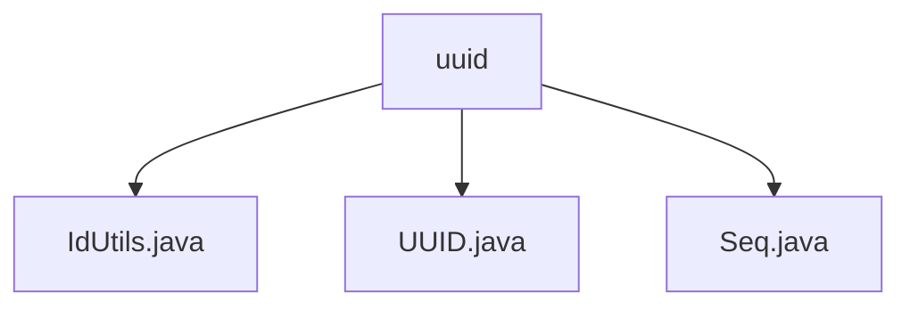

# 基础信息

|      |      |
|------|------|
| 名称 | uuid |
| 编码语言 | .java |
| 代码路径 | RuoYi-main/ruoyi-common/src/main/java/com/ruoyi/common/utils/uuid |
| 包名 | RuoYi-main.ruoyi-common.src.main.java.com.ruoyi.common.utils.uuid |
| 概述说明 | IdUtils类提供两种UUID生成方法，简化版和性能优化版。UUID类支持多种生成方式和字符串转换。Seq类生成唯一序列号，包含日期、机器标识和递增数值。 |

# 说明

## 概述
该代码模块主要提供了生成唯一标识符的工具类，包括随机UUID、序列号等。这些工具类适用于不同的业务场景，能够满足高并发、高性能以及唯一性等需求。模块中的工具类设计灵活，用户可以根据具体场景选择合适的方法来生成唯一标识符。

## 主要业务场景
1. **生成随机UUID**：
   - **IdUtils类**：提供了两种生成UUID的方法，简化版适用于一般场景，性能优化版适用于高并发或高性能需求，确保在大量生成UUID时仍能保持较高的效率。
   - **UUID类**：实现了序列化和比较接口，支持多种生成方式（随机生成和基于名称生成），并提供了与字符串之间的转换功能，便于在不同场景下使用。

2. **生成唯一序列号**：
   - **Seq类**：用于生成通用和上传序列号，序列号包含日期、机器标识和递增数值三个部分，确保每个序列号的唯一性和顺序性。适用于需要唯一标识的场景，如订单号、交易号等。

该模块的工具类广泛应用于需要生成唯一标识符的业务场景，如用户注册、订单生成、文件上传等，确保了系统的高效性和数据的唯一性。

### 包内部结构视图

该流程图展示了在`uuid`目录下的三个文件：`IdUtils.java`、`UUID.java`和`Seq.java`。这些文件都位于同一层级，且都属于`uuid`目录，表明它们是该目录下的主要实现文件，可能用于生成和处理唯一标识符或序列号。

# 文件列表 File List

| 名称   | 类型  | 说明 |
|-------|------|-------------|
| [Seq.java](Seq.md) | file | Seq类生成序列号，包含日期、机器标识和递增数值。 |
| [UUID.java](UUID.md) | file | UUID类实现序列化和比较接口，支持随机生成、名称生成及字符串转换，包含高低64位。 |
| [IdUtils.java](IdUtils.md) | file | IdUtils类提供生成随机UUID的简化版和性能优化版方法。 |

