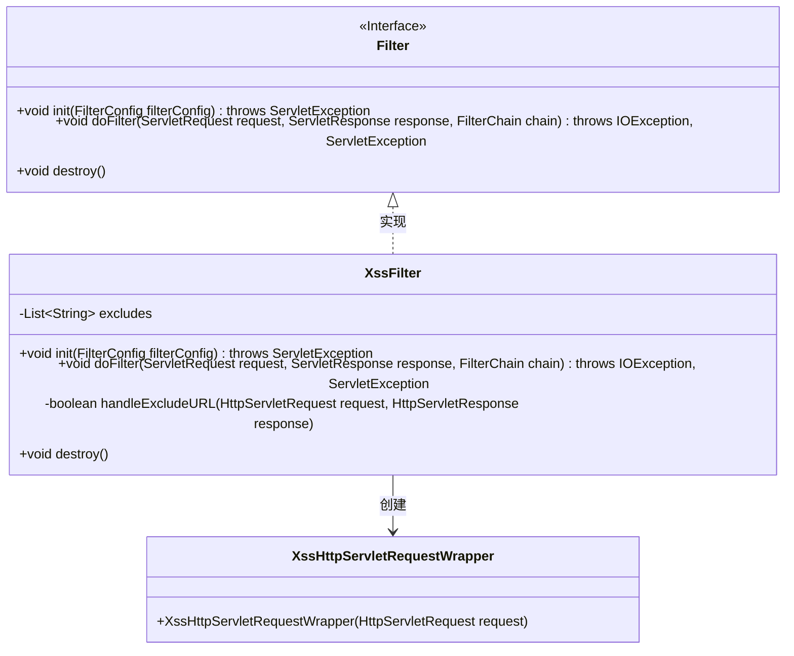
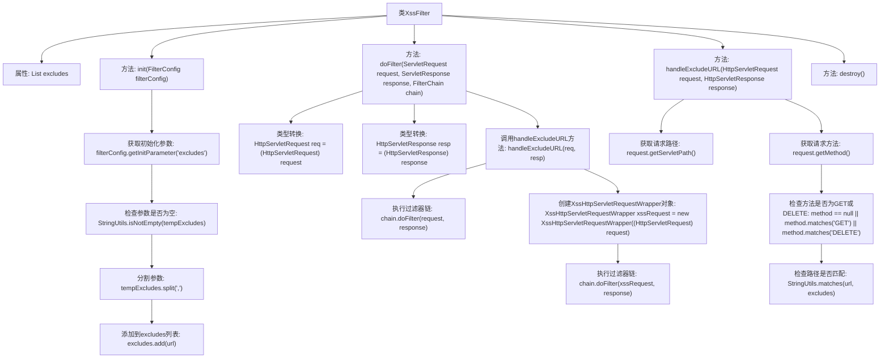

# 基础信息

|      |      |
|------|------|
| 名称 | XssFilter |
| 编码语言 | .java |
| 代码路径 | RuoYi-main/ruoyi-common/src/main/java/com/ruoyi/common/xss/XssFilter.java |
| 包名 | com.ruoyi.common.xss |
| 依赖项 | ['java.io.IOException', 'java.util.ArrayList', 'java.util.List', 'javax.servlet.Filter', 'javax.servlet.FilterChain', 'javax.servlet.FilterConfig', 'javax.servlet.ServletException', 'javax.servlet.ServletRequest', 'javax.servlet.ServletResponse', 'javax.servlet.http.HttpServletRequest', 'javax.servlet.http.HttpServletResponse', 'com.ruoyi.common.utils.StringUtils'] |
| 概述说明 | XssFilter类过滤功能，排除指定URL，处理GET和DELETE请求。 |

# 说明

XssFilter类具备过滤功能，能够有效排除指定URL，同时支持处理GET和DELETE请求。该类的设计旨在增强安全性，防止跨站脚本攻击（XSS），确保在处理不同类型请求时，能够针对特定URL进行过滤操作，从而提升系统的整体安全性。

# 类列表 Class Summary

| 名称   | 类型  | 说明 |
|-------|------|-------------|
| XssFilter | class | XssFilter类实现过滤功能，排除指定URL，处理GET和DELETE请求。 |

## 类 XssFilter

|      |      |
|------|------|
| 访问范围 | public |
| 类型 | class |
| 名称 | XssFilter |
| 说明 | XssFilter类实现过滤功能，排除指定URL，处理GET和DELETE请求。 |

### UML类图

这段代码定义了一个 `XssFilter` 类，它实现了 `Filter` 接口，用于过滤 HTTP 请求中的跨站脚本攻击（XSS）。`XssFilter` 类通过 `init` 方法初始化排除的 URL 列表，`doFilter` 方法根据请求的 URL 和方法决定是否进行过滤，`handleExcludeURL` 方法用于判断当前请求是否需要排除过滤。`XssHttpServletRequestWrapper` 类用于包装 HTTP 请求，以便进行 XSS 过滤。

### 内部方法调用关系图

这段代码定义了一个名为`XssFilter`的类，用于过滤HTTP请求中的跨站脚本攻击（XSS）。它通过`init`方法初始化排除链接列表，`doFilter`方法处理请求并决定是否进行过滤，`handleExcludeURL`方法判断请求是否在排除列表中，`destroy`方法用于销毁过滤器。代码通过检查请求方法和路径来决定是否跳过过滤，确保某些请求不受影响。

### 字段列表 Field List

| 名称  | 类型  | 说明 |
|-------|-------|------|
| excludes = new ArrayList<>() | List<String> | 创建一个名为`excludes`的字符串列表。 |

### 方法列表 Method List

| 名称  | 类型  | 说明 |
|-------|-------|------|
| handleExcludeURL | boolean | 方法检查请求URL和方法，GET和DELETE方法不处理，其他方法匹配排除列表。 |
| destroy | void | 重写destroy方法，无具体实现。 |
| doFilter | void | 过滤器处理请求，排除特定URL后执行XSS防护。 |
| init | void | 重写init方法，解析excludes参数并存入集合。 |

