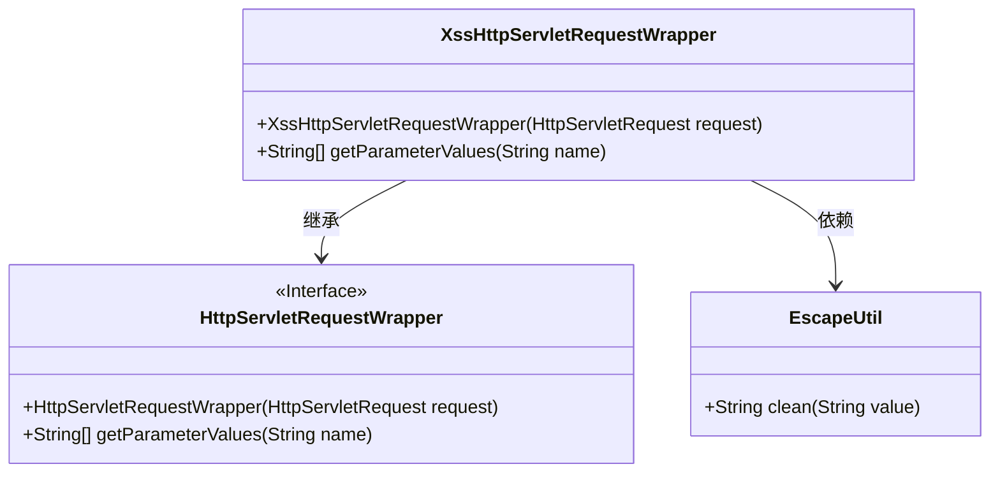
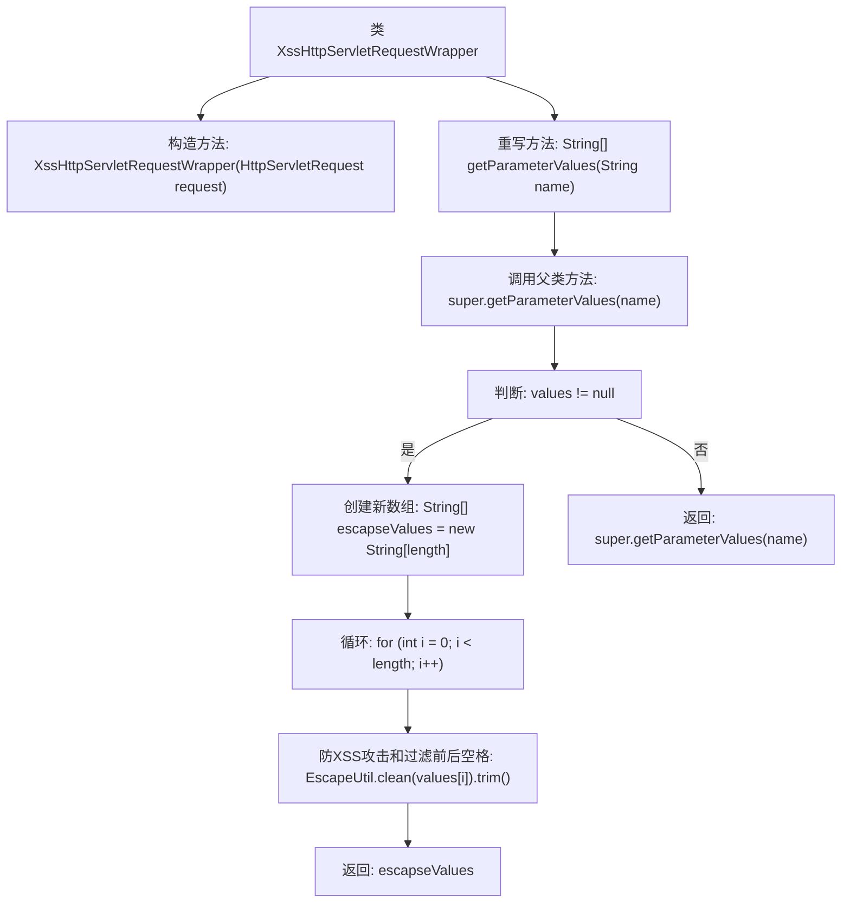

# 基础信息

|      |      |
|------|------|
| 名称 | XssHttpServletRequestWrapper |
| 编码语言 | .java |
| 代码路径 | RuoYi-main/ruoyi-common/src/main/java/com/ruoyi/common/xss/XssHttpServletRequestWrapper.java |
| 包名 | com.ruoyi.common.xss |
| 依赖项 | ['javax.servlet.http.HttpServletRequest', 'javax.servlet.http.HttpServletRequestWrapper', 'com.ruoyi.common.utils.html.EscapeUtil'] |
| 概述说明 | XssHttpServletRequestWrapper类防XSS攻击并过滤参数空格。 |

# 说明

XssHttpServletRequestWrapper类的主要功能是防止跨站脚本攻击（XSS），并自动过滤请求参数值的前后空格。通过封装HTTP请求，该类确保传入的参数在处理前已去除不必要的空白字符，并有效拦截潜在的恶意脚本注入，从而增强应用程序的安全性。

# 类列表 Class Summary

| 名称   | 类型  | 说明 |
|-------|------|-------------|
| XssHttpServletRequestWrapper | class | XssHttpServletRequestWrapper类用于防止XSS攻击并过滤参数值的前后空格。 |

## 类 XssHttpServletRequestWrapper

|      |      |
|------|------|
| 访问范围 | public |
| 类型 | class |
| 名称 | XssHttpServletRequestWrapper |
| 说明 | XssHttpServletRequestWrapper类用于防止XSS攻击并过滤参数值的前后空格。 |

### UML类图

类图描述：`XssHttpServletRequestWrapper`类继承自`HttpServletRequestWrapper`，并重写了`getParameterValues`方法，用于处理HTTP请求参数中的XSS攻击和前后空格过滤。该类依赖于`EscapeUtil`工具类，调用其`clean`方法对参数进行清洗。通过这种方式，`XssHttpServletRequestWrapper`增强了原始请求的安全性，防止XSS攻击。

### 内部方法调用关系图

这段代码定义了一个`XssHttpServletRequestWrapper`类，继承自`HttpServletRequestWrapper`，主要用于防止XSS攻击。它重写了`getParameterValues`方法，首先调用父类的方法获取参数值，然后检查这些值是否为空。如果不为空，则创建一个新数组，对每个值进行XSS攻击防护和前后空格过滤，最后返回处理后的数组。如果值为空，则直接返回父类的方法结果。

### 字段列表 Field List

| 名称  | 类型  | 说明 |
|-------|-------|------|

### 方法列表 Method List

| 名称  | 类型  | 说明 |
|-------|-------|------|
| getParameterValues | String[] | 重写方法，防XSS攻击并过滤参数值前后空格。 |

