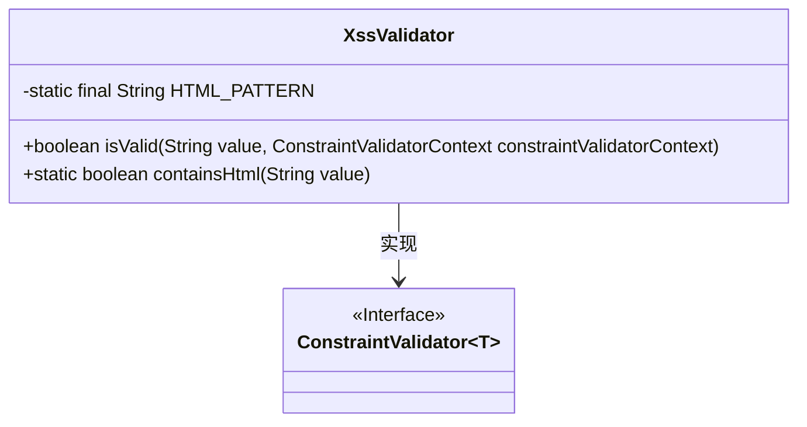
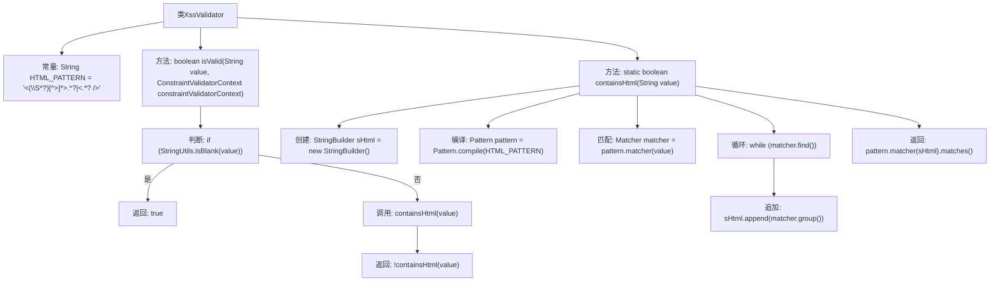

# 基础信息

|      |      |
|------|------|
| 名称 | XssValidator |
| 编码语言 | .java |
| 代码路径 | RuoYi-main/ruoyi-common/src/main/java/com/ruoyi/common/xss/XssValidator.java |
| 包名 | com.ruoyi.common.xss |
| 依赖项 | ['com.ruoyi.common.utils.StringUtils', 'javax.validation.ConstraintValidator', 'javax.validation.ConstraintValidatorContext', 'java.util.regex.Matcher', 'java.util.regex.Pattern'] |
| 概述说明 | XssValidator类验证字符串，防止XSS攻击。 |

# 说明

XssValidator类的主要功能是验证输入字符串中是否包含HTML标签，以防止跨站脚本攻击（XSS）。通过检测和过滤潜在的恶意标签，该类帮助确保应用程序的安全性，防止攻击者通过注入恶意脚本代码来危害系统或用户数据。

# 类列表 Class Summary

| 名称   | 类型  | 说明 |
|-------|------|-------------|
| XssValidator | class | XssValidator类用于验证字符串是否包含HTML标签，避免XSS攻击。 |

## 类 XssValidator

|      |      |
|------|------|
| 访问范围 | public |
| 类型 | class |
| 名称 | XssValidator |
| 说明 | XssValidator类用于验证字符串是否包含HTML标签，避免XSS攻击。 |

### UML类图

**描述：**

`XssValidator` 类实现了 `ConstraintValidator` 接口，用于验证字符串是否包含 HTML 标签。该类包含一个静态常量 `HTML_PATTERN`，用于匹配 HTML 标签的正则表达式。`isValid` 方法用于检查输入字符串是否为空或仅包含空白字符，若为空则返回 `true`，否则调用 `containsHtml` 方法检查是否包含 HTML 标签。`containsHtml` 方法使用正则表达式匹配输入字符串中的 HTML 标签，并返回是否匹配成功。

### 内部方法调用关系图

这段代码定义了一个名为`XssValidator`的类，用于验证字符串是否包含HTML标签。`isValid`方法首先检查输入字符串是否为空或空白，如果是则返回`true`，否则调用`containsHtml`方法检查字符串是否包含HTML标签。`containsHtml`方法使用正则表达式匹配HTML标签，并将匹配到的标签追加到`StringBuilder`中，最后返回是否匹配的结果。流程图清晰地展示了类内部方法的调用关系和逻辑流程。

### 字段列表 Field List

| 名称  | 类型  | 说明 |
|-------|-------|------|
| HTML_PATTERN = "<(\\S*?)[^>]*>.*?|<.*? />" | String | 定义HTML标签匹配的正则表达式模式。 |

### 方法列表 Method List

| 名称  | 类型  | 说明 |
|-------|-------|------|
| containsHtml | boolean | 该方法检查字符串是否包含HTML标签。 |
| isValid | boolean | 该方法校验字符串值，若为空则有效，否则检查是否包含HTML标签。 |

