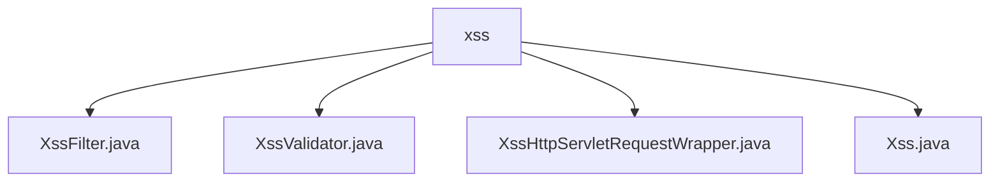

# 基础信息

|      |      |
|------|------|
| 名称 | xss |
| 编码语言 | .java |
| 代码路径 | RuoYi-main/ruoyi-common/src/main/java/com/ruoyi/common/xss |
| 包名 | RuoYi-main.ruoyi-common.src.main.java.com.ruoyi.common.xss |
| 概述说明 | XssFilter类过滤URL防XSS，XssValidator类检测HTML标签，XssHttpServletRequestWrapper类过滤请求参数空格。 |

# 说明

## 概述
该代码模块主要专注于增强应用程序的安全性，特别是防止跨站脚本攻击（XSS）。模块包含多个类，分别负责过滤、验证和封装HTTP请求，以确保在处理用户输入时能够有效拦截潜在的恶意脚本注入，并去除不必要的空白字符。

## 主要业务场景
1. **XssFilter类**：负责过滤指定URL，支持处理GET和DELETE请求。通过增强安全性，防止跨站脚本攻击（XSS），确保在处理不同类型请求时，能够针对特定URL进行过滤操作，从而提升系统的整体安全性。
2. **XssValidator类**：用于验证输入字符串中是否包含HTML标签，以防止跨站脚本攻击（XSS）。通过检测和过滤潜在的恶意标签，确保应用程序的安全性，防止攻击者通过注入恶意脚本代码来危害系统或用户数据。
3. **XssHttpServletRequestWrapper类**：封装HTTP请求，防止跨站脚本攻击（XSS），并自动过滤请求参数值的前后空格。确保传入的参数在处理前已去除不必要的空白字符，并有效拦截潜在的恶意脚本注入，从而增强应用程序的安全性。
4. **Xss类**：未提供具体信息，无法进行详细描述。

### 包内部结构视图

该流程图展示了`xss`目录下的文件层级关系。`xss`作为根节点，包含了四个子节点，分别是`XssFilter.java`、`XssValidator.java`、`XssHttpServletRequestWrapper.java`和`Xss.java`。这些文件都与XSS（跨站脚本攻击）相关的功能实现有关，展示了它们在项目中的组织结构和依赖关系。

# 文件列表 File List

| 名称   | 类型  | 说明 |
|-------|------|-------------|
| [XssValidator.java](XssValidator.md) | file | XssValidator类验证字符串，防止XSS攻击。 |
| [Xss.java](Xss.md) | file | 信息为空，无法生成概要描述。 |
| [XssHttpServletRequestWrapper.java](XssHttpServletRequestWrapper.md) | file | XssHttpServletRequestWrapper类防XSS攻击并过滤参数空格。 |
| [XssFilter.java](XssFilter.md) | file | XssFilter类过滤功能，排除指定URL，处理GET和DELETE请求。 |

