# 基础信息

|      |      |
|------|------|
| 名称 | framework |
| 编码语言 | .java |
| 代码路径 | RuoYi-main/ruoyi-framework/src/main/java/com/ruoyi/framework |
| 包名 | RuoYi-main.ruoyi-framework.src.main.java.com.ruoyi.framework |
| 概述说明 | 代码模块涵盖异步任务、会话管理、资源清理、数据源切换、重复提交拦截、安全配置、权限验证、日志记录等功能，确保系统稳定性、安全性和高效性。 |

# 说明

## 概述

该代码模块是一个综合性的Java框架模块，涵盖了异步任务管理、会话管理、系统资源清理、用户认证与授权、数据源动态切换、防止重复提交请求、日志记录、数据权限过滤、权限检查等多个功能。模块通过多个核心类（如 `AsyncFactory`、`ShutdownManager`、`AsyncManager`、`UserRealm`、`DynamicDataSource` 等）和服务类（如 `PermissionService`、`ConfigService`、`CacheService` 等）的协同工作，确保了系统的稳定性、安全性、高效性和可扩展性。模块还通过AOP（面向切面编程）增强了系统的功能性和安全性，提供了全面的配置支持，适用于多种复杂的业务场景。

## 主要业务场景

1. **异步任务管理与资源清理**：
   - `AsyncFactory` 负责同步会话管理和操作日志记录，确保关键操作的一致性和可追溯性。
   - `ShutdownManager` 在系统关闭时负责清理会话、异步任务和缓存，避免资源泄漏。
   - `AsyncManager` 通过线程池管理异步任务，确保任务执行的可控性和安全性。

2. **用户认证与授权**：
   - `UserRealm` 实现用户认证和授权，管理用户角色和权限，确保系统访问的安全性。
   - `SysLoginService` 和 `SysPasswordService` 处理用户登录和密码验证，防止未授权访问和恶意攻击。

3. **会话管理**：
   - `OnlineSession` 和 `OnlineSessionDAO` 管理用户会话信息，确保会话的实时性和一致性。
   - `SyncOnlineSessionFilter` 和 `KickoutSessionFilter` 处理会话同步和会话数量管理，优化会话资源的分配。

4. **数据源动态切换**：
   - `DynamicDataSource` 实现多数据源的动态切换，支持复杂的数据源管理需求，提升系统的高可用性。

5. **防止重复提交请求**：
   - 通过拦截器机制防止重复提交请求，确保数据一致性和系统资源的有效利用，适用于高并发场景。

6. **日志记录与权限检查**：
   - `LogAspect` 记录操作日志，排除敏感信息，便于系统行为的追踪和分析。
   - `PermissionsAspect` 在方法执行前进行权限验证，确保用户具备相应权限，增强系统的安全性。

7. **数据权限过滤**：
   - `DataScopeAspect` 根据用户角色和权限过滤数据，防止未经授权的数据访问，保障数据安全。

8. **系统资源监控与全局异常处理**：
   - `Mem`、`Sys`、`SysFile`、`CPU`、`JVM` 等类监控服务器资源状态，确保系统运行的稳定性。
   - 全局异常处理器捕获和处理各类异常，提供清晰的错误反馈，提升用户体验和系统稳定性。

9. **配置管理与国际化支持**：
   - `ConfigService` 和 `I18nConfig` 提供灵活的配置管理和多语言支持，满足不同场景下的需求。
   - `ShiroConfig` 和 `FilterConfig` 实现系统的安全性配置，确保用户认证、授权和安全防护的高效管理。

通过这些功能，该模块为系统提供了全面的基础服务支持，适用于需要高安全性、高性能、高可用性和高扩展性的复杂业务场景。

### 包内部结构视图

```mermaid
graph TD
    framework --> manager
    framework --> shiro
    framework --> datasource
    framework --> interceptor
    framework --> config
    framework --> web
    manager --> factory
    manager --> ShutdownManager.java
    manager --> AsyncManager.java
    factory --> AsyncFactory.java
    shiro --> util
    shiro --> rememberMe
    shiro --> realm
    shiro --> service
    shiro --> session
    shiro --> web
    util --> AuthorizationUtils.java
    rememberMe --> CustomCookieRememberMeManager.java
    realm --> UserRealm.java
    service --> SysRegisterService.java
    service --> SysShiroService.java
    service --> SysLoginService.java
    service --> SysPasswordService.java
    session --> OnlineSession.java
    session --> OnlineSessionFactory.java
    session --> OnlineSessionDAO.java
    web --> filter
    web --> CustomShiroFilterFactoryBean.java
    web --> session
    filter --> sync
    filter --> LogoutFilter.java
    filter --> captcha
    filter --> online
    filter --> kickout
    sync --> SyncOnlineSessionFilter.java
    captcha --> CaptchaValidateFilter.java
    online --> OnlineSessionFilter.java
    kickout --> KickoutSessionFilter.java
    session --> OnlineWebSessionManager.java
    session --> SpringSessionValidationScheduler.java
    datasource --> DynamicDataSource.java
    interceptor --> RepeatSubmitInterceptor.java
    interceptor --> impl
    impl --> SameUrlDataInterceptor.java
    config --> MyBatisConfig.java
    config --> CaptchaConfig.java
    config --> KaptchaTextCreator.java
    config --> I18nConfig.java
    config --> ResourcesConfig.java
    config --> properties
    config --> FilterConfig.java
    config --> DruidConfig.java
    config --> ApplicationConfig.java
    config --> ShiroConfig.java
    properties --> PermitAllUrlProperties.java
    properties --> DruidProperties.java
    web --> service
    web --> domain
    web --> exception
    web --> aspectj
    service --> PermissionService.java
    service --> ConfigService.java
    service --> CacheService.java
    service --> DictService.java
    domain --> Server.java
    domain --> server
    server --> Mem.java
    server --> Sys.java
    server --> SysFile.java
    server --> Cpu.java
    server --> Jvm.java
    exception --> GlobalExceptionHandler.java
    aspectj --> LogAspect.java
    aspectj --> DataSourceAspect.java
    aspectj --> DataScopeAspect.java
    aspectj --> PermissionsAspect.java
```

该流程图展示了RuoYi框架中`ruoyi-framework`模块的目录结构及其层级关系。从`framework`根目录出发，逐步展开到各个子模块，如`manager`、`shiro`、`datasource`等，并进一步细化到具体的Java文件。每个节点仅显示路径的最后一级元素，清晰展示了模块之间的依赖关系和文件组织方式。

# 文件列表 File List

| 名称   | 类型  | 说明 |
|-------|------|-------------|
| [aspectj](aspectj/_module.md) | package | LogAspect记录操作日志，DataSourceAspect动态切换数据源，DataScopeAspect过滤数据权限，PermissionsAspect验证前置权限。 |
| [web](web/_module.md) | package | Java框架模块提供权限验证、配置管理、缓存操作、字典查询及资源监控功能，确保系统安全、高效运行。 |
| [config](config/_module.md) | package | MyBatis配置类设置别名包和映射文件，创建SqlSessionFactory。验证码配置类定义生成器Bean，控制外观和复杂度。数学表达式生成工具增强安全性。国际化配置支持多语言和拦截功能。WebMvc配置自定义首页和资源路径。匿名URL管理和数据库连接池配置提升系统安全性和效率。XSS过滤器配置灵活控制应用范围。Druid主从数据源配置提升高可用性。AOP代理机制增强切面编程能力。Shiro配置类实现会话、缓存、权限和验证码管理。 |
| [interceptor](interceptor/_module.md) | package | 抽象类实现拦截器，防止重复提交请求，提高系统效率和稳定性。 |
| [datasource](datasource/_module.md) | package | DynamicDataSource继承AbstractRoutingDataSource，实现动态数据源切换。 |
| [shiro](shiro/_module.md) | package | 清理缓存、优化权限存储、管理用户会话，提升系统安全性与性能。 |
| [manager](manager/_module.md) | package | AsyncFactory类支持会话管理、日志记录和登录信息管理。ShutdownManager类确保系统关闭时资源释放。AsyncManager类通过单例模式和线程池管理异步任务。 |

