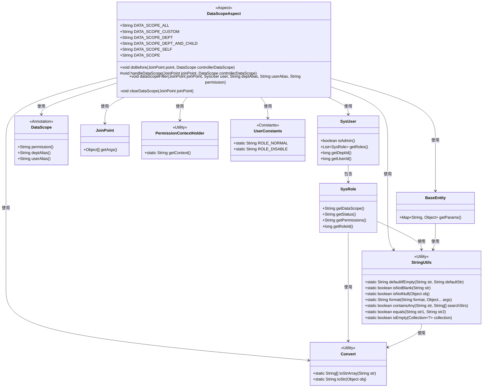
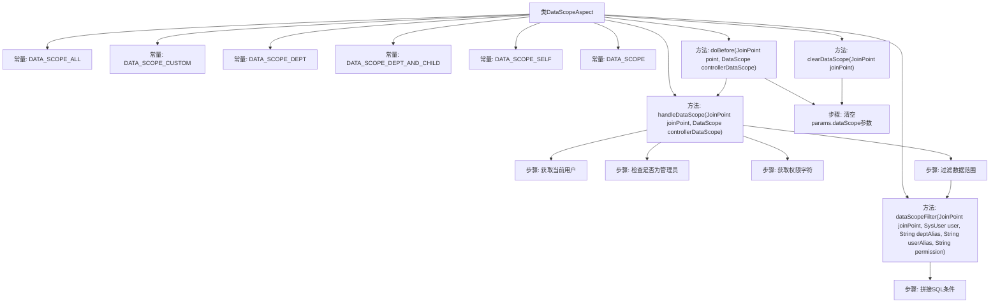

# 基础信息

|      |      |
|------|------|
| 名称 | DataScopeAspect |
| 编码语言 | .java |
| 代码路径 | RuoYi-main/ruoyi-framework/src/main/java/com/ruoyi/framework/aspectj/DataScopeAspect.java |
| 包名 | com.ruoyi.framework.aspectj |
| 依赖项 | ['java.util.ArrayList', 'java.util.List', 'org.aspectj.lang.JoinPoint', 'org.aspectj.lang.annotation.Aspect', 'org.aspectj.lang.annotation.Before', 'org.springframework.stereotype.Component', 'com.ruoyi.common.annotation.DataScope', 'com.ruoyi.common.constant.UserConstants', 'com.ruoyi.common.core.context.PermissionContextHolder', 'com.ruoyi.common.core.domain.BaseEntity', 'com.ruoyi.common.core.domain.entity.SysRole', 'com.ruoyi.common.core.domain.entity.SysUser', 'com.ruoyi.common.core.text.Convert', 'com.ruoyi.common.utils.ShiroUtils', 'com.ruoyi.common.utils.StringUtils'] |
| 概述说明 | DataScopeAspect类实现数据权限过滤，支持全部、自定义、部门等类型，保障数据安全。 |

# 说明

DataScopeAspect类是一个用于数据权限过滤的工具，支持多种权限类型，包括全部、自定义和部门等，旨在确保数据访问的安全性。通过该类的应用，可以有效控制不同用户或角色对数据的访问权限，从而防止未经授权的数据访问，保障系统的数据安全。

# 类列表 Class Summary

| 名称   | 类型  | 说明 |
|-------|------|-------------|
| DataScopeAspect | class | DataScopeAspect类用于数据权限过滤，支持多种权限类型，如全部、自定义、部门等，确保数据访问安全。 |

## 类 DataScopeAspect

|      |      |
|------|------|
| 访问范围 | @Aspect;@Component;public |
| 类型 | class |
| 名称 | DataScopeAspect |
| 说明 | DataScopeAspect类用于数据权限过滤，支持多种权限类型，如全部、自定义、部门等，确保数据访问安全。 |

### UML类图

这段代码定义了一个名为 `DataScopeAspect` 的切面类，用于处理数据权限的过滤。它通过 `@Before` 注解在方法执行前进行拦截，根据用户的角色和权限动态生成 SQL 过滤条件。代码中使用了多个工具类和常量类，如 `StringUtils`、`Convert` 和 `UserConstants`，来处理字符串操作、类型转换和常量定义。`SysUser` 和 `SysRole` 类分别表示用户和角色信息，`BaseEntity` 类用于存储 SQL 参数。整个切面类的设计旨在实现灵活的数据权限控制，确保不同角色的用户只能访问其权限范围内的数据。

### 内部方法调用关系图

**描述：**  
`DataScopeAspect`类是一个切面类，用于处理数据权限范围的控制。它定义了多个常量来表示不同的数据权限范围，并通过`doBefore`方法在目标方法执行前进行数据权限的过滤。`handleDataScope`方法负责获取当前用户并检查其权限，`dataScopeFilter`方法根据用户的角色和权限拼接SQL条件，`clearDataScope`方法用于清空`params.dataScope`参数以防止注入。整个流程通过切面技术实现了数据权限的动态控制。

### 字段列表 Field List

| 名称  | 类型  | 说明 |
|-------|-------|------|
| DATA_SCOPE_ALL = "1" | String | 定义常量DATA_SCOPE_ALL，值为"1"。 |
| DATA_SCOPE = "dataScope" | String | 定义静态常量DATA_SCOPE，值为"dataScope"。 |
| DATA_SCOPE_CUSTOM = "2" | String | 静态常量DATA_SCOPE_CUSTOM值为"2"。 |
| DATA_SCOPE_DEPT = "3" | String | 定义常量DATA_SCOPE_DEPT，值为"3"。 |
| DATA_SCOPE_SELF = "5" | String | 定义常量DATA_SCOPE_SELF，值为"5"。 |
| DATA_SCOPE_DEPT_AND_CHILD = "4" | String | 定义常量DATA_SCOPE_DEPT_AND_CHILD，值为"4"。 |

### 方法列表 Method List

| 名称  | 类型  | 说明 |
|-------|-------|------|
| doBefore | void | 方法在执行前清除并处理数据范围。 |
| handleDataScope | void | 方法处理数据范围，超级管理员不过滤，其他用户按权限过滤。 |
| clearDataScope | void | 清除数据范围，检查参数是否为BaseEntity并清空其数据范围值。 |
| dataScopeFilter | void | 根据用户角色和权限生成SQL过滤条件。 |

