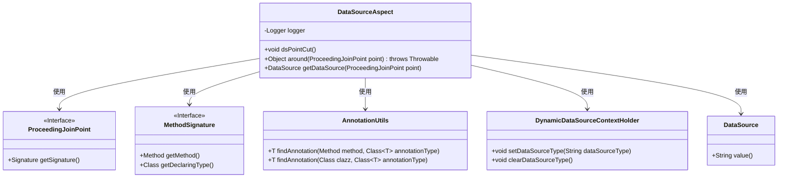
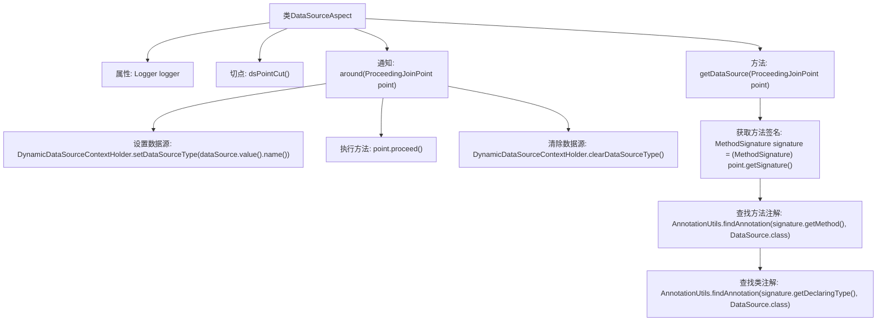

# 基础信息

|      |      |
|------|------|
| 名称 | DataSourceAspect |
| 编码语言 | .java |
| 代码路径 | RuoYi-main/ruoyi-framework/src/main/java/com/ruoyi/framework/aspectj/DataSourceAspect.java |
| 包名 | com.ruoyi.framework.aspectj |
| 依赖项 | ['java.util.Objects', 'org.aspectj.lang.ProceedingJoinPoint', 'org.aspectj.lang.annotation.Around', 'org.aspectj.lang.annotation.Aspect', 'org.aspectj.lang.annotation.Pointcut', 'org.aspectj.lang.reflect.MethodSignature', 'org.slf4j.Logger', 'org.slf4j.LoggerFactory', 'org.springframework.core.annotation.AnnotationUtils', 'org.springframework.core.annotation.Order', 'org.springframework.stereotype.Component', 'com.ruoyi.common.annotation.DataSource', 'com.ruoyi.common.config.datasource.DynamicDataSourceContextHolder', 'com.ruoyi.common.utils.StringUtils'] |
| 概述说明 | DataSourceAspect类通过注解动态切换和清理数据源。 |

# 说明

DataSourceAspect类的主要功能是实现数据源的动态切换，它通过注解机制来设置和清理数据源。具体来说，该类利用注解来标识和管理不同数据源的配置，确保在需要时能够正确切换数据源，并在操作完成后进行清理，以保证系统的稳定性和数据的一致性。这种方法简化了数据源的管理，提高了系统的灵活性和可维护性。

# 类列表 Class Summary

| 名称   | 类型  | 说明 |
|-------|------|-------------|
| DataSourceAspect | class | DataSourceAspect类用于动态切换数据源，通过注解实现数据源设置与清理。 |

## 类 DataSourceAspect

|      |      |
|------|------|
| 访问范围 | @Aspect;@Order(1);@Component;public |
| 类型 | class |
| 名称 | DataSourceAspect |
| 说明 | DataSourceAspect类用于动态切换数据源，通过注解实现数据源设置与清理。 |

### UML类图

**描述：**  
`DataSourceAspect` 是一个切面类，用于处理数据源的动态切换。它通过 `@Around` 注解在方法执行前后进行拦截，获取并设置数据源类型。`dsPointCut` 方法定义了切点，`around` 方法在方法执行前后处理数据源切换，`getDataSource` 方法用于获取需要切换的数据源。该类依赖于 `ProceedingJoinPoint`、`MethodSignature`、`AnnotationUtils`、`DynamicDataSourceContextHolder` 和 `DataSource` 等类或接口来实现其功能。

### 内部方法调用关系图

这段代码是一个使用Spring AOP的切面类`DataSourceAspect`，用于动态切换数据源。通过`@Pointcut`定义了切点`dsPointCut()`，匹配带有`@DataSource`注解的方法或类。`@Around`通知在方法执行前后进行数据源的设置和清理。`getDataSource`方法通过反射获取方法或类上的`@DataSource`注解，确定需要切换的数据源。

### 字段列表 Field List

| 名称  | 类型  | 说明 |
|-------|-------|------|
| logger = LoggerFactory.getLogger(getClass()) | Logger | 保护日志记录器实例，用于获取当前类的日志对象。 |

### 方法列表 Method List

| 名称  | 类型  | 说明 |
|-------|-------|------|
| around | Object | AOP环绕方法设置并清除动态数据源类型。 |
| dsPointCut | void | 定义切入点方法dsPointCut，匹配使用DataSource注解的类或方法。 |
| getDataSource | DataSource | 方法获取数据源注解，优先从方法查找，未找到则从类查找。 |

