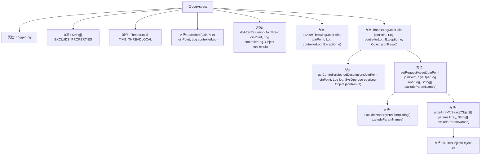

# 基础信息

|      |      |
|------|------|
| 名称 | LogAspect |
| 编码语言 | .java |
| 代码路径 | RuoYi-main/ruoyi-framework/src/main/java/com/ruoyi/framework/aspectj/LogAspect.java |
| 包名 | com.ruoyi.framework.aspectj |
| 依赖项 | ['java.util.Collection', 'java.util.Map', 'javax.servlet.http.HttpServletRequest', 'javax.servlet.http.HttpServletResponse', 'org.apache.commons.lang3.ArrayUtils', 'org.aspectj.lang.JoinPoint', 'org.aspectj.lang.annotation.AfterReturning', 'org.aspectj.lang.annotation.AfterThrowing', 'org.aspectj.lang.annotation.Aspect', 'org.aspectj.lang.annotation.Before', 'org.slf4j.Logger', 'org.slf4j.LoggerFactory', 'org.springframework.core.NamedThreadLocal', 'org.springframework.stereotype.Component', 'org.springframework.validation.BindingResult', 'org.springframework.web.multipart.MultipartFile', 'com.alibaba.fastjson.JSONObject', 'com.alibaba.fastjson.support.spring.PropertyPreFilters', 'com.ruoyi.common.annotation.Log', 'com.ruoyi.common.core.domain.entity.SysUser', 'com.ruoyi.common.core.text.Convert', 'com.ruoyi.common.enums.BusinessStatus', 'com.ruoyi.common.utils.ExceptionUtil', 'com.ruoyi.common.utils.ServletUtils', 'com.ruoyi.common.utils.ShiroUtils', 'com.ruoyi.common.utils.StringUtils', 'com.ruoyi.framework.manager.AsyncManager', 'com.ruoyi.framework.manager.factory.AsyncFactory', 'com.ruoyi.system.domain.SysOperLog'] |
| 概述说明 | LogAspect类记录操作日志，处理请求前后及异常，排除敏感字段，计算耗时并保存日志。 |

# 说明

LogAspect类是一个用于记录操作日志的工具，主要负责在请求处理前后及发生异常时进行日志记录。该类能够排除敏感字段，确保日志信息的安全性，同时计算操作耗时并将相关日志信息保存下来，以便后续分析和追踪。

# 类列表 Class Summary

| 名称   | 类型  | 说明 |
|-------|------|-------------|
| LogAspect | class | LogAspect类用于记录操作日志，处理请求前后及异常，排除敏感字段，计算耗时并保存日志。 |


## 类 LogAspect

|      |      |
|------|------|
| 访问范围 | @Aspect;@Component;public |
| 类型 | class |
| 名称 | LogAspect |
| 说明 | LogAspect类用于记录操作日志，处理请求前后及异常，排除敏感字段，计算耗时并保存日志。 |


### UML类图

```mermaid
classDiagram
    class LogAspect {
        -Logger log
        -String[] EXCLUDE_PROPERTIES
        -ThreadLocal~Long~ TIME_THREADLOCAL
        +doBefore(JoinPoint joinPoint, Log controllerLog) void
        +doAfterReturning(JoinPoint joinPoint, Log controllerLog, Object jsonResult) void
        +doAfterThrowing(JoinPoint joinPoint, Log controllerLog, Exception e) void
        #handleLog(JoinPoint joinPoint, Log controllerLog, Exception e, Object jsonResult) void
        +getControllerMethodDescription(JoinPoint joinPoint, Log log, SysOperLog operLog, Object jsonResult) void
        -setRequestValue(JoinPoint joinPoint, SysOperLog operLog, String[] excludeParamNames) void
        +excludePropertyPreFilter(String[] excludeParamNames) PropertyPreFilters.MySimplePropertyPreFilter
        -argsArrayToString(Object[] paramsArray, String[] excludeParamNames) String
        +isFilterObject(Object o) boolean
    }

    class SysOperLog {
        +setStatus(int status) void
        +setOperIp(String ip) void
        +setOperUrl(String url) void
        +setOperName(String name) void
        +setDeptName(String deptName) void
        +setErrorMsg(String errorMsg) void
        +setMethod(String method) void
        +setRequestMethod(String method) void
        +setCostTime(long costTime) void
        +setBusinessType(int businessType) void
        +setTitle(String title) void
        +setOperatorType(int operatorType) void
        +setJsonResult(String jsonResult) void
        +setOperParam(String operParam) void
    }

    class Log {
        <<Interface>>
        +businessType() BusinessType
        +title() String
        +operatorType() OperatorType
        +isSaveRequestData() boolean
        +isSaveResponseData() boolean
        +excludeParamNames() String[]
    }

    class PropertyPreFilters {
        +addFilter() MySimplePropertyPreFilter
        +addExcludes(String[] excludes) void
        class MySimplePropertyPreFilter {
            <<Interface>>
        }
    }

    class AsyncManager {
        +me() AsyncManager
        +execute(Runnable task) void
    }

    class AsyncFactory {
        +recordOper(SysOperLog operLog) Runnable
    }

    LogAspect --> Log : 依赖
    LogAspect --> SysOperLog : 依赖
    LogAspect --> PropertyPreFilters : 依赖
    LogAspect --> AsyncManager : 依赖
    LogAspect --> AsyncFactory : 依赖
```

### 描述
`LogAspect` 类是一个基于AOP的日志切面，用于在方法执行前后记录操作日志。它通过`@Before`、`@AfterReturning`和`@AfterThrowing`注解来捕获方法执行的不同阶段，并调用`handleLog`方法来处理日志记录。`Log`接口定义了日志的元数据，`SysOperLog`类用于存储操作日志的详细信息。`PropertyPreFilters`类用于过滤敏感属性，`AsyncManager`和`AsyncFactory`类用于异步保存日志。整个切面通过AOP机制实现了日志的自动记录和处理。


### 内部方法调用关系图



这段代码是一个基于Spring AOP的日志切面类`LogAspect`，用于记录控制器方法的执行情况。它通过`@Before`、`@AfterReturning`和`@AfterThrowing`注解分别在方法执行前、成功返回后和抛出异常时执行相应的日志记录操作。`handleLog`方法负责处理日志的具体逻辑，包括获取用户信息、设置操作日志的各个字段、处理异常信息、计算操作耗时等。`getControllerMethodDescription`方法用于获取控制器方法的描述信息，`setRequestValue`方法用于获取请求参数并设置到日志中。`excludePropertyPreFilter`和`argsArrayToString`方法用于过滤敏感属性和拼接参数，`isFilterObject`方法用于判断是否需要过滤的对象。整个流程通过`AsyncManager`异步保存日志记录。

### 字段列表 Field List

| 名称  | 类型  | 说明 |
|-------|-------|------|
| log = LoggerFactory.getLogger(LogAspect.class) | Logger | 定义LogAspect类的日志记录器实例。 |
| EXCLUDE_PROPERTIES = { "password", "oldPassword", "newPassword", "confirmPassword" } | String[] | 定义排除属性数组，包含密码相关字段。 |
| TIME_THREADLOCAL = new NamedThreadLocal<Long>("Cost Time") | ThreadLocal<Long> | 定义线程局部变量存储时间消耗。 |

### 方法列表 Method List

| 名称  | 类型  | 说明 |
|-------|-------|------|
| doBefore | void | 方法在执行前记录当前时间。 |
| argsArrayToString | String | 将对象数组转换为字符串，排除指定参数名。 |
| excludePropertyPreFilter | PropertyPreFilters.MySimplePropertyPreFilter | 方法创建并返回包含排除属性的过滤器实例。 |
| doAfterThrowing | void | 切面处理异常，记录日志。 |
| setRequestValue | void | 方法设置请求参数并截取前2000字符记录日志。 |
| doAfterReturning | void | 切面方法在控制器日志返回后处理日志。 |
| getControllerMethodDescription | void | 方法设置操作日志的业务类型、标题、操作人类别，并保存请求和响应数据。 |
| isFilterObject | boolean | 检查对象是否为MultipartFile、HttpServletRequest、HttpServletResponse或BindingResult类型。 |
| handleLog | void | 处理日志记录，包括用户信息、请求详情、异常状态及方法耗时，并异步保存至数据库。 |


