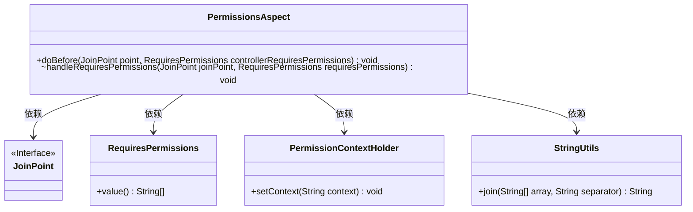
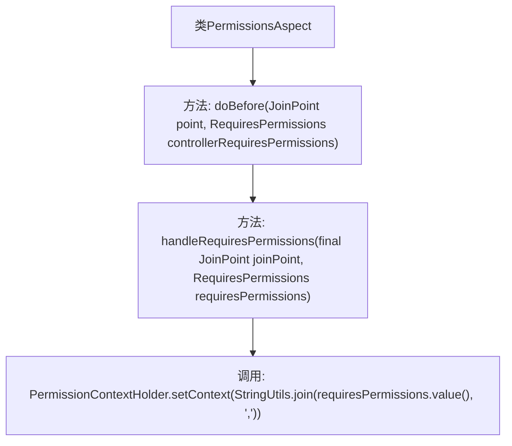

# 基础信息

|      |      |
|------|------|
| 名称 | PermissionsAspect |
| 编码语言 | .java |
| 代码路径 | RuoYi-main/ruoyi-framework/src/main/java/com/ruoyi/framework/aspectj/PermissionsAspect.java |
| 包名 | com.ruoyi.framework.aspectj |
| 依赖项 | ['org.apache.shiro.authz.annotation.RequiresPermissions', 'org.aspectj.lang.JoinPoint', 'org.aspectj.lang.annotation.Aspect', 'org.aspectj.lang.annotation.Before', 'org.springframework.stereotype.Component', 'com.ruoyi.common.core.context.PermissionContextHolder', 'com.ruoyi.common.utils.StringUtils'] |
| 概述说明 | 权限切面类通过前置处理注解设置权限上下文。 |

# 说明

权限切面类负责处理前置权限检查，通过注解方式设置权限上下文。该切面类在方法执行前进行权限验证，确保用户具备相应权限。通过注解配置，灵活定义权限需求，并在上下文中记录权限信息，便于后续操作和权限管理。这一机制提高了系统的安全性和可维护性。

# 类列表 Class Summary

| 名称   | 类型  | 说明 |
|-------|------|-------------|
| PermissionsAspect | class | 权限切面类，前置处理注解并设置权限上下文。 |

## 类 PermissionsAspect

|      |      |
|------|------|
| 访问范围 | @Aspect;@Component;public |
| 类型 | class |
| 名称 | PermissionsAspect |
| 说明 | 权限切面类，前置处理注解并设置权限上下文。 |

### UML类图

**描述：**
`PermissionsAspect` 类是一个切面类，用于处理权限相关的逻辑。它通过 `@Before` 注解在方法执行前调用 `doBefore` 方法，进而调用 `handleRequiresPermissions` 方法。`handleRequiresPermissions` 方法将 `RequiresPermissions` 注解中的权限信息拼接后设置到 `PermissionContextHolder` 中。`JoinPoint` 和 `RequiresPermissions` 是接口和注解类，分别提供方法执行的上下文和权限信息。`StringUtils` 是一个工具类，用于字符串操作。

### 内部方法调用关系图

该流程图展示了`PermissionsAspect`类的内部函数调用关系。`doBefore`方法在接收到`JoinPoint`和`RequiresPermissions`参数后，调用`handleRequiresPermissions`方法。`handleRequiresPermissions`方法进一步调用`PermissionContextHolder.setContext`，将`requiresPermissions.value()`拼接后的字符串设置为上下文。整个流程清晰地反映了权限处理的逻辑顺序。

### 字段列表 Field List

| 名称  | 类型  | 说明 |
|-------|-------|------|

### 方法列表 Method List

| 名称  | 类型  | 说明 |
|-------|-------|------|
| doBefore | void | 在执行特定注解前处理权限检查。 |
| handleRequiresPermissions | void | 处理权限需求，设置权限上下文。 |

