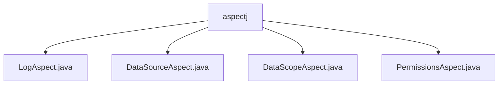

# 基础信息

|      |      |
|------|------|
| 名称 | aspectj |
| 编码语言 | .java |
| 代码路径 | RuoYi-main/ruoyi-framework/src/main/java/com/ruoyi/framework/aspectj |
| 包名 | RuoYi-main.ruoyi-framework.src.main.java.com.ruoyi.framework.aspectj |
| 概述说明 | LogAspect记录操作日志，DataSourceAspect动态切换数据源，DataScopeAspect过滤数据权限，PermissionsAspect验证前置权限。 |

# 说明

## 概述
该代码模块主要包含四个切面类，分别用于日志记录、数据源切换、数据权限过滤和权限检查。这些切面类通过AOP（面向切面编程）的方式，增强了系统的功能性和安全性。具体来说，`LogAspect`类负责记录操作日志，`DataSourceAspect`类实现数据源的动态切换，`DataScopeAspect`类用于数据权限过滤，`PermissionsAspect`类则处理前置权限检查。这些类共同协作，提升了系统的灵活性、可维护性和安全性。

## 主要业务场景
1. **日志记录**：`LogAspect`类在请求处理前后及发生异常时记录日志，能够排除敏感字段，确保日志信息的安全性，同时计算操作耗时，便于后续分析和追踪。
2. **数据源切换**：`DataSourceAspect`类通过注解机制实现数据源的动态切换，确保在需要时能够正确切换数据源，并在操作完成后进行清理，保证系统的稳定性和数据的一致性。
3. **数据权限过滤**：`DataScopeAspect`类支持多种权限类型，如全部、自定义和部门等，有效控制不同用户或角色对数据的访问权限，防止未经授权的数据访问，保障系统的数据安全。
4. **权限检查**：`PermissionsAspect`类在方法执行前进行权限验证，确保用户具备相应权限。通过注解配置，灵活定义权限需求，并在上下文中记录权限信息，便于后续操作和权限管理，提高系统的安全性和可维护性。

### 包内部结构视图

该流程图展示了`aspectj`文件夹下的四个Java文件，分别是`LogAspect.java`、`DataSourceAspect.java`、`DataScopeAspect.java`和`PermissionsAspect.java`。这些文件均位于`aspectj`目录下，表示它们属于同一个模块或功能组，可能是用于处理不同方面的切面编程。

# 文件列表 File List

| 名称   | 类型  | 说明 |
|-------|------|-------------|
| [PermissionsAspect.java](PermissionsAspect.md) | file | 权限切面类通过前置处理注解设置权限上下文。 |
| [LogAspect.java](LogAspect.md) | file | LogAspect类记录操作日志，处理请求前后及异常，排除敏感字段，计算耗时并保存日志。 |
| [DataSourceAspect.java](DataSourceAspect.md) | file | DataSourceAspect类通过注解动态切换和清理数据源。 |
| [DataScopeAspect.java](DataScopeAspect.md) | file | DataScopeAspect类实现数据权限过滤，支持全部、自定义、部门等类型，保障数据安全。 |

