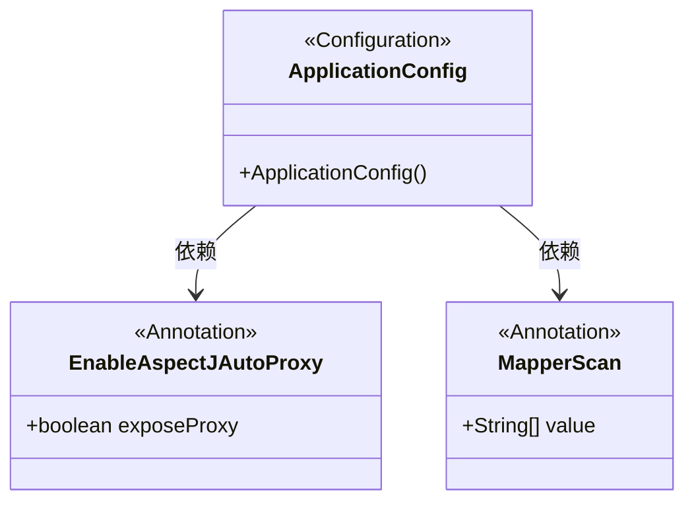
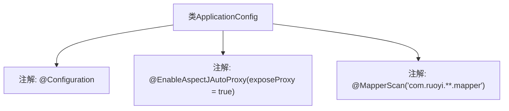

# 基础信息

|      |      |
|------|------|
| 名称 | ApplicationConfig |
| 编码语言 | .java |
| 代码路径 | RuoYi-main/ruoyi-framework/src/main/java/com/ruoyi/framework/config/ApplicationConfig.java |
| 包名 | com.ruoyi.framework.config |
| 依赖项 | ['org.mybatis.spring.annotation.MapperScan', 'org.springframework.context.annotation.Configuration', 'org.springframework.context.annotation.EnableAspectJAutoProxy'] |
| 概述说明 | 配置类启用AOP代理并指定Mapper扫描路径。 |

# 说明

该配置类通过启用AOP代理机制，增强了应用程序的面向切面编程能力，同时指定了Mapper接口的扫描路径，确保相关映射器能够被自动识别和加载，从而简化了数据访问层的配置和管理。

# 类列表 Class Summary

| 名称   | 类型  | 说明 |
|-------|------|-------------|
| ApplicationConfig | class | 配置类启用AOP代理并指定Mapper扫描路径。 |

## 类 ApplicationConfig

|      |      |
|------|------|
| 访问范围 | @Configuration;// 表示通过aop框架暴露该代理对象,AopContext能够访问;@EnableAspectJAutoProxy(exposeProxy = true);// 指定要扫描的Mapper类的包的路径;@MapperScan("com.ruoyi.**.mapper");public |
| 类型 | class |
| 名称 | ApplicationConfig |
| 说明 | 配置类启用AOP代理并指定Mapper扫描路径。 |

### UML类图

这段代码定义了一个名为 `ApplicationConfig` 的配置类，使用了 `@Configuration` 注解来标记它是一个配置类。该类还使用了 `@EnableAspectJAutoProxy` 注解来启用AspectJ自动代理，并通过 `exposeProxy = true` 参数暴露代理对象。此外，`@MapperScan` 注解用于指定要扫描的Mapper类的包路径。类图展示了 `ApplicationConfig` 类与 `EnableAspectJAutoProxy` 和 `MapperScan` 注解之间的依赖关系。

### 内部方法调用关系图

该流程图描述了`ApplicationConfig`类的结构及其使用的注解。`@Configuration`表示该类是一个配置类，`@EnableAspectJAutoProxy(exposeProxy = true)`启用了AspectJ自动代理并暴露代理对象，`@MapperScan("com.ruoyi.**.mapper")`指定了Mapper类扫描的包路径。这些注解共同定义了Spring应用配置的核心行为。

### 字段列表 Field List

| 名称  | 类型  | 说明 |
|-------|-------|------|

### 方法列表 Method List

| 名称  | 类型  | 说明 |
|-------|-------|------|

