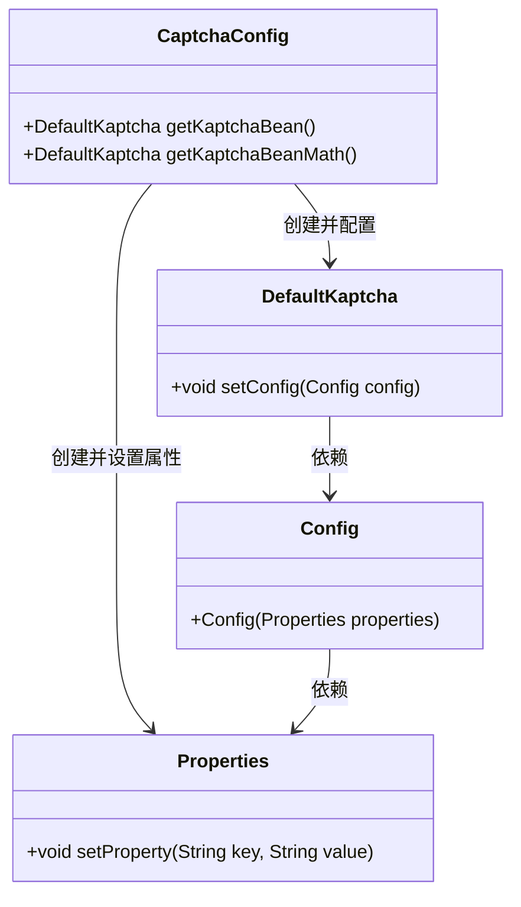

# 基础信息

|      |      |
|------|------|
| 名称 | CaptchaConfig |
| 编码语言 | .java |
| 代码路径 | RuoYi-main/ruoyi-framework/src/main/java/com/ruoyi/framework/config/CaptchaConfig.java |
| 包名 | com.ruoyi.framework.config |
| 依赖项 | ['java.util.Properties', 'org.springframework.context.annotation.Bean', 'org.springframework.context.annotation.Configuration', 'com.google.code.kaptcha.impl.DefaultKaptcha', 'com.google.code.kaptcha.util.Config', 'com.google.code.kaptcha.Constants'] |
| 概述说明 | CaptchaConfig类定义两个验证码生成器Bean，配置边框、颜色、尺寸、字体及字符长度。 |

# 说明

配置类CaptchaConfig定义了两个验证码生成器的Bean，每个生成器都配置了边框、颜色、尺寸、字体和字符长度等属性。这些属性用于控制验证码的外观和复杂度，确保生成的验证码符合安全性和用户体验的需求。

# 类列表 Class Summary

| 名称   | 类型  | 说明 |
|-------|------|-------------|
| CaptchaConfig | class | 配置类CaptchaConfig定义了两个验证码生成器Bean，分别设置边框、颜色、尺寸、字体、字符长度等属性。 |

## 类 CaptchaConfig

|      |      |
|------|------|
| 访问范围 | @Configuration;public |
| 类型 | class |
| 名称 | CaptchaConfig |
| 说明 | 配置类CaptchaConfig定义了两个验证码生成器Bean，分别设置边框、颜色、尺寸、字体、字符长度等属性。 |

### UML类图

**描述**：`CaptchaConfig`类是一个配置类，负责创建和配置两种类型的验证码生成器`DefaultKaptcha`。通过`Properties`类设置验证码的各种属性，如边框、颜色、大小等，并将这些属性传递给`Config`类，最终配置到`DefaultKaptcha`实例中。`getKaptchaBean`和`getKaptchaBeanMath`方法分别返回不同配置的验证码生成器实例。

### 内部方法调用关系图

```mermaid
graph TD
    A["类CaptchaConfig"]
    B["方法: getKaptchaBean()"]
    C["创建DefaultKaptcha对象"]
    D["创建Properties对象"]
    E["设置KAPTCHA_BORDER为'yes'"]
    F["设置KAPTCHA_TEXTPRODUCER_FONT_COLOR为'black'"]
    G["设置KAPTCHA_IMAGE_WIDTH为'160'"]
    H["设置KAPTCHA_IMAGE_HEIGHT为'60'"]
    I["设置KAPTCHA_TEXTPRODUCER_FONT_SIZE为'38'"]
    J["设置KAPTCHA_SESSION_CONFIG_KEY为'kaptchaCode'"]
    K["设置KAPTCHA_TEXTPRODUCER_CHAR_LENGTH为'4'"]
    L["设置KAPTCHA_TEXTPRODUCER_FONT_NAMES为'Arial,Courier'"]
    M["设置KAPTCHA_OBSCURIFICATOR_IMPL为'com.google.code.kaptcha.impl.ShadowGimpy'"]
    N["创建Config对象"]
    O["设置DefaultKaptcha的Config"]
    P["返回DefaultKaptcha对象"]
    Q["方法: getKaptchaBeanMath()"]
    R["创建DefaultKaptcha对象"]
    S["创建Properties对象"]
    T["设置KAPTCHA_BORDER为'yes'"]
    U["设置KAPTCHA_BORDER_COLOR为'105,179,90'"]
    V["设置KAPTCHA_TEXTPRODUCER_FONT_COLOR为'blue'"]
    W["设置KAPTCHA_IMAGE_WIDTH为'160'"]
    X["设置KAPTCHA_IMAGE_HEIGHT为'60'"]
    Y["设置KAPTCHA_TEXTPRODUCER_FONT_SIZE为'35'"]
    Z["设置KAPTCHA_SESSION_CONFIG_KEY为'kaptchaCodeMath'"]
    AA["设置KAPTCHA_TEXTPRODUCER_IMPL为'com.ruoyi.framework.config.KaptchaTextCreator'"]
    AB["设置KAPTCHA_TEXTPRODUCER_CHAR_SPACE为'3'"]
    AC["设置KAPTCHA_TEXTPRODUCER_CHAR_LENGTH为'6'"]
    AD["设置KAPTCHA_TEXTPRODUCER_FONT_NAMES为'Arial,Courier'"]
    AE["设置KAPTCHA_NOISE_COLOR为'white'"]
    AF["设置KAPTCHA_NOISE_IMPL为'com.google.code.kaptcha.impl.NoNoise'"]
    AG["设置KAPTCHA_OBSCURIFICATOR_IMPL为'com.google.code.kaptcha.impl.ShadowGimpy'"]
    AH["创建Config对象"]
    AI["设置DefaultKaptcha的Config"]
    AJ["返回DefaultKaptcha对象"]

    A --> B
    B --> C
    B --> D
    D --> E
    D --> F
    D --> G
    D --> H
    D --> I
    D --> J
    D --> K
    D --> L
    D --> M
    B --> N
    N --> O
    O --> P
    A --> Q
    Q --> R
    Q --> S
    S --> T
    S --> U
    S --> V
    S --> W
    S --> X
    S --> Y
    S --> Z
    S --> AA
    S --> AB
    S --> AC
    S --> AD
    S --> AE
    S --> AF
    S --> AG
    Q --> AH
    AH --> AI
    AI --> AJ
```

该流程图展示了`CaptchaConfig`类中两个方法`getKaptchaBean()`和`getKaptchaBeanMath()`的执行流程。每个方法首先创建`DefaultKaptcha`和`Properties`对象，然后通过设置`Properties`对象的多个属性来配置验证码的样式和行为，最后将配置应用到`DefaultKaptcha`对象并返回。流程图中详细描述了每个步骤的设置和操作，确保验证码生成器能够按照预期工作。

### 字段列表 Field List

| 名称  | 类型  | 说明 |
|-------|-------|------|

### 方法列表 Method List

| 名称  | 类型  | 说明 |
|-------|-------|------|
| getKaptchaBean | DefaultKaptcha | 创建验证码Bean，设置边框、颜色、尺寸、字体、样式等属性。 |
| getKaptchaBeanMath | DefaultKaptcha | 配置验证码生成器，设置边框、颜色、尺寸、字体、字符间距、长度、噪点及干扰样式。 |

