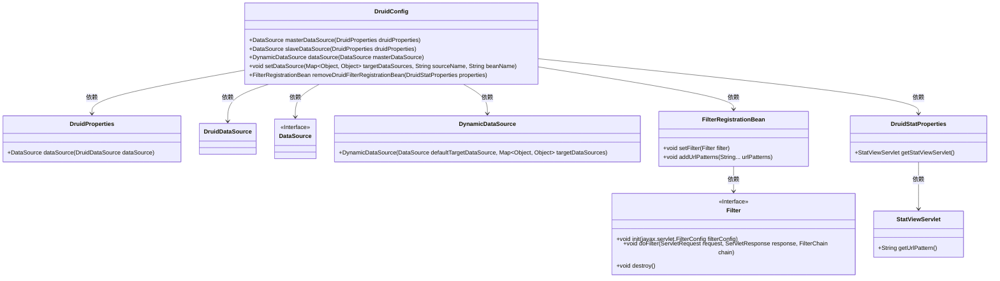
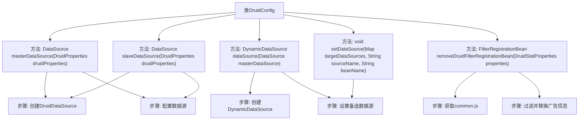

# 基础信息

|      |      |
|------|------|
| 名称 | DruidConfig |
| 编码语言 | .java |
| 代码路径 | RuoYi-main/ruoyi-framework/src/main/java/com/ruoyi/framework/config/DruidConfig.java |
| 包名 | com.ruoyi.framework.config |
| 依赖项 | ['java.io.IOException', 'java.util.HashMap', 'java.util.Map', 'javax.servlet.Filter', 'javax.servlet.FilterChain', 'javax.servlet.ServletException', 'javax.servlet.ServletRequest', 'javax.servlet.ServletResponse', 'javax.sql.DataSource', 'org.springframework.boot.autoconfigure.condition.ConditionalOnProperty', 'org.springframework.boot.context.properties.ConfigurationProperties', 'org.springframework.boot.web.servlet.FilterRegistrationBean', 'org.springframework.context.annotation.Bean', 'org.springframework.context.annotation.Configuration', 'org.springframework.context.annotation.Primary', 'com.alibaba.druid.pool.DruidDataSource', 'com.alibaba.druid.spring.boot.autoconfigure.DruidDataSourceBuilder', 'com.alibaba.druid.spring.boot.autoconfigure.properties.DruidStatProperties', 'com.alibaba.druid.util.Utils', 'com.ruoyi.common.enums.DataSourceType', 'com.ruoyi.common.utils.spring.SpringUtils', 'com.ruoyi.framework.config.properties.DruidProperties', 'com.ruoyi.framework.datasource.DynamicDataSource'] |
| 概述说明 | 配置Druid主从数据源，实现动态切换，移除监控页面广告。 |

# 说明

配置Druid主从数据源，实现动态切换功能，确保系统在主数据源故障时自动切换到从数据源，提升系统的高可用性和稳定性。同时，去除Druid监控页面的广告，优化用户体验，使监控页面更加简洁，便于开发者专注于数据源的监控和管理。

# 类列表 Class Summary

| 名称   | 类型  | 说明 |
|-------|------|-------------|
| DruidConfig | class | 配置Druid主从数据源，动态切换，并去除监控页面广告。 |

## 类 DruidConfig

|      |      |
|------|------|
| 访问范围 | @Configuration;public |
| 类型 | class |
| 名称 | DruidConfig |
| 说明 | 配置Druid主从数据源，动态切换，并去除监控页面广告。 |

### UML类图

**描述**：  
`DruidConfig`类是一个配置类，主要用于配置Druid数据源和动态数据源。它通过`masterDataSource`和`slaveDataSource`方法创建主从数据源，并通过`dataSource`方法配置动态数据源。此外，`DruidConfig`还包含一个`removeDruidFilterRegistrationBean`方法，用于去除Druid监控页面底部的广告。该类依赖于`DruidProperties`、`DruidDataSource`、`DataSource`、`DynamicDataSource`、`FilterRegistrationBean`和`DruidStatProperties`等类或接口，实现了数据源的动态管理和监控页面的自定义过滤。

### 内部方法调用关系图

这段代码定义了一个Spring配置类`DruidConfig`，用于配置和管理Druid数据源。它包含多个方法，分别用于创建主数据源、从数据源、动态数据源，以及设置备选数据源。此外，还包含一个方法用于去除Druid监控页面底部的广告。每个方法都通过特定的步骤实现其功能，如创建数据源、配置数据源、过滤并替换广告信息等。整个流程通过Spring的依赖注入和条件配置来确保数据源的正确初始化和广告过滤的有效性。

### 字段列表 Field List

| 名称  | 类型  | 说明 |
|-------|-------|------|

### 方法列表 Method List

| 名称  | 类型  | 说明 |
|-------|-------|------|
| dataSource | DynamicDataSource | 定义主数据源并配置动态数据源。 |
| removeDruidFilterRegistrationBean | FilterRegistrationBean | 根据配置启用Druid监控，过滤并修改common.js内容。 |
| slaveDataSource | DataSource | 配置从数据源，启用时基于Druid属性创建。 |
| setDataSource | void | 设置数据源，将beanName对应的DataSource存入targetDataSources。 |
| masterDataSource | DataSource | 配置主数据源，使用DruidProperties设置DruidDataSource。 |

