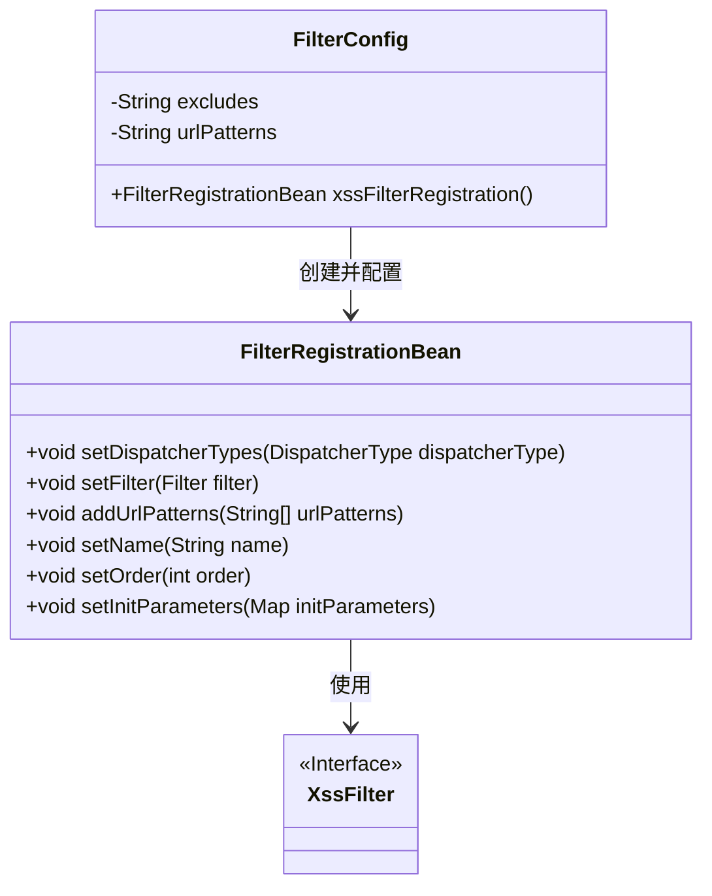
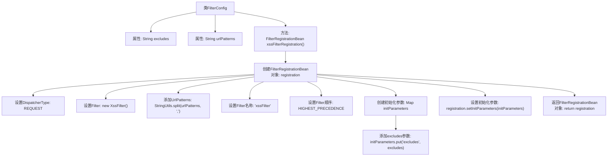

# 基础信息

|      |      |
|------|------|
| 名称 | FilterConfig |
| 编码语言 | .java |
| 代码路径 | RuoYi-main/ruoyi-framework/src/main/java/com/ruoyi/framework/config/FilterConfig.java |
| 包名 | com.ruoyi.framework.config |
| 依赖项 | ['java.util.HashMap', 'java.util.Map', 'javax.servlet.DispatcherType', 'org.springframework.beans.factory.annotation.Value', 'org.springframework.boot.autoconfigure.condition.ConditionalOnProperty', 'org.springframework.boot.web.servlet.FilterRegistrationBean', 'org.springframework.context.annotation.Bean', 'org.springframework.context.annotation.Configuration', 'com.ruoyi.common.utils.StringUtils', 'com.ruoyi.common.xss.XssFilter'] |
| 概述说明 | FilterConfig类通过xss.enabled属性注册XSS过滤器，配置URL模式和排除项。 |

# 说明

配置类FilterConfig根据xss.enabled属性的值来决定是否注册XSS过滤器。该配置类还负责设置过滤器的URL模式，以便指定哪些URL路径需要应用该过滤器。同时，配置类还支持设置排除项，用于指定哪些URL路径不应被过滤器处理。通过这些设置，FilterConfig能够灵活地控制XSS过滤器的应用范围，确保在需要的地方进行安全防护，同时在不需要的地方避免不必要的处理。

# 类列表 Class Summary

| 名称   | 类型  | 说明 |
|-------|------|-------------|
| FilterConfig | class | 配置类FilterConfig，根据xss.enabled属性注册XSS过滤器，设置URL模式和排除项。 |

## 类 FilterConfig

|      |      |
|------|------|
| 访问范围 | @Configuration;@ConditionalOnProperty(value = "xss.enabled", havingValue = "true");public |
| 类型 | class |
| 名称 | FilterConfig |
| 说明 | 配置类FilterConfig，根据xss.enabled属性注册XSS过滤器，设置URL模式和排除项。 |

### UML类图

这段代码定义了一个名为 `FilterConfig` 的配置类，用于配置和注册一个 XSS 过滤器。`FilterConfig` 类通过 `@ConditionalOnProperty` 注解控制是否启用该配置，并通过 `@Value` 注解从配置文件中读取 `xss.excludes` 和 `xss.urlPatterns` 参数。`xssFilterRegistration` 方法创建并配置了一个 `FilterRegistrationBean` 实例，设置了过滤器的调度类型、URL 模式、名称、优先级以及初始化参数。最终，该过滤器被注册到应用中，用于防止 XSS 攻击。

### 内部方法调用关系图

这段代码定义了一个Spring配置类`FilterConfig`，用于配置XSS过滤器。通过`@ConditionalOnProperty`注解，该类仅在`xss.enabled`属性为`true`时生效。类中包含两个属性`excludes`和`urlPatterns`，分别用于排除特定路径和指定过滤器应用的URL模式。`xssFilterRegistration`方法创建并配置了一个`FilterRegistrationBean`对象，设置了过滤器的类型、过滤器实例、URL模式、名称、顺序以及初始化参数，最后返回该对象。流程图清晰地展示了类的属性、方法以及方法内部的详细步骤。

### 字段列表 Field List

| 名称  | 类型  | 说明 |
|-------|-------|------|
| excludes | String | 排除XSS过滤的路径配置。 |
| urlPatterns | String | 配置XSS防护的URL模式字符串。 |

### 方法列表 Method List

| 名称  | 类型  | 说明 |
|-------|-------|------|
| xssFilterRegistration | FilterRegistrationBean | 注册XSS过滤器，设置请求类型、URL模式、名称、优先级及初始化参数。 |

