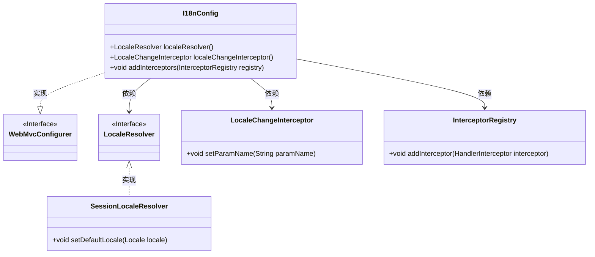
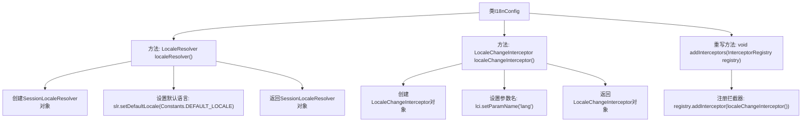

# 基础信息

|      |      |
|------|------|
| 名称 | I18nConfig |
| 编码语言 | .java |
| 代码路径 | RuoYi-main/ruoyi-framework/src/main/java/com/ruoyi/framework/config/I18nConfig.java |
| 包名 | com.ruoyi.framework.config |
| 依赖项 | ['org.springframework.context.annotation.Bean', 'org.springframework.context.annotation.Configuration', 'org.springframework.web.servlet.LocaleResolver', 'org.springframework.web.servlet.config.annotation.InterceptorRegistry', 'org.springframework.web.servlet.config.annotation.WebMvcConfigurer', 'org.springframework.web.servlet.i18n.LocaleChangeInterceptor', 'org.springframework.web.servlet.i18n.SessionLocaleResolver', 'com.ruoyi.common.constant.Constants'] |
| 概述说明 | 配置类实现国际化，设置默认语言和参数名，注册拦截器。 |

# 说明

配置类实现了国际化功能，通过设置默认语言和参数名来支持多语言环境。此外，该类还注册了拦截器，用于在请求处理过程中进行特定操作，确保系统能够根据用户的语言偏好动态调整响应内容。这一配置为应用程序提供了灵活的国际化和拦截功能，提升了用户体验和系统可扩展性。

# 类列表 Class Summary

| 名称   | 类型  | 说明 |
|-------|------|-------------|
| I18nConfig | class | 配置类实现国际化，默认语言和参数名设置，并注册拦截器。 |

## 类 I18nConfig

|      |      |
|------|------|
| 访问范围 | @Configuration;public |
| 类型 | class |
| 名称 | I18nConfig |
| 说明 | 配置类实现国际化，默认语言和参数名设置，并注册拦截器。 |

### UML类图

这段代码定义了一个配置类 `I18nConfig`，实现了 `WebMvcConfigurer` 接口，用于配置国际化相关的设置。`I18nConfig` 类中定义了两个 Bean：`localeResolver` 和 `localeChangeInterceptor`，分别用于解析用户的语言偏好和拦截语言切换请求。`localeResolver` 使用了 `SessionLocaleResolver` 来设置默认语言，而 `localeChangeInterceptor` 则通过 `setParamName` 方法指定了用于切换语言的请求参数名。最后，`addInterceptors` 方法将 `localeChangeInterceptor` 注册到拦截器链中。

### 内部方法调用关系图

这段代码定义了一个名为`I18nConfig`的配置类，用于处理国际化（i18n）相关的配置。类中定义了三个方法：`localeResolver()`用于创建并配置`SessionLocaleResolver`对象，设置默认语言；`localeChangeInterceptor()`用于创建并配置`LocaleChangeInterceptor`对象，设置语言切换的参数名；`addInterceptors()`方法则用于将`LocaleChangeInterceptor`注册到拦截器链中。通过这些配置，应用程序可以根据用户请求中的语言参数动态切换语言环境。

### 字段列表 Field List

| 名称  | 类型  | 说明 |
|-------|-------|------|

### 方法列表 Method List

| 名称  | 类型  | 说明 |
|-------|-------|------|
| addInterceptors | void | 重写方法，添加语言切换拦截器。 |
| localeResolver | LocaleResolver | 创建默认语言为常量的会话区域解析器。 |
| localeChangeInterceptor | LocaleChangeInterceptor | 创建LocaleChangeInterceptor实例，设置参数名为"lang"。 |

