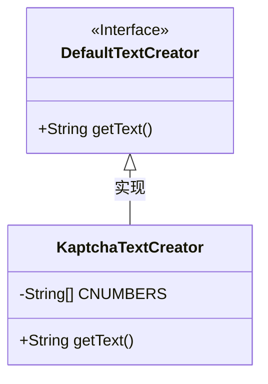
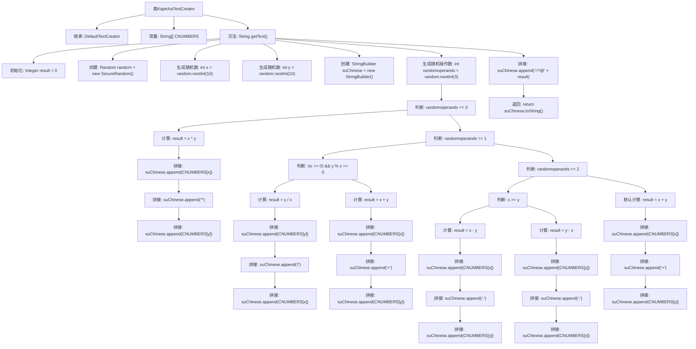

# 基础信息

|      |      |
|------|------|
| 名称 | KaptchaTextCreator |
| 编码语言 | .java |
| 代码路径 | RuoYi-main/ruoyi-framework/src/main/java/com/ruoyi/framework/config/KaptchaTextCreator.java |
| 包名 | com.ruoyi.framework.config |
| 依赖项 | ['java.security.SecureRandom', 'java.util.Random', 'com.google.code.kaptcha.text.impl.DefaultTextCreator'] |
| 概述说明 | KaptchaTextCreator生成随机数学表达式及结果。 |

# 说明

KaptchaTextCreator是一个用于生成随机数学表达式及其计算结果的工具。它能够自动创建包含加、减、乘、除等基本运算的数学问题，并同时提供这些问题的正确答案。该工具的主要用途是在需要验证用户身份或防止自动化脚本的场合，通过生成复杂的数学表达式来增强安全性。生成的表达式通常具有一定的难度，以确保其有效性。KaptchaTextCreator的设计旨在简化验证码的创建过程，同时保证其难以被机器破解。

# 类列表 Class Summary

| 名称   | 类型  | 说明 |
|-------|------|-------------|
| KaptchaTextCreator | class | KaptchaTextCreator生成随机数学表达式及其结果。 |

## 类 KaptchaTextCreator

|      |      |
|------|------|
| 访问范围 | public |
| 类型 | class |
| 名称 | KaptchaTextCreator |
| 说明 | KaptchaTextCreator生成随机数学表达式及其结果。 |

### UML类图

**描述：**  
`KaptchaTextCreator` 类继承自 `DefaultTextCreator` 接口，并实现了 `getText` 方法。该类用于生成随机的数学表达式作为验证码文本。通过随机生成两个数字和一个运算符（乘法、除法、加法或减法），构造出数学表达式，并将结果附加在表达式后返回。代码中使用了 `SecureRandom` 来确保随机数的安全性，并通过 `StringBuilder` 构建最终的字符串。

### 内部方法调用关系图

**描述：**
该代码实现了一个验证码文本生成器，继承自`DefaultTextCreator`类。通过随机生成两个0到9的整数，并根据随机操作数进行加、减、乘、除运算，最终生成一个包含运算结果的字符串。代码通过`StringBuilder`拼接运算表达式和结果，并返回最终的验证码文本。流程图详细展示了从随机数生成到最终字符串拼接的完整过程。

### 字段列表 Field List

| 名称  | 类型  | 说明 |
|-------|-------|------|
| CNUMBERS = "0,1,2,3,4,5,6,7,8,9,10".split(",") | String[] | 定义静态字符串数组CNUMBERS，包含数字0到10。 |

### 方法列表 Method List

| 名称  | 类型  | 说明 |
|-------|-------|------|
| getText | String | 随机生成10以内加减乘除运算，返回中文表达式及结果。 |

