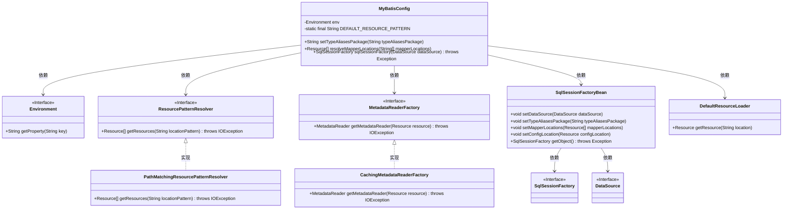
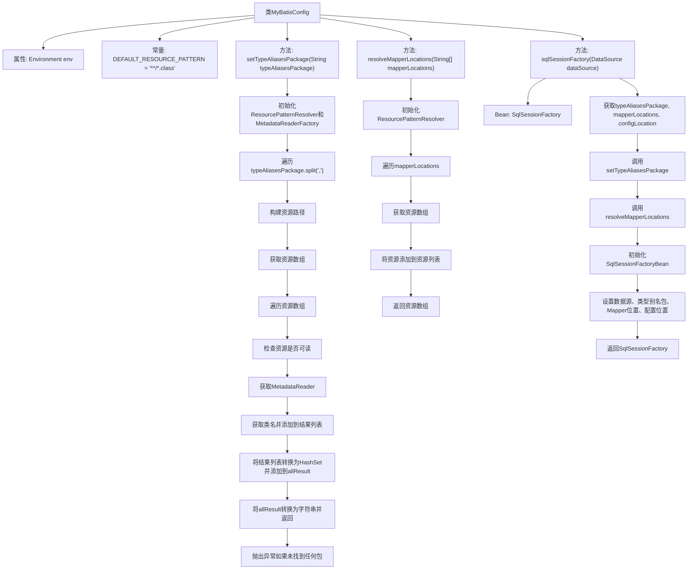

# 基础信息

|      |      |
|------|------|
| 名称 | MyBatisConfig |
| 编码语言 | .java |
| 代码路径 | RuoYi-main/ruoyi-framework/src/main/java/com/ruoyi/framework/config/MyBatisConfig.java |
| 包名 | com.ruoyi.framework.config |
| 依赖项 | ['java.io.IOException', 'java.util.ArrayList', 'java.util.Arrays', 'java.util.HashSet', 'java.util.List', 'javax.sql.DataSource', 'org.apache.ibatis.io.VFS', 'org.apache.ibatis.session.SqlSessionFactory', 'org.mybatis.spring.SqlSessionFactoryBean', 'org.mybatis.spring.boot.autoconfigure.SpringBootVFS', 'org.springframework.beans.factory.annotation.Autowired', 'org.springframework.context.annotation.Bean', 'org.springframework.context.annotation.Configuration', 'org.springframework.core.env.Environment', 'org.springframework.core.io.DefaultResourceLoader', 'org.springframework.core.io.Resource', 'org.springframework.core.io.support.PathMatchingResourcePatternResolver', 'org.springframework.core.io.support.ResourcePatternResolver', 'org.springframework.core.type.classreading.CachingMetadataReaderFactory', 'org.springframework.core.type.classreading.MetadataReader', 'org.springframework.core.type.classreading.MetadataReaderFactory', 'org.springframework.util.ClassUtils', 'com.ruoyi.common.utils.StringUtils'] |
| 概述说明 | MyBatis配置类设置别名包和映射文件，创建SqlSessionFactory。 |

# 说明

MyBatis配置类用于设置类型别名包和映射文件的位置，并创建SqlSessionFactory。类型别名包指定了哪些包中的类可以使用简化的别名，映射文件位置则指明了MyBatis如何找到XML映射文件。SqlSessionFactory是MyBatis的核心对象，用于生成SqlSession实例，进而执行数据库操作。

# 类列表 Class Summary

| 名称   | 类型  | 说明 |
|-------|------|-------------|
| MyBatisConfig | class | MyBatis配置类，设置类型别名包和映射文件位置，创建SqlSessionFactory。 |

## 类 MyBatisConfig

|      |      |
|------|------|
| 访问范围 | @Configuration;public |
| 类型 | class |
| 名称 | MyBatisConfig |
| 说明 | MyBatis配置类，设置类型别名包和映射文件位置，创建SqlSessionFactory。 |

### UML类图

这段代码定义了一个名为 `MyBatisConfig` 的配置类，用于配置 MyBatis 的 `SqlSessionFactory`。它通过 `Environment` 获取配置属性，使用 `ResourcePatternResolver` 和 `MetadataReaderFactory` 来解析类型别名包和映射器位置，并通过 `SqlSessionFactoryBean` 来创建 `SqlSessionFactory`。代码中涉及多个接口和实现类，用于处理资源解析和工厂创建。

### 内部方法调用关系图

这段代码是一个Spring配置类，用于配置MyBatis的SqlSessionFactory。它通过读取环境变量中的配置信息，动态设置MyBatis的类型别名包和Mapper文件位置，并最终创建并返回一个SqlSessionFactory实例。代码中包含了两个主要方法：`setTypeAliasesPackage`用于解析和设置类型别名包，`resolveMapperLocations`用于解析Mapper文件位置。`sqlSessionFactory`方法则整合了这些功能，最终生成SqlSessionFactory。

### 字段列表 Field List

| 名称  | 类型  | 说明 |
|-------|-------|------|
| env | Environment | 自动注入环境变量实例。 |
| DEFAULT_RESOURCE_PATTERN = "**/*.class" | String | 默认资源匹配模式为"**/*.class"。 |

### 方法列表 Method List

| 名称  | 类型  | 说明 |
|-------|-------|------|
| resolveMapperLocations | Resource[] | 解析指定路径的Mapper资源文件并返回资源数组。 |
| setTypeAliasesPackage | String | 方法扫描指定包路径，返回有效类包名，未找到则报错。 |
| sqlSessionFactory | SqlSessionFactory | 创建SqlSessionFactory，配置数据源、类型别名、映射器位置和配置文件位置。 |

