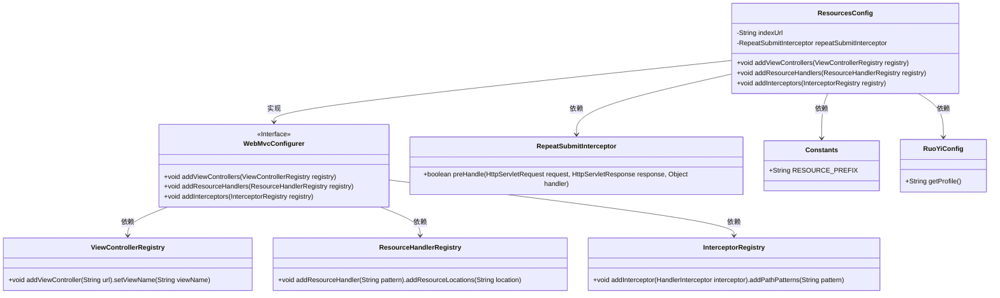
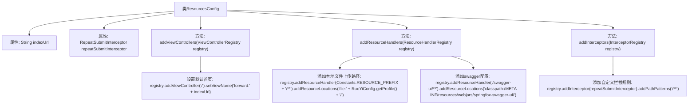

# 基础信息

|      |      |
|------|------|
| 名称 | ResourcesConfig |
| 编码语言 | .java |
| 代码路径 | RuoYi-main/ruoyi-framework/src/main/java/com/ruoyi/framework/config/ResourcesConfig.java |
| 包名 | com.ruoyi.framework.config |
| 依赖项 | ['org.springframework.beans.factory.annotation.Autowired', 'org.springframework.beans.factory.annotation.Value', 'org.springframework.context.annotation.Configuration', 'org.springframework.web.servlet.config.annotation.InterceptorRegistry', 'org.springframework.web.servlet.config.annotation.ResourceHandlerRegistry', 'org.springframework.web.servlet.config.annotation.ViewControllerRegistry', 'org.springframework.web.servlet.config.annotation.WebMvcConfigurer', 'com.ruoyi.common.config.RuoYiConfig', 'com.ruoyi.common.constant.Constants', 'com.ruoyi.framework.interceptor.RepeatSubmitInterceptor'] |
| 概述说明 | 配置类实现WebMvcConfigurer，设置首页、资源路径和拦截器。 |

# 说明

该配置类实现了WebMvcConfigurer接口，用于自定义Spring MVC的配置。主要功能包括设置应用程序的首页、配置静态资源的路径以及添加拦截器。通过实现该接口，可以灵活地调整MVC框架的行为，例如指定默认访问的首页页面、管理静态资源的访问路径以及定义请求拦截逻辑，从而增强应用程序的功能性和安全性。

# 类列表 Class Summary

| 名称   | 类型  | 说明 |
|-------|------|-------------|
| ResourcesConfig | class | 配置类实现WebMvcConfigurer，设置首页、资源路径和拦截器。 |

## 类 ResourcesConfig

|      |      |
|------|------|
| 访问范围 | @Configuration;public |
| 类型 | class |
| 名称 | ResourcesConfig |
| 说明 | 配置类实现WebMvcConfigurer，设置首页、资源路径和拦截器。 |

### UML类图

这段代码定义了一个Spring配置类`ResourcesConfig`，它实现了`WebMvcConfigurer`接口，用于配置Spring MVC的行为。该类通过`@Value`注解从配置文件中注入`indexUrl`，并通过`@Autowired`注入`RepeatSubmitInterceptor`拦截器。`ResourcesConfig`重写了`addViewControllers`方法，将根路径`/`重定向到`indexUrl`指定的页面；`addResourceHandlers`方法配置了本地文件上传路径和Swagger UI的资源路径；`addInterceptors`方法注册了自定义的拦截器`repeatSubmitInterceptor`，拦截所有请求路径。

### 内部方法调用关系图

**描述：**  
该流程图展示了`ResourcesConfig`类的结构及其方法调用关系。`ResourcesConfig`类通过实现`WebMvcConfigurer`接口，配置了默认首页、本地文件上传路径、swagger资源路径以及自定义拦截规则。每个方法的具体实现步骤通过箭头清晰地展示，如设置默认首页、添加资源处理器和拦截器等，确保配置的正确性和可维护性。

### 字段列表 Field List

| 名称  | 类型  | 说明 |
|-------|-------|------|
| repeatSubmitInterceptor | RepeatSubmitInterceptor | 自动注入重复提交拦截器实例。 |
| indexUrl | String | Shiro配置中用户登录后默认跳转的URL。 |

### 方法列表 Method List

| 名称  | 类型  | 说明 |
|-------|-------|------|
| addViewControllers | void | 重写方法，将根路径请求转发至指定URL。 |
| addInterceptors | void | 重写方法，添加拦截器并指定路径匹配规则。 |
| addResourceHandlers | void | 配置本地文件路径和Swagger资源处理器。 |

