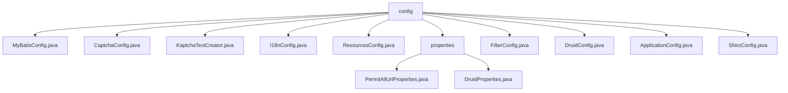

# 基础信息

|      |      |
|------|------|
| 名称 | config |
| 编码语言 | .java |
| 代码路径 | RuoYi-main/ruoyi-framework/src/main/java/com/ruoyi/framework/config |
| 包名 | RuoYi-main.ruoyi-framework.src.main.java.com.ruoyi.framework.config |
| 概述说明 | MyBatis配置类设置别名包和映射文件，创建SqlSessionFactory。验证码配置类定义生成器Bean，控制外观和复杂度。数学表达式生成工具增强安全性。国际化配置支持多语言和拦截功能。WebMvc配置自定义首页和资源路径。匿名URL管理和数据库连接池配置提升系统安全性和效率。XSS过滤器配置灵活控制应用范围。Druid主从数据源配置提升高可用性。AOP代理机制增强切面编程能力。Shiro配置类实现会话、缓存、权限和验证码管理。 |

# 说明

## 概述
该代码模块是一个综合性的配置模块，主要负责系统的核心配置、资源管理、安全性、国际化以及数据库连接等功能。通过多个配置类的实现，模块确保了系统在处理请求、管理资源、保障安全性和支持多语言环境等方面的高效性和灵活性。模块涵盖了从MyBatis的数据库操作配置到验证码生成、XSS过滤、主从数据源切换、AOP代理、Shiro安全框架等多个方面的功能，为系统提供了全面的配置支持。

## 主要业务场景
1. **数据库操作与连接池管理**：
   - `MyBatisConfig`类用于配置MyBatis的类型别名包和映射文件位置，并创建`SqlSessionFactory`，确保数据库操作的高效执行。
   - `DruidConfig`类配置Druid主从数据源，实现动态切换功能，提升系统的高可用性和稳定性。
   - `DruidProperties`类负责配置Druid连接池的参数，优化数据库连接的管理和性能。

2. **安全性配置**：
   - `CaptchaConfig`类定义验证码生成器的Bean，控制验证码的外观和复杂度，增强系统安全性。
   - `KaptchaTextCreator`类生成复杂的数学表达式验证码，用于防止自动化脚本攻击。
   - `FilterConfig`类根据配置决定是否启用XSS过滤器，并设置过滤器的URL模式和排除项，确保在需要的地方进行安全防护。
   - `ShiroConfig`类实现会话管理、缓存机制、过滤器设置、权限控制和验证码功能，确保系统在用户认证、授权和安全防护方面的高效管理。

3. **国际化与拦截器配置**：
   - `I18nConfig`类通过设置默认语言和参数名，支持多语言环境，并注册拦截器，动态调整响应内容，提升用户体验。
   - `ResourcesConfig`类自定义Spring MVC配置，设置首页、静态资源路径和拦截器，增强应用程序的功能性和安全性。

4. **AOP与Mapper接口管理**：
   - `ApplicationConfig`类启用AOP代理机制，增强面向切面编程能力，并指定Mapper接口的扫描路径，简化数据访问层的配置和管理。

5. **匿名访问URL管理**：
   - `PermitAllUrlProperties`类扫描Controller，汇总允许匿名访问的URL路径，确保系统能够正确处理无需身份验证的请求，适用于公开访问的接口场景。

通过这些配置类，模块为系统提供了全面的配置支持，确保其在安全性、性能、可扩展性和用户体验等方面达到预期目标。

### 包内部结构视图

该流程图展示了RuoYi框架中配置模块的层级关系。`config`作为根节点，包含了多个配置文件，如`MyBatisConfig.java`、`CaptchaConfig.java`等。同时，`config`下还有一个`properties`子节点，该子节点进一步包含了`PermitAllUrlProperties.java`和`DruidProperties.java`两个配置文件。整个结构清晰地反映了配置文件的组织方式。

# 文件列表 File List

| 名称   | 类型  | 说明 |
|-------|------|-------------|
| [ApplicationConfig.java](ApplicationConfig.md) | file | 配置类启用AOP代理并指定Mapper扫描路径。 |
| [ResourcesConfig.java](ResourcesConfig.md) | file | 配置类实现WebMvcConfigurer，设置首页、资源路径和拦截器。 |
| [CaptchaConfig.java](CaptchaConfig.md) | file | CaptchaConfig类定义两个验证码生成器Bean，配置边框、颜色、尺寸、字体及字符长度。 |
| [ShiroConfig.java](ShiroConfig.md) | file | Shiro配置类集成会话、缓存、过滤、权限及验证码功能。 |
| [DruidConfig.java](DruidConfig.md) | file | 配置Druid主从数据源，实现动态切换，移除监控页面广告。 |
| [FilterConfig.java](FilterConfig.md) | file | FilterConfig类通过xss.enabled属性注册XSS过滤器，配置URL模式和排除项。 |
| [I18nConfig.java](I18nConfig.md) | file | 配置类实现国际化，设置默认语言和参数名，注册拦截器。 |
| [KaptchaTextCreator.java](KaptchaTextCreator.md) | file | KaptchaTextCreator生成随机数学表达式及结果。 |
| [MyBatisConfig.java](MyBatisConfig.md) | file | MyBatis配置类设置别名包和映射文件，创建SqlSessionFactory。 |
| [properties](properties/_module.md) | package | PermitAllUrlProperties类收集匿名访问URL，DruidProperties类配置Druid连接池参数。 |

