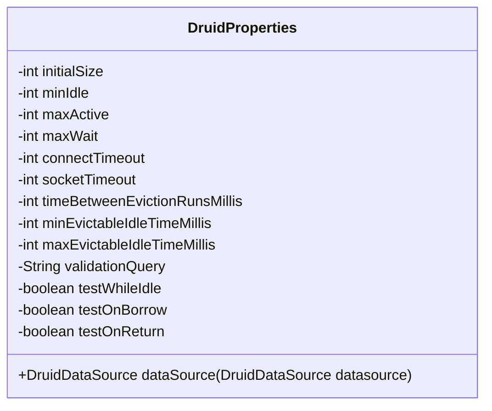

# 基础信息

|      |      |
|------|------|
| 名称 | DruidProperties |
| 编码语言 | .java |
| 代码路径 | RuoYi-main/ruoyi-framework/src/main/java/com/ruoyi/framework/config/properties/DruidProperties.java |
| 包名 | com.ruoyi.framework.config.properties |
| 依赖项 | ['org.springframework.beans.factory.annotation.Value', 'org.springframework.context.annotation.Configuration', 'com.alibaba.druid.pool.DruidDataSource'] |
| 概述说明 | DruidProperties类配置Druid数据源连接池参数。 |

# 说明

DruidProperties类用于配置Druid数据源的连接池参数，涵盖了初始化大小、最小空闲连接数、最大活跃连接数以及超时时间等关键设置。这些参数共同决定了连接池的行为和性能，确保数据库连接的高效管理和资源优化。

# 类列表 Class Summary

| 名称   | 类型  | 说明 |
|-------|------|-------------|
| DruidProperties | class | DruidProperties类配置了Druid数据源的连接池参数，包括初始化大小、最小空闲、最大活跃、超时时间等。 |

## 类 DruidProperties

|      |      |
|------|------|
| 访问范围 | @Configuration;public |
| 类型 | class |
| 名称 | DruidProperties |
| 说明 | DruidProperties类配置了Druid数据源的连接池参数，包括初始化大小、最小空闲、最大活跃、超时时间等。 |

### UML类图

**描述：**  
`DruidProperties` 类是一个配置类，用于管理和配置 Druid 数据库连接池的各种属性。它通过 `@Value` 注解从配置文件中读取属性值，并通过 `dataSource` 方法将这些属性应用到 `DruidDataSource` 实例中。这些属性包括连接池的初始化大小、最小空闲连接数、最大活跃连接数、连接超时时间、网络超时时间等。`dataSource` 方法负责将这些配置应用到传入的 `DruidDataSource` 对象中，并返回配置后的数据源实例。

### 内部方法调用关系图

```mermaid
graph TD
    A["类DruidProperties"]
    B["属性: int initialSize"]
    C["属性: int minIdle"]
    D["属性: int maxActive"]
    E["属性: int maxWait"]
    F["属性: int connectTimeout"]
    G["属性: int socketTimeout"]
    H["属性: int timeBetweenEvictionRunsMillis"]
    I["属性: int minEvictableIdleTimeMillis"]
    J["属性: int maxEvictableIdleTimeMillis"]
    K["属性: String validationQuery"]
    L["属性: boolean testWhileIdle"]
    M["属性: boolean testOnBorrow"]
    N["属性: boolean testOnReturn"]
    O["方法: DruidDataSource dataSource(DruidDataSource datasource)"]
    P["设置初始化大小: datasource.setInitialSize(initialSize)"]
    Q["设置最大连接数: datasource.setMaxActive(maxActive)"]
    R["设置最小空闲连接数: datasource.setMinIdle(minIdle)"]
    S["设置最大等待时间: datasource.setMaxWait(maxWait)"]
    T["设置连接超时时间: datasource.setConnectTimeout(connectTimeout)"]
    U["设置网络超时时间: datasource.setSocketTimeout(socketTimeout)"]
    V["设置检测间隔时间: datasource.setTimeBetweenEvictionRunsMillis(timeBetweenEvictionRunsMillis)"]
    W["设置最小生存时间: datasource.setMinEvictableIdleTimeMillis(minEvictableIdleTimeMillis)"]
    X["设置最大生存时间: datasource.setMaxEvictableIdleTimeMillis(maxEvictableIdleTimeMillis)"]
    Y["设置验证查询语句: datasource.setValidationQuery(validationQuery)"]
    Z["设置空闲时检测: datasource.setTestWhileIdle(testWhileIdle)"]
    AA["设置借出时检测: datasource.setTestOnBorrow(testOnBorrow)"]
    AB["设置归还时检测: datasource.setTestOnReturn(testOnReturn)"]
    AC["返回配置后的数据源: return datasource"]

    A --> B
    A --> C
    A --> D
    A --> E
    A --> F
    A --> G
    A --> H
    A --> I
    A --> J
    A --> K
    A --> L
    A --> M
    A --> N
    A --> O
    O --> P
    O --> Q
    O --> R
    O --> S
    O --> T
    O --> U
    O --> V
    O --> W
    O --> X
    O --> Y
    O --> Z
    O --> AA
    O --> AB
    O --> AC
```

这段代码定义了一个名为`DruidProperties`的配置类，用于配置Druid数据源的各项参数。类中通过`@Value`注解从配置文件中读取相关属性值，并在`dataSource`方法中对传入的`DruidDataSource`对象进行配置。配置内容包括初始化大小、最大连接数、最小空闲连接数、超时时间、检测间隔时间、验证查询语句等。最后返回配置完成的数据源对象。

### 字段列表 Field List

| 名称  | 类型  | 说明 |
|-------|-------|------|
| initialSize | int | Spring配置Druid初始连接池大小。 |
| maxWait | int | 配置Druid连接池的最大等待时间。 |
| validationQuery | String | Spring配置中定义Druid数据源验证查询语句。 |
| minEvictableIdleTimeMillis | int | Druid数据源最小空闲可回收时间配置。 |
| maxActive | int | Spring配置Druid数据源最大连接数。 |
| minIdle | int | Spring配置Druid数据源最小空闲连接数。 |
| maxEvictableIdleTimeMillis | int | 配置Druid数据源最大空闲可回收时间。 |
| socketTimeout | int | Spring配置中设置Druid数据库连接超时时间。 |
| timeBetweenEvictionRunsMillis | int | Spring配置Druid连接池回收间隔时间。 |
| testOnReturn | boolean | Spring配置Druid数据源返回时测试连接。 |
| testOnBorrow | boolean | Spring配置Druid数据源借出时测试连接状态。 |
| testWhileIdle | boolean | Druid数据源配置：testWhileIdle参数控制空闲连接测试。 |
| connectTimeout | int | Spring配置中Druid数据源连接超时时间。 |

### 方法列表 Method List

| 名称  | 类型  | 说明 |
|-------|-------|------|
| dataSource | DruidDataSource | 配置Druid数据源，设置连接池大小、超时时间、空闲连接检测及连接有效性验证。 |

