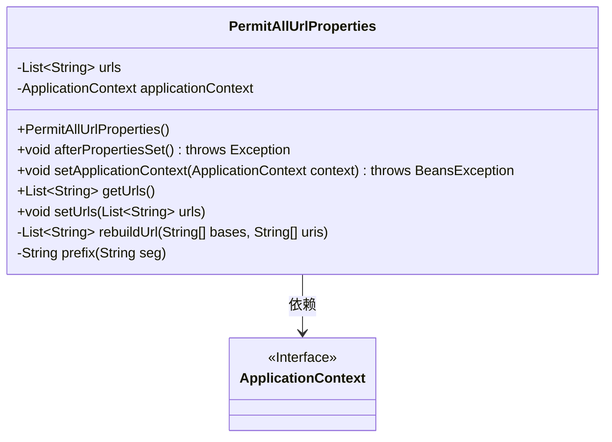
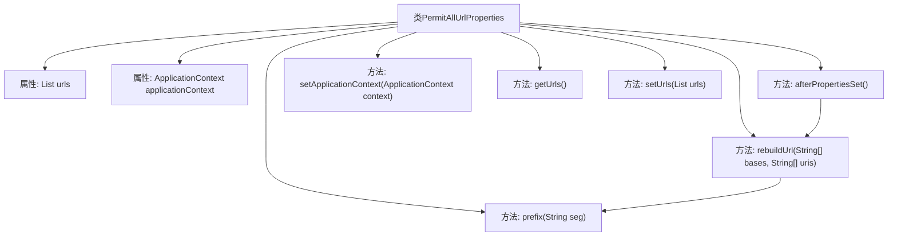

# 基础信息

|      |      |
|------|------|
| 名称 | PermitAllUrlProperties |
| 编码语言 | .java |
| 代码路径 | RuoYi-main/ruoyi-framework/src/main/java/com/ruoyi/framework/config/properties/PermitAllUrlProperties.java |
| 包名 | com.ruoyi.framework.config.properties |
| 依赖项 | ['java.lang.reflect.Method', 'java.util.ArrayList', 'java.util.List', 'java.util.Map', 'java.util.Objects', 'org.springframework.aop.framework.Advised', 'org.springframework.beans.BeansException', 'org.springframework.beans.factory.InitializingBean', 'org.springframework.context.ApplicationContext', 'org.springframework.context.ApplicationContextAware', 'org.springframework.context.annotation.Configuration', 'org.springframework.stereotype.Controller', 'org.springframework.web.bind.annotation.DeleteMapping', 'org.springframework.web.bind.annotation.GetMapping', 'org.springframework.web.bind.annotation.PostMapping', 'org.springframework.web.bind.annotation.PutMapping', 'org.springframework.web.bind.annotation.RequestMapping', 'com.ruoyi.common.annotation.Anonymous'] |
| 概述说明 | PermitAllUrlProperties扫描Controller，收集匿名访问URL。 |

# 说明

类PermitAllUrlProperties负责扫描Controller并收集允许匿名访问的URL。该功能通过分析Controller中的配置，识别并汇总所有无需身份验证即可访问的URL路径，确保系统能够正确处理匿名请求。

# 类列表 Class Summary

| 名称   | 类型  | 说明 |
|-------|------|-------------|
| PermitAllUrlProperties | class | 类PermitAllUrlProperties扫描Controller并收集匿名访问URL。 |

## 类 PermitAllUrlProperties

|      |      |
|------|------|
| 访问范围 | @Configuration;public |
| 类型 | class |
| 名称 | PermitAllUrlProperties |
| 说明 | 类PermitAllUrlProperties扫描Controller并收集匿名访问URL。 |

### UML类图

**描述：**

`PermitAllUrlProperties` 类是一个配置类，实现了 `InitializingBean` 和 `ApplicationContextAware` 接口。它通过 `ApplicationContext` 获取所有带有 `Controller` 注解的 Bean，并检查这些 Bean 的类和方法是否带有 `Anonymous` 注解。如果存在 `Anonymous` 注解，则会根据 `RequestMapping`、`GetMapping`、`PostMapping`、`PutMapping` 或 `DeleteMapping` 注解的 URL 路径，生成允许匿名访问的 URL 列表。该类还提供了 `rebuildUrl` 和 `prefix` 方法用于处理 URL 路径的拼接和格式化。

### 内部方法调用关系图

这段代码定义了一个名为`PermitAllUrlProperties`的类，该类实现了`InitializingBean`和`ApplicationContextAware`接口。代码的主要作用是在Spring应用启动后，通过`afterPropertiesSet`方法扫描所有带有`Controller`注解的Bean，并处理这些Bean中带有`Anonymous`注解的类和方法，最终生成一个允许匿名访问的URL列表。`rebuildUrl`方法用于构建完整的URL路径，`prefix`方法确保URL路径以斜杠开头。整个流程通过Spring的`ApplicationContext`获取Bean，并进行相应的注解处理和URL生成。

### 字段列表 Field List

| 名称  | 类型  | 说明 |
|-------|-------|------|
| urls = new ArrayList<>() | List<String> | 声明一个存储字符串的私有列表变量urls。 |
| applicationContext | ApplicationContext | 声明私有ApplicationContext类型的applicationContext变量。 |

### 方法列表 Method List

| 名称  | 类型  | 说明 |
|-------|-------|------|
| setApplicationContext | void | 重写方法，设置应用上下文。 |
| rebuildUrl | List<String> | 方法rebuildUrl通过组合base和uri生成URL列表。 |
| getUrls | List<String> | 该方法返回一个字符串列表类型的URL集合。 |
| setUrls | void | 设置URL列表的方法，将传入的URL列表赋值给当前对象的URL属性。 |
| prefix | String | 该方法为字符串添加前缀"/"，若字符串已以"/"开头则不添加。 |
| afterPropertiesSet | void | 扫描控制器并处理类和方法级别的匿名访问注解，生成URL列表。 |

