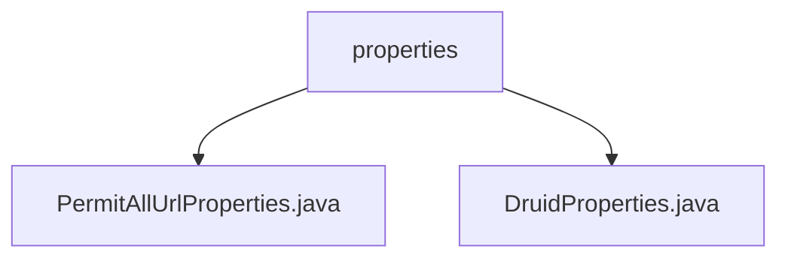

# 基础信息

|      |      |
|------|------|
| 名称 | properties |
| 编码语言 | .java |
| 代码路径 | RuoYi-main/ruoyi-framework/src/main/java/com/ruoyi/framework/config/properties |
| 包名 | RuoYi-main.ruoyi-framework.src.main.java.com.ruoyi.framework.config.properties |
| 概述说明 | PermitAllUrlProperties类收集匿名访问URL，DruidProperties类配置Druid连接池参数。 |

# 说明

## 概述
该代码模块主要负责系统配置和资源管理，具体包括匿名访问URL的识别与汇总以及数据库连接池的配置。通过这两个核心功能，模块确保了系统在处理匿名请求时的安全性以及数据库连接的高效管理。

## 主要业务场景
1. **匿名访问URL管理**：
   - `PermitAllUrlProperties`类负责扫描系统中的Controller，收集并汇总所有允许匿名访问的URL路径。该功能通过分析Controller中的配置，确保系统能够正确处理无需身份验证的请求，适用于需要公开访问的接口场景。

2. **数据库连接池配置**：
   - `DruidProperties`类用于配置Druid数据源的连接池参数，包括初始化大小、最小空闲连接数、最大活跃连接数以及超时时间等。这些参数的设置直接影响数据库连接池的性能和资源利用率，适用于需要高效管理数据库连接的应用场景。

### 包内部结构视图

该流程图展示了`properties`文件夹与其包含的两个Java文件之间的层级关系。`properties`作为父节点，包含了`PermitAllUrlProperties.java`和`DruidProperties.java`两个子节点，清晰地反映了路径中的文件组织结构。

# 文件列表 File List

| 名称   | 类型  | 说明 |
|-------|------|-------------|
| [DruidProperties.java](DruidProperties.md) | file | DruidProperties类配置Druid数据源连接池参数。 |
| [PermitAllUrlProperties.java](PermitAllUrlProperties.md) | file | PermitAllUrlProperties扫描Controller，收集匿名访问URL。 |

