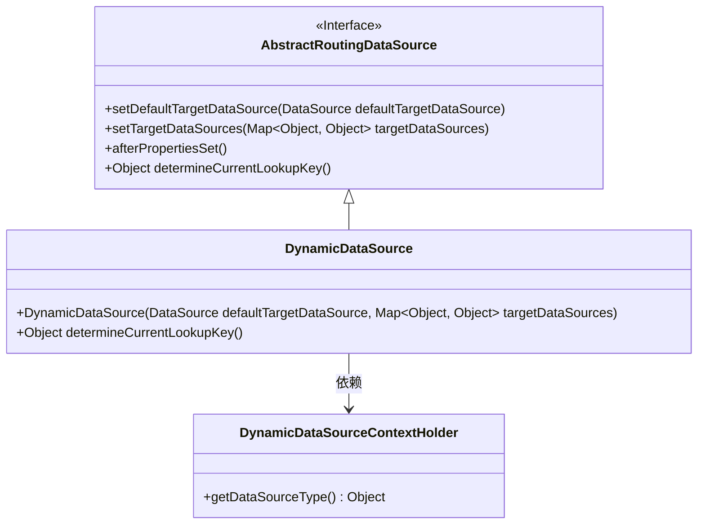
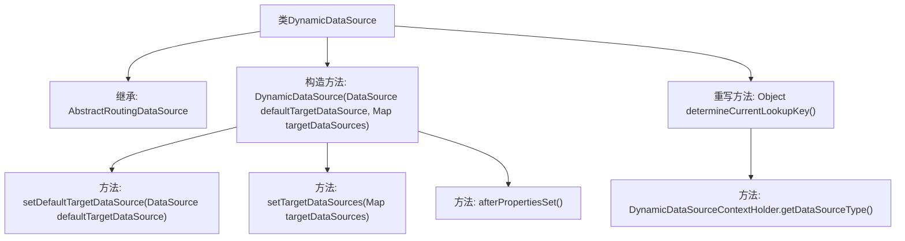

# 基础信息

|      |      |
|------|------|
| 名称 | DynamicDataSource |
| 编码语言 | .java |
| 代码路径 | RuoYi-main/ruoyi-framework/src/main/java/com/ruoyi/framework/datasource/DynamicDataSource.java |
| 包名 | com.ruoyi.framework.datasource |
| 依赖项 | ['java.util.Map', 'javax.sql.DataSource', 'org.springframework.jdbc.datasource.lookup.AbstractRoutingDataSource', 'com.ruoyi.common.config.datasource.DynamicDataSourceContextHolder'] |
| 概述说明 | DynamicDataSource继承AbstractRoutingDataSource，实现动态数据源切换。 |

# 说明

DynamicDataSource类继承自AbstractRoutingDataSource，具备动态切换数据源的能力。该类通过继承AbstractRoutingDataSource，实现了在运行时根据特定条件或需求灵活切换不同数据源的功能，从而支持多数据源环境下的动态管理和调用。

# 类列表 Class Summary

| 名称   | 类型  | 说明 |
|-------|------|-------------|
| DynamicDataSource | class | DynamicDataSource类继承AbstractRoutingDataSource，支持动态切换数据源。 |

## 类 DynamicDataSource

|      |      |
|------|------|
| 访问范围 | public |
| 类型 | class |
| 名称 | DynamicDataSource |
| 说明 | DynamicDataSource类继承AbstractRoutingDataSource，支持动态切换数据源。 |

### UML类图

这段代码定义了一个`DynamicDataSource`类，它继承自`AbstractRoutingDataSource`接口。`DynamicDataSource`类通过构造函数接收默认数据源和目标数据源映射，并调用父类的方法进行初始化。`determineCurrentLookupKey`方法从`DynamicDataSourceContextHolder`中获取当前数据源类型。类图展示了`DynamicDataSource`与`AbstractRoutingDataSource`的继承关系，以及`DynamicDataSource`对`DynamicDataSourceContextHolder`的依赖关系。

### 内部方法调用关系图

这段代码定义了一个`DynamicDataSource`类，继承自`AbstractRoutingDataSource`。构造方法接受默认数据源和目标数据源映射，并调用父类的方法进行设置和初始化。重写的`determineCurrentLookupKey`方法通过`DynamicDataSourceContextHolder`获取当前数据源类型。流程图展示了类的继承关系、构造方法及其内部调用的父类方法，以及重写方法的调用关系。

### 字段列表 Field List

| 名称  | 类型  | 说明 |
|-------|-------|------|

### 方法列表 Method List

| 名称  | 类型  | 说明 |
|-------|-------|------|
| determineCurrentLookupKey | Object | 动态数据源切换方法，返回当前数据源类型。 |

