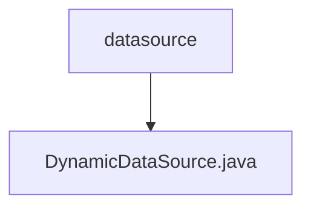

# 基础信息

|      |      |
|------|------|
| 名称 | datasource |
| 编码语言 | .java |
| 代码路径 | RuoYi-main/ruoyi-framework/src/main/java/com/ruoyi/framework/datasource |
| 包名 | RuoYi-main.ruoyi-framework.src.main.java.com.ruoyi.framework.datasource |
| 概述说明 | DynamicDataSource继承AbstractRoutingDataSource，实现动态数据源切换。 |

# 说明

DynamicDataSource类继承自AbstractRoutingDataSource，具备动态切换数据源的能力。该类通过继承AbstractRoutingDataSource，实现了在运行时根据特定条件或需求灵活切换不同数据源的功能，从而支持多数据源环境下的动态管理和调用。

### 包内部结构视图

该流程图展示了路径 `RuoYi-main/ruoyi-framework/src/main/java/com/ruoyi/framework/datasource` 的层级关系。`datasource` 是父节点，`DynamicDataSource.java` 是其子节点，表示在 `datasource` 文件夹中包含了一个名为 `DynamicDataSource.java` 的文件。

# 文件列表 File List

| 名称   | 类型  | 说明 |
|-------|------|-------------|
| [DynamicDataSource.java](DynamicDataSource.md) | file | DynamicDataSource继承AbstractRoutingDataSource，实现动态数据源切换。 |

