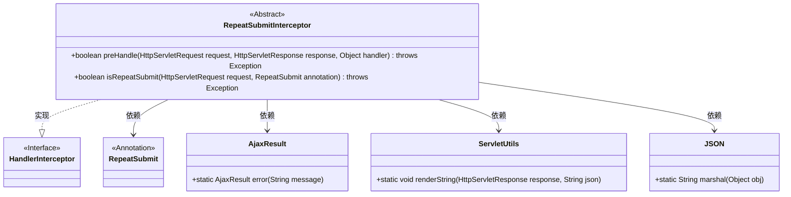
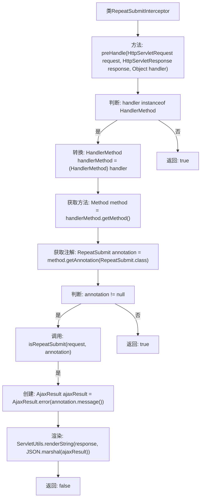

# 基础信息

|      |      |
|------|------|
| 名称 | RepeatSubmitInterceptor |
| 编码语言 | .java |
| 代码路径 | RuoYi-main/ruoyi-framework/src/main/java/com/ruoyi/framework/interceptor/RepeatSubmitInterceptor.java |
| 包名 | com.ruoyi.framework.interceptor |
| 依赖项 | ['java.lang.reflect.Method', 'javax.servlet.http.HttpServletRequest', 'javax.servlet.http.HttpServletResponse', 'org.springframework.stereotype.Component', 'org.springframework.web.method.HandlerMethod', 'org.springframework.web.servlet.HandlerInterceptor', 'com.ruoyi.common.json.JSON', 'com.ruoyi.common.annotation.RepeatSubmit', 'com.ruoyi.common.core.domain.AjaxResult', 'com.ruoyi.common.utils.ServletUtils'] |
| 概述说明 | 抽象类实现拦截器，避免重复提交请求。 |

# 说明

抽象类实现拦截器功能，主要用于防止重复提交请求。通过拦截器机制，可以在请求处理过程中进行拦截和检查，确保同一请求不会被重复提交。这种设计可以有效避免因重复提交导致的资源浪费或数据不一致问题。抽象类提供了基础的拦截逻辑，具体实现可以根据需求进行扩展和定制，适用于多种场景和业务需求。

# 类列表 Class Summary

| 名称   | 类型  | 说明 |
|-------|------|-------------|
| RepeatSubmitInterceptor | class | 抽象类实现拦截器，防止重复提交请求。 |

## 类 RepeatSubmitInterceptor

|      |      |
|------|------|
| 访问范围 | @Component;public abstract |
| 类型 | class |
| 名称 | RepeatSubmitInterceptor |
| 说明 | 抽象类实现拦截器，防止重复提交请求。 |

### UML类图

**描述：**
`RepeatSubmitInterceptor` 是一个抽象类，实现了 `HandlerInterceptor` 接口，用于拦截请求并检查是否重复提交。它通过 `preHandle` 方法在请求处理前进行验证，若发现重复提交则返回错误信息。`isRepeatSubmit` 方法由子类实现，用于定义具体的防重复提交规则。该类依赖 `RepeatSubmit` 注解、`AjaxResult`、`ServletUtils` 和 `JSON` 类来完成其功能。

### 内部方法调用关系图

这段代码是一个抽象类 `RepeatSubmitInterceptor`，它实现了 `HandlerInterceptor` 接口，用于拦截和处理重复提交的请求。`preHandle` 方法首先检查 `handler` 是否是 `HandlerMethod` 类型，如果是，则获取方法上的 `RepeatSubmit` 注解，并调用 `isRepeatSubmit` 方法验证是否重复提交。如果验证结果为重复提交，则返回错误信息并终止请求处理；否则继续执行。`isRepeatSubmit` 方法由子类实现具体的防重复提交规则。

### 字段列表 Field List

| 名称  | 类型  | 说明 |
|-------|-------|------|

### 方法列表 Method List

| 名称  | 类型  | 说明 |
|-------|-------|------|
| isRepeatSubmit | boolean | 抽象方法检查请求是否重复提交，抛出异常。 |
| preHandle | boolean | 检查请求是否重复提交，若重复则返回错误信息，否则继续处理。 |

