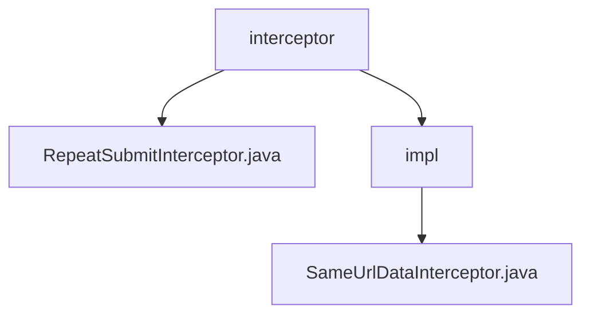

# 基础信息

|      |      |
|------|------|
| 名称 | interceptor |
| 编码语言 | .java |
| 代码路径 | RuoYi-main/ruoyi-framework/src/main/java/com/ruoyi/framework/interceptor |
| 包名 | RuoYi-main.ruoyi-framework.src.main.java.com.ruoyi.framework.interceptor |
| 概述说明 | 抽象类实现拦截器，防止重复提交请求，提高系统效率和稳定性。 |

# 说明

## 概述
该代码模块主要实现了一个用于防止重复提交请求的拦截器功能。通过抽象类设计，拦截器可以在请求处理过程中进行拦截和检查，确保同一请求不会被重复提交。这种设计有效避免了因重复提交导致的资源浪费或数据不一致问题。模块提供了基础的拦截逻辑，具体实现可以根据需求进行扩展和定制，适用于多种场景和业务需求。

## 主要业务场景
1. **防止重复提交请求**：拦截器通过比较请求参数和时间间隔来检查是否存在重复请求，确保系统能够识别并处理重复的请求，从而提高系统效率和稳定性。
2. **资源优化**：通过拦截重复请求，减少对系统资源的浪费，避免因重复请求导致的潜在错误处理。
3. **数据一致性**：防止因重复提交导致的数据不一致问题，确保系统在处理请求时的数据完整性和一致性。

该模块适用于需要高并发处理和数据一致性要求较高的业务场景，如在线交易系统、表单提交系统等。

### 包内部结构视图

该流程图展示了RuoYi项目中`interceptor`文件夹及其子文件和子文件夹的层级关系。`interceptor`文件夹下包含`RepeatSubmitInterceptor.java`文件和`impl`子文件夹，而`impl`子文件夹中又包含`SameUrlDataInterceptor.java`文件。通过该图可以清晰地看出文件之间的层级结构。

# 文件列表 File List

| 名称   | 类型  | 说明 |
|-------|------|-------------|
| [RepeatSubmitInterceptor.java](RepeatSubmitInterceptor.md) | file | 抽象类实现拦截器，避免重复提交请求。 |
| [impl](impl/_module.md) | package | 拦截器检查重复请求，对比参数与时间间隔。 |

