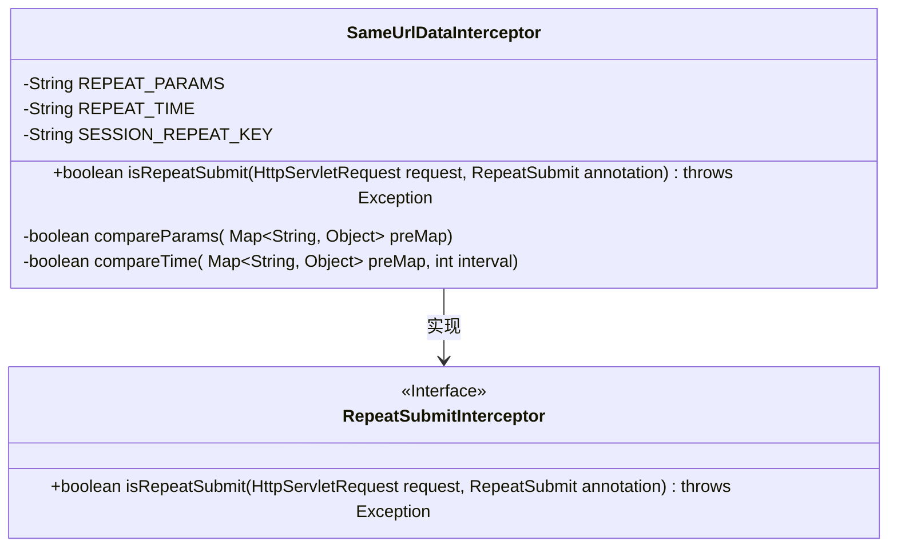
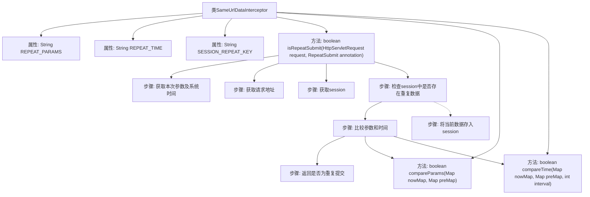

# 基础信息

|      |      |
|------|------|
| 名称 | SameUrlDataInterceptor |
| 编码语言 | .java |
| 代码路径 | RuoYi-main/ruoyi-framework/src/main/java/com/ruoyi/framework/interceptor/impl/SameUrlDataInterceptor.java |
| 包名 | com.ruoyi.framework.interceptor.impl |
| 依赖项 | ['java.util.HashMap', 'java.util.Map', 'javax.servlet.http.HttpServletRequest', 'javax.servlet.http.HttpSession', 'org.springframework.stereotype.Component', 'com.ruoyi.common.annotation.RepeatSubmit', 'com.ruoyi.common.json.JSON', 'com.ruoyi.framework.interceptor.RepeatSubmitInterceptor'] |
| 概述说明 | 拦截器检查重复请求，对比参数与时间间隔。 |

# 说明

拦截器通过比较请求参数和时间间隔来检查是否存在重复请求。该机制确保系统能够识别并处理重复的请求，从而提高系统效率和稳定性。拦截器在接收到请求时，会分析其参数和发送时间，与之前记录的请求进行对比，以判断是否为重复请求。这种方法有效防止了重复请求对系统资源的浪费和潜在的错误处理。

# 类列表 Class Summary

| 名称   | 类型  | 说明 |
|-------|------|-------------|
| SameUrlDataInterceptor | class | 拦截器检查重复请求，比较参数和时间间隔。 |

## 类 SameUrlDataInterceptor

|      |      |
|------|------|
| 访问范围 | @Component;public |
| 类型 | class |
| 名称 | SameUrlDataInterceptor |
| 说明 | 拦截器检查重复请求，比较参数和时间间隔。 |

### UML类图

这段代码定义了一个 `SameUrlDataInterceptor` 类，它继承自 `RepeatSubmitInterceptor` 接口。`SameUrlDataInterceptor` 类的主要功能是拦截重复提交的请求，通过比较当前请求参数和时间与之前存储的请求参数和时间来判断是否为重复提交。类中包含三个常量 `REPEAT_PARAMS`、`REPEAT_TIME` 和 `SESSION_REPEAT_KEY`，分别用于标识重复提交的参数、时间和会话键。`isRepeatSubmit` 方法是核心逻辑，它通过比较当前请求和会话中存储的请求数据来判断是否重复提交。`compareParams` 和 `compareTime` 是辅助方法，分别用于比较参数和时间间隔。

### 内部方法调用关系图

这段代码的流程图描述了`SameUrlDataInterceptor`类的工作流程，主要用于拦截和判断HTTP请求是否为重复提交。首先，获取请求的参数和系统时间，然后检查session中是否已存在相同URL的重复数据。如果存在，则进一步比较参数和时间间隔，判断是否为重复提交。如果满足条件，则返回`true`，否则将当前数据存入session并返回`false`。整个过程通过`compareParams`和`compareTime`两个私有方法进行参数和时间的比较。

### 字段列表 Field List

| 名称  | 类型  | 说明 |
|-------|-------|------|
| REPEAT_PARAMS = "repeatParams" | String | 定义了一个不可变的字符串常量REPEAT_PARAMS，值为"repeatParams"。 |
| SESSION_REPEAT_KEY = "repeatData" | String | SESSION_REPEAT_KEY为常量，表示会话重复数据键。 |
| REPEAT_TIME = "repeatTime" | String | 定义常量REPEAT_TIME，值为字符串"repeatTime"。 |

### 方法列表 Method List

| 名称  | 类型  | 说明 |
|-------|-------|------|
| compareTime | boolean | 比较两个时间差是否小于指定间隔。 |
| isRepeatSubmit | boolean | 检查请求是否重复提交，比较参数和时间间隔。 |
| compareParams | boolean | 比较两个Map中REPEAT_PARAMS键对应的值是否相等。 |

