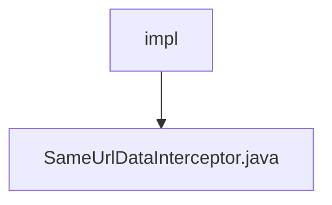

# 基础信息

|      |      |
|------|------|
| 名称 | impl |
| 编码语言 | .java |
| 代码路径 | RuoYi-main/ruoyi-framework/src/main/java/com/ruoyi/framework/interceptor/impl |
| 包名 | RuoYi-main.ruoyi-framework.src.main.java.com.ruoyi.framework.interceptor.impl |
| 概述说明 | 拦截器检查重复请求，对比参数与时间间隔。 |

# 说明

拦截器通过比较请求参数和时间间隔来检查是否存在重复请求。该机制确保系统能够识别并处理重复的请求，从而提高系统效率和稳定性。拦截器在接收到请求时，会分析其参数和发送时间，与之前记录的请求进行对比，以判断是否为重复请求。这种方法有效防止了重复请求对系统资源的浪费和潜在的错误处理。

### 包内部结构视图

该流程图展示了路径 `RuoYi-main/ruoyi-framework/src/main/java/com/ruoyi/framework/interceptor/impl` 及其子文件 `SameUrlDataInterceptor.java` 的层级关系。`impl` 作为父节点，包含了一个子节点 `SameUrlDataInterceptor.java`，表示该文件位于 `impl` 目录下。

# 文件列表 File List

| 名称   | 类型  | 说明 |
|-------|------|-------------|
| [SameUrlDataInterceptor.java](SameUrlDataInterceptor.md) | file | 拦截器检查重复请求，对比参数与时间间隔。 |

