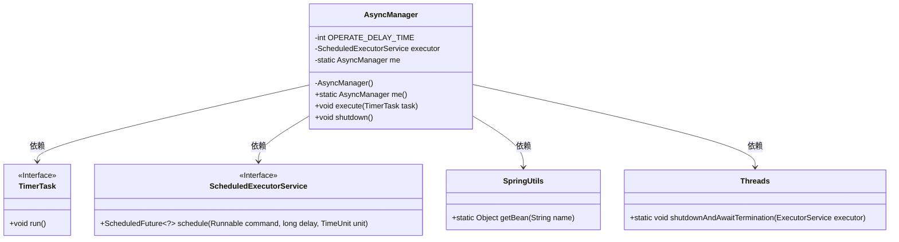
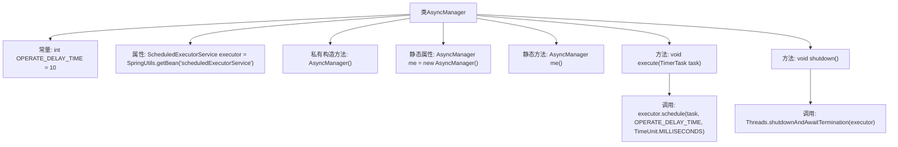

# 基础信息

|      |      |
|------|------|
| 名称 | AsyncManager |
| 编码语言 | .java |
| 代码路径 | RuoYi-main/ruoyi-framework/src/main/java/com/ruoyi/framework/manager/AsyncManager.java |
| 包名 | com.ruoyi.framework.manager |
| 依赖项 | ['java.util.TimerTask', 'java.util.concurrent.ScheduledExecutorService', 'java.util.concurrent.TimeUnit', 'com.ruoyi.common.utils.Threads', 'com.ruoyi.common.utils.spring.SpringUtils'] |
| 概述说明 | AsyncManager类采用单例模式，延迟10毫秒执行任务，支持线程池关闭。 |

# 说明

AsyncManager类采用单例模式，确保全局唯一实例。该类通过线程池管理任务执行，任务在执行前会延迟10毫秒。此外，AsyncManager类还提供了关闭线程池的功能，以便在需要时安全地终止所有线程任务。这种设计既保证了任务的异步执行，又提供了对线程池的有效控制。

# 类列表 Class Summary

| 名称   | 类型  | 说明 |
|-------|------|-------------|
| AsyncManager | class | AsyncManager类使用单例模式，通过线程池延迟10毫秒执行任务，并提供关闭线程池功能。 |

## 类 AsyncManager

|      |      |
|------|------|
| 访问范围 | public |
| 类型 | class |
| 名称 | AsyncManager |
| 说明 | AsyncManager类使用单例模式，通过线程池延迟10毫秒执行任务，并提供关闭线程池功能。 |

### UML类图

这段代码定义了一个 `AsyncManager` 类，用于管理异步任务的执行。它使用了单例模式，并通过 `ScheduledExecutorService` 来调度任务的执行，任务会在指定的延迟时间后执行。`AsyncManager` 类依赖于 `TimerTask`、`ScheduledExecutorService`、`SpringUtils` 和 `Threads` 类来完成其功能。`TimerTask` 和 `ScheduledExecutorService` 是接口，分别定义了任务和任务调度的方法。`SpringUtils` 用于获取 `ScheduledExecutorService` 的实例，`Threads` 提供了线程池的关闭功能。

### 内部方法调用关系图

该流程图描述了`AsyncManager`类的结构及其方法调用关系。`AsyncManager`类包含一个常量`OPERATE_DELAY_TIME`、一个线程池属性`executor`、一个私有构造方法、一个静态实例`me`以及两个公共方法`execute`和`shutdown`。`execute`方法用于延迟执行任务，`shutdown`方法用于停止线程池。流程图清晰地展示了类内部的属性和方法之间的调用关系。

### 字段列表 Field List

| 名称  | 类型  | 说明 |
|-------|-------|------|
| OPERATE_DELAY_TIME = 10 | int | 私有常量OPERATE_DELAY_TIME值为10。 |
| executor = SpringUtils.getBean("scheduledExecutorService") | ScheduledExecutorService | 使用Spring获取定时任务执行器实例。 |
| me = new AsyncManager() | AsyncManager | 私有静态变量me初始化为AsyncManager实例。 |

### 方法列表 Method List

| 名称  | 类型  | 说明 |
|-------|-------|------|
| me | AsyncManager | 静态方法返回AsyncManager实例。 |
| shutdown | void | 关闭线程池并等待所有任务完成。 |
| execute | void | 该方法延迟执行指定任务，延迟时间为OPERATE_DELAY_TIME毫秒。 |

