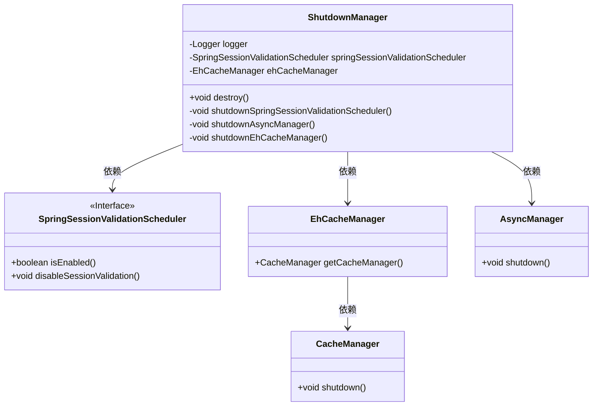
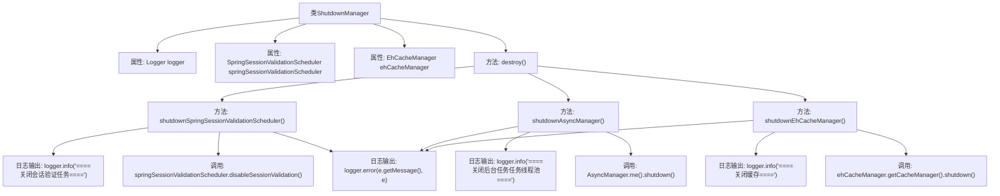

# 基础信息

|      |      |
|------|------|
| 名称 | ShutdownManager |
| 编码语言 | .java |
| 代码路径 | RuoYi-main/ruoyi-framework/src/main/java/com/ruoyi/framework/manager/ShutdownManager.java |
| 包名 | com.ruoyi.framework.manager |
| 依赖项 | ['com.ruoyi.framework.shiro.web.session.SpringSessionValidationScheduler', 'net.sf.ehcache.CacheManager', 'org.apache.shiro.cache.ehcache.EhCacheManager', 'org.slf4j.Logger', 'org.slf4j.LoggerFactory', 'org.springframework.beans.factory.annotation.Autowired', 'org.springframework.stereotype.Component', 'javax.annotation.PreDestroy'] |
| 概述说明 | ShutdownManager类销毁时关闭会话、异步任务和缓存。 |

# 说明

ShutdownManager类在销毁过程中负责关闭会话验证、异步任务和缓存管理，确保系统资源得到正确释放，避免内存泄漏和资源浪费。通过这一机制，系统在关闭时能够有序地终止相关操作，保证数据一致性和系统稳定性。

# 类列表 Class Summary

| 名称   | 类型  | 说明 |
|-------|------|-------------|
| ShutdownManager | class | ShutdownManager类在销毁时关闭会话验证、异步任务和缓存管理。 |

## 类 ShutdownManager

|      |      |
|------|------|
| 访问范围 | @Component;public |
| 类型 | class |
| 名称 | ShutdownManager |
| 说明 | ShutdownManager类在销毁时关闭会话验证、异步任务和缓存管理。 |

### UML类图

这段代码定义了一个 `ShutdownManager` 类，用于管理应用程序关闭时的资源清理任务。它依赖于 `SpringSessionValidationScheduler`、`EhCacheManager` 和 `AsyncManager` 三个类，分别用于关闭会话验证任务、缓存管理器和异步任务管理器。`ShutdownManager` 类通过 `@PreDestroy` 注解的 `destroy` 方法在应用程序关闭时执行清理操作，确保资源被正确释放。

### 内部方法调用关系图

这段代码定义了一个`ShutdownManager`类，用于在应用关闭时执行一系列的清理任务。它通过`@PreDestroy`注解标记的`destroy()`方法，依次调用`shutdownSpringSessionValidationScheduler()`、`shutdownAsyncManager()`和`shutdownEhCacheManager()`方法来关闭会话验证任务、后台任务线程池和缓存管理器。每个方法在执行过程中都会记录日志，并在发生异常时捕获并记录错误信息。

### 字段列表 Field List

| 名称  | 类型  | 说明 |
|-------|-------|------|
| logger = LoggerFactory.getLogger("sys-user") | Logger | 定义私有静态日志记录器，名称为"sys-user"。 |
| ehCacheManager | EhCacheManager | 自动注入可选的EhCacheManager实例。 |
| springSessionValidationScheduler | SpringSessionValidationScheduler | 自动注入SpringSessionValidationScheduler，非必需。 |

### 方法列表 Method List

| 名称  | 类型  | 说明 |
|-------|-------|------|
| shutdownEhCacheManager | void | 关闭缓存管理器并处理异常。 |
| shutdownAsyncManager | void | 关闭后台任务线程池并处理异常。 |
| shutdownSpringSessionValidationScheduler | void | 关闭会话验证任务，处理异常并记录日志。 |
| destroy | void | 销毁方法关闭Spring会话验证调度器、异步管理器和EhCache管理器。 |

