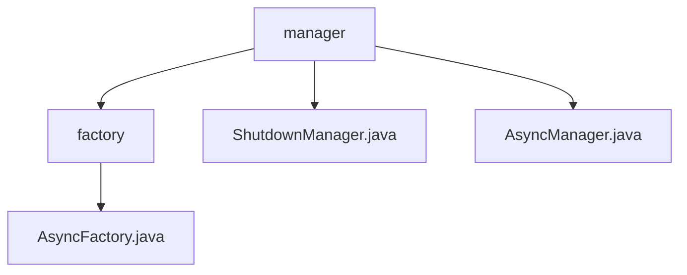

# 基础信息

|      |      |
|------|------|
| 名称 | manager |
| 编码语言 | .java |
| 代码路径 | RuoYi-main/ruoyi-framework/src/main/java/com/ruoyi/framework/manager |
| 包名 | RuoYi-main.ruoyi-framework.src.main.java.com.ruoyi.framework.manager |
| 概述说明 | AsyncFactory类支持会话管理、日志记录和登录信息管理。ShutdownManager类确保系统关闭时资源释放。AsyncManager类通过单例模式和线程池管理异步任务。 |

# 说明

## 概述

该代码模块主要涉及异步任务管理、会话管理以及系统关闭时的资源清理。模块的核心类包括 `AsyncFactory`、`ShutdownManager` 和 `AsyncManager`，它们分别负责不同的功能，共同确保系统的稳定性、可靠性和资源的高效利用。

## 主要业务场景

1. **同步会话管理与操作日志记录**：
   - `AsyncFactory` 类负责同步会话管理，确保操作的一致性和稳定性。同时，它还能够记录操作日志，便于系统行为的追踪和审计。
   - 应用场景：在用户进行关键操作时，`AsyncFactory` 确保这些操作在同步环境中执行，并通过日志记录操作细节，便于后续的审计和问题排查。

2. **登录信息管理**：
   - `AsyncFactory` 类还负责管理登录信息，确保用户身份验证的安全性和有效性。
   - 应用场景：在用户登录系统时，`AsyncFactory` 负责验证用户身份并管理登录会话，防止未授权访问。

3. **系统关闭时的资源清理**：
   - `ShutdownManager` 类在系统关闭时负责关闭会话验证、异步任务和缓存管理，确保系统资源得到正确释放，避免内存泄漏和资源浪费。
   - 应用场景：在系统关闭或重启时，`ShutdownManager` 确保所有会话和异步任务被正确终止，保证数据一致性和系统稳定性。

4. **异步任务管理与线程池控制**：
   - `AsyncManager` 类采用单例模式，通过线程池管理异步任务的执行。任务在执行前会延迟10毫秒，并且提供了关闭线程池的功能，以便在需要时安全地终止所有线程任务。
   - 应用场景：在需要执行异步任务（如后台数据处理、定时任务等）时，`AsyncManager` 确保任务在可控的线程池中执行，并在系统关闭时安全地终止所有任务。

### 包内部结构视图

该流程图展示了RuoYi项目中`manager`模块的层级结构。`manager`作为根节点，包含`factory`、`ShutdownManager.java`和`AsyncManager.java`三个子节点。其中，`factory`进一步包含`AsyncFactory.java`文件。整个结构清晰地反映了路径中的文件夹和文件之间的层级关系。

# 文件列表 File List

| 名称   | 类型  | 说明 |
|-------|------|-------------|
| [ShutdownManager.java](ShutdownManager.md) | file | ShutdownManager类销毁时关闭会话、异步任务和缓存。 |
| [AsyncManager.java](AsyncManager.md) | file | AsyncManager类采用单例模式，延迟10毫秒执行任务，支持线程池关闭。 |
| [factory](factory/_module.md) | package | AsyncFactory类支持同步会话、日志记录和登录管理。 |

