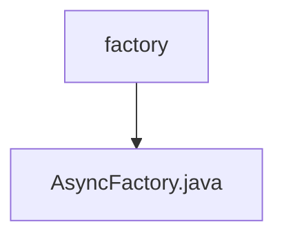

# 基础信息

|      |      |
|------|------|
| 名称 | factory |
| 编码语言 | .java |
| 代码路径 | RuoYi-main/ruoyi-framework/src/main/java/com/ruoyi/framework/manager/factory |
| 包名 | RuoYi-main.ruoyi-framework.src.main.java.com.ruoyi.framework.manager.factory |
| 概述说明 | AsyncFactory类支持同步会话、日志记录和登录管理。 |

# 说明

AsyncFactory类具备三大核心功能：首先，它支持同步会话管理，确保操作的一致性和稳定性；其次，它能够记录操作日志，便于追踪和审计系统行为；最后，它还负责管理登录信息，保障用户身份验证的安全性和有效性。这些功能共同提升了系统的可靠性和可维护性。

### 包内部结构视图

该流程图展示了路径的层级关系，其中`factory`是父节点，`AsyncFactory.java`是其子节点。路径表示`AsyncFactory.java`文件位于`factory`目录下，结构清晰且简洁。

# 文件列表 File List

| 名称   | 类型  | 说明 |
|-------|------|-------------|
| [AsyncFactory.java](AsyncFactory.md) | file | AsyncFactory类支持同步会话、日志记录和登录管理。 |

