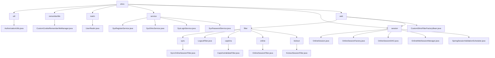

# 基础信息

|      |      |
|------|------|
| 名称 | shiro |
| 编码语言 | .java |
| 代码路径 | RuoYi-main/ruoyi-framework/src/main/java/com/ruoyi/framework/shiro |
| 包名 | RuoYi-main.ruoyi-framework.src.main.java.com.ruoyi.framework.shiro |
| 概述说明 | 清理缓存、优化权限存储、管理用户会话，提升系统安全性与性能。 |

# 说明

## 概述
该代码模块基于Shiro框架，主要围绕用户认证、授权、会话管理以及相关的安全机制展开。模块通过多个服务类、过滤器、会话管理组件和自定义Realm实现，提供了从用户注册、登录、权限验证到会话管理的完整流程。模块的核心目标是确保系统的安全性、实时性和高效性，同时通过灵活的配置和优化手段提升用户体验和系统性能。

## 主要业务场景
1. **用户认证与授权**：
   - **用户注册**：`SysRegisterService` 类负责处理用户注册流程，包括验证用户名、密码和验证码的有效性，检查用户名的唯一性，并对密码进行加密处理，确保注册过程的安全性和完整性。
   - **用户登录**：`SysLoginService` 类负责验证用户名和密码的有效性，检查用户IP是否在黑名单中，并根据验证结果设置用户的角色权限，记录登录信息，确保系统的安全性和操作的可追溯性。
   - **密码验证**：`SysPasswordService` 类负责密码验证功能，包括登录失败的重试限制机制和密码匹配检查，防止恶意攻击并确保密码验证的准确性。
   - **自定义Realm**：`UserRealm` 类负责实现系统的授权和认证功能，管理用户的角色和权限，并支持缓存清理功能，确保权限管理的实时性和一致性。

2. **会话管理**：
   - **会话信息管理**：`OnlineSession` 类用于存储和管理用户的在线会话信息，包括用户ID、名称、部门、IP地址、浏览器类型、操作系统信息等，便于会话的实时监控和管理。
   - **会话创建与设备适配**：`OnlineSessionFactory` 类通过解析用户代理信息，自动识别用户使用的浏览器和操作系统类型，优化用户体验。
   - **会话同步与维护**：`OnlineSessionDAO` 类定期将会话数据同步到数据库，更新会话的最后访问时间，并处理会话的过期与停止逻辑，确保会话管理的高效性和数据一致性。
   - **会话生命周期管理**：通过 `OnlineSessionDAO` 实现会话的创建、同步、更新、过期和删除，确保系统能够高效管理大量在线会话。

3. **过滤器与安全机制**：
   - **在线会话同步**：`SyncOnlineSessionFilter` 类负责将在线会话数据同步到数据库，避免重复同步带来的性能开销和数据一致性问题。
   - **用户退出处理**：`LogoutFilter` 类处理用户退出操作，包括记录日志、清理缓存，并将用户重定向到指定URL，确保退出过程的安全性和可追踪性。
   - **验证码校验**：`CaptchaValidateFilter` 类用于验证码验证，确保用户输入的验证码正确，提升系统的安全性。
   - **访问控制与会话管理**：`OnlineSessionFilter` 类验证会话状态，并在拒绝访问时处理重定向操作，确保只有符合条件的会话能够继续访问。
   - **会话数量管理**：`KickoutSessionFilter` 类管理用户会话数量，当会话数超过设定限制时，自动踢出最早的会话，并将用户重定向到指定页面，确保会话资源的合理分配和使用。
   - **会话验证与清理**：`SpringSessionValidationScheduler` 类定时验证会话的有效性，防止无效或过期的会话占用系统资源，确保会话数据的及时更新和资源的有效释放。

4. **缓存与性能优化**：
   - **清理用户授权缓存**：通过清理用户授权缓存，确保系统在验证用户权限时使用最新的数据，避免因缓存过期或数据不一致导致的安全问题。
   - **自定义CookieRememberMeManager**：通过优化角色权限的存储方式，减少存储在Cookie中的数据量，避免因请求头过大导致的性能瓶颈和潜在的安全风险，提升系统的整体性能和用户体验。

通过以上业务场景，该模块为用户认证、授权、会话管理和安全机制提供了全面的支持，确保了系统的安全性、稳定性和高效性。

### 包内部结构视图

该流程图展示了RuoYi框架中`shiro`模块的目录结构及其文件关系。`shiro`模块下包含多个子模块，如`util`、`rememberMe`、`realm`、`service`、`session`和`web`。每个子模块下又包含具体的实现类或文件，例如`AuthorizationUtils.java`、`CustomCookieRememberMeManager.java`等。`web`模块下的`filter`子模块进一步细分为`sync`、`LogoutFilter`、`captcha`、`online`和`kickout`等过滤器，每个过滤器都有对应的实现类。整体结构清晰，展示了`shiro`模块的复杂性和功能性。

# 文件列表 File List

| 名称   | 类型  | 说明 |
|-------|------|-------------|
| [web](web/_module.md) | package | Shiro框架实现会话管理、验证码校验、用户退出等过滤器，提升系统安全性和稳定性。 |
| [session](session/_module.md) | package | OnlineSession类管理在线会话，包含用户信息、设备信息和状态。OnlineSessionFactory创建会话，解析用户代理信息。OnlineSessionDAO同步和删除会话，处理过期逻辑。 |
| [service](service/_module.md) | package | SysRegisterService处理用户注册，验证用户名密码，加密密码。SysShiroService管理会话，删除和获取会话信息。SysLoginService处理登录，验证用户信息，设置权限。SysPasswordService验证密码，控制登录失败次数。 |
| [realm](realm/_module.md) | package | UserRealm类负责用户授权认证，管理角色权限，支持缓存清理。 |
| [rememberMe](rememberMe/_module.md) | package | 优化CookieRememberMeManager，减少角色权限存储，避免请求头过大。 |
| [util](util/_module.md) | package | 清理用户授权缓存并获取自定义Realm。 |

